# Reversing Prison Architects Multi-Player Lobbies

## Motive & Mission
I want a local on-site Prison Architect Lobby, since the remote ones are unstable.
Our final product should be a Python script which (_assuming we redirect the regular traffic_) connects us to our peer (for simplicity, we shall assume that both peers are in the same LAN).

## Walkthrough

### Reversing

#### Starting Point
Since the game clearly does some kind of network communication in order to connect to the server, let's assume it is one of the well known protocols.
Naively, we shall assume that the initial request to the central server is done over HTTP(s).
After getting both Proxifier and BurpSuite running and fiddling a bit, still no hits.
Guessing might work but I'd rather just get to the point, so IDA it is - on the core executable. 

#### Static IDA Reversing (the beginning)
I want to stare at IDA at little as possible so let's just figure out what protocol is being used and get on with it.
Going to the Imports section we see [WS2_32](winsock2), and a few simple functions like "connect" and "getaddrinfo".
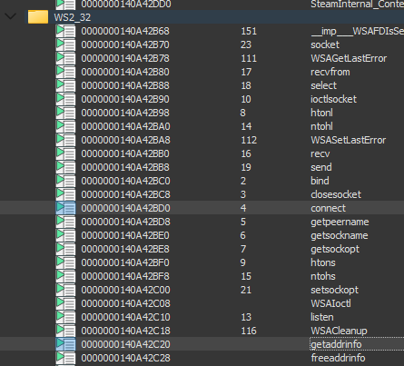

IDA does not like being lonely, so we fire up Windbg and set a breakpoint for our two friends.
Starting with `getaddrinfo`:
```
bp ws2_32!getaddrinfo ".printf \"getaddrinfo(%ma)\\n\", @rcx;gc;"
```
We now see which domain names the game is trying to resolve - and only one appears again and again: `ns.exitgames.com`.

```powershell
PS C:\> nslookup ns.exitgames.com
Non-authoritative answer:
Name:    ns-eu.exitgames.com
Address:  <REDACTED>
Aliases:  ns.exitgames.com
          nameserver.trafficmanager.net
```

So we place this in our hosts file resolving to localhost.
```
  127.0.0.1 ns.exitgames.com
```

Now what protocol are we targeting? And on what port?

One more breakpoint (don't worry, ChatGPT helped with this one):
```
bp ws2_32!connect ".printf \"\\n[connect] \";.printf \"%d.%d.%d.%d:\",((poi(@rdx+4)) & 0xff),((poi(@rdx+4)>>8) & 0xff),((poi(@rdx+4)>>0x10) & 0xff),((poi(@rdx+4)>>0x18) & 0xff);.printf \"%d\n\",((poi(@rdx+2)&0xff)<<8)|((poi(@rdx+2)>>8)&0xff);kb;gc"
```
After fixing the slop Chat gave us, we finally see some useful information:
```
[connect] 127.0.0.1:4533  # RetAddr               : Args to Child                                                           : Call Site
00 00000001`4095237c     : 00000000`5acff6c8 00000000`00000000 00000000`2934bcc0 00000000`00000000 : WS2_32!connect
01 00000001`40952b79     : 00000001`00010000 00000001`00000001 00000000`00000001 00000001`40d48568 : Prison_Architect64+0x95237c
02 00000001`409427e1     : 00000000`00000000 00000000`00000000 00000000`00000000 00000000`00000001 : Prison_Architect64+0x952b79
03 00000001`4094890e     : 00000000`2934bcc0 00000000`2920bec8 00000000`00000000 00007ff9`ccd23850 : Prison_Architect64+0x9427e1
04 00000001`40942736     : 00000000`00000000 00007ff9`ca3ebacd ffffffff`fffffffe 00000000`00000000 : Prison_Architect64+0x94890e
05 00000001`4093cf93     : 00000000`84acb4d8 00000000`852bb870 00000000`852bb890 00000001`4015e794 : Prison_Architect64+0x942736
06 00000001`4084c083     : 00000000`2aa54070 00000000`852bb870 00000000`00000000 00000000`2934bcc0 : Prison_Architect64+0x93cf93
07 00000001`401307fe     : 00000000`852bb898 00000000`0080fd60 00000000`852bb898 00000001`4012f586 : Prison_Architect64+0x84c083
08 00000001`4015e9a1     : 000000f9`2c237d30 00000000`852bb898 00000000`852bb898 00000000`00000000 : Prison_Architect64+0x1307fe
09 00000001`4015f09e     : 00000000`852bb898 00000000`2aa98a70 00000000`852bb890 00000000`00000040 : Prison_Architect64+0x15e9a1
0a 00007ff9`cbbe259d     : 00000000`852bb898 00000000`00000000 00000000`00000000 00000000`00000000 : Prison_Architect64+0x15f09e
0b 00007ff9`ccd2af78     : 00000000`00000000 00000000`00000000 00000000`00000000 00000000`00000000 : KERNEL32!BaseThreadInitThunk+0x1d
0c 00000000`00000000     : 00000000`00000000 00000000`00000000 00000000`00000000 00000000`00000000 : ntdll!RtlUserThreadStart+0x28
```
Port **4533**.
We can also manually check the `sa_family` of the `sockaddr` - it's `AF_INET`.

#### Proxy TCP Server
After testing this port on TCP using "Packet Sender" and getting some binary nonsense from the game, we shall vibe code a python server to proxy the traffic from our game to the real server.

```python
from socket import socket, AF_INET, SOCK_STREAM
import threading
from typing import Literal, Union

LISTEN_HOST = "127.0.0.1"
PORT = 4533
TARGET_IP = "<REDACTED>"

def pipe(src: socket, dst: socket, direction: Union[Literal["C->S"], Literal["S->C"]]):
    ind = 0
    while True:
        data = src.recv(4096)
        if not data:
            break

        print(f"[{direction}] {data!r}")
        if direction == "S->C":
            with open(f"s-c_{ind}.bin", "wb") as f:
                f.write(data)
            ind += 1
        dst.sendall(data)

    # src.close()
    # dst.close()


def handle_client(client: socket) -> None:
    remote = socket(AF_INET, SOCK_STREAM)
    target = (TARGET_IP, PORT)
    print(f"Connecting to {target}")
    remote.connect(target)

    t1 = threading.Thread(target=pipe, args=(client, remote, "C->S"))
    t2 = threading.Thread(target=pipe, args=(remote, client, "S->C"))

    t1.start()
    t2.start()


def main():
    server = socket(AF_INET, SOCK_STREAM)
    server.bind((LISTEN_HOST, PORT))
    server.listen(5)

    print(f"Proxy listening on {LISTEN_HOST}:{PORT}")

    while True:
        client, addr = server.accept()
        print(f"Client connected: {addr}")
        threading.Thread(target=handle_client, args=(client,), daemon=False).start()


if __name__ == "__main__":
    main()
```

After leaking a few sockets and manually triggering re-connections to different servers in the game, we can examine the traffic between the two.

#### Binary Formats
The data trasferred looks to be in some proprietary format and heaven knows I don't want to figure it out using IDA (I'll probably end up doing that anyway) so let's reverse it using HxD (binary/hex editor) and common sense.

First we shall compare the captures packets between the different servers.
A few observations:
  1) The first packet, regardless of the server, is always the same.
  2) Apart from the second packet, all packets begin with `0xFB`.
  3) Bytes 01-08 seem to be almost identical between packets.

_Side note which might have not been clear: At this point, we are proxying TCP traffic between the game and `ns.exitgames.com`, not the final continent dependant server. I assume that the game asks this central load-balancing server which frontend to connect to according to your geographical location._

Some more educated guesses tell us that bytes 01-04 (uint32) are the size of the data of the packet, and bytes 06-07 (uint16) are _probably_ the protocol version - as they do not change between packets.

The next big dillema is what is the second packet? Why does it always begin with `0xF0` rather than `0xFB`? Why does it not contain a length?

My first guess was that it was the IP of the endpoint, but triggering two requests to the same endpoint returned wiledly different data, while two closely-timed requests to different endpoint retured data which was numerically more similar.
My second guess was that this was some time calculation, or a sequential number, but I don't see the buissness logic behind something like that so let's move along.
My third guess was that this was an encryption key (I was praying for something silly like a XOR-key and not some AES nonsense.)

After looking again I noticed that the packet is always exactly 9 bytes long and the first byte is always `0xF0` and the sixth byte is always `0x06`. That eliminates the encryption key theory.

I tried the trivial thing of searching for the IP's of the actual endpoints in the network traffic, seeing as after the game does its chit-chat with the central server is calls `getaddrinfo` on a resolved IP rather than a hostname. This effort was to no avail.

_It's currently past 2AM and I have work tommorow morning, so I guess this sidequest will have to wait for now._

#### Back to IDA
It's a new day and I've already had two cups of coffee so let's open IDA and lock in.
I remmember seeing a debug print in Windbg saying something with the trace from a ".cpp" file.
You know what that meens! [RTTI](Run Time Type Information).
So let's try to hunt these RTTI's down in the executable and reverse it hardcode.
Going into the strings subview the very first thing I see is 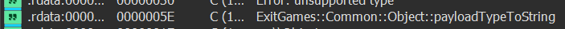 which looks like something that will be parsing our packets (seeing as they are sent to/from ns.exitgames.com).
On second thought, having the "default" namespace named after your company kind of makes sense and does not immediately indicate that this is the communication object.

Scrolling down a tad bit shows some of the most rivetting strings I could have hoped for!
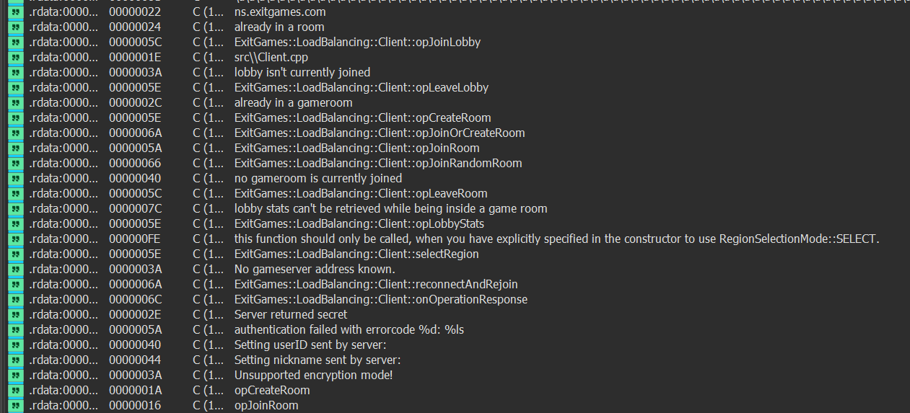

"LoadBalancing" is most likely the initial "region selection" server (we literally have a class called `RegionSelectionMode`) so let's dive into it.
_Notice the "`Unsupported encryption mode!`" string at the bottom of the image - may god help me._

Before we start really reading the assembly code, let's do a quick sanity - if I xref from the "ns.exitgames.com" string I expect to arrive at a function which passes it to `getaddrinfo`.
Hold tight!
After clicking some unnamed functions I ended up on a function which prints "[something] Photon connecting" and "diconnecting". This is also visible durring the connection phase in Windbg so it's good enough as our sanity for now!

N.B. After seeing a few vftable's I changed IDA's settings to show the names better 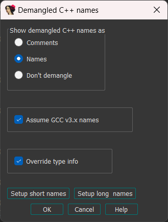.

#### Breaking the Behemoth
The string I chose to start with might not be the most interesting overall, but it is definetly the one which pissed me off yesterday the most - "Server returned secret". If this is some encryption I will crash out.

Xrefing from there I reached the following lovely function:
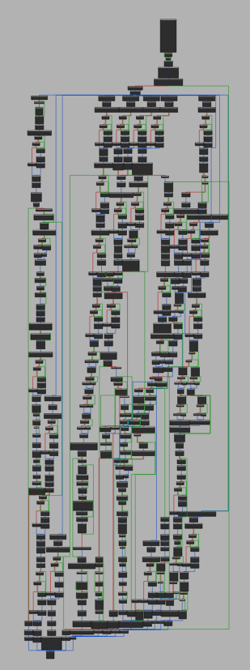

While this function is going to haunt me, it actually just seems to be a packet parser with a ton of inlined logic.
Fortunately, the developers left us some excellent clues 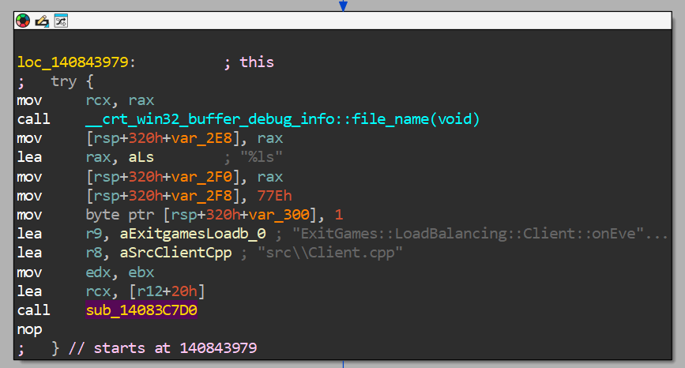

So this function is `ExitGames::LoadBalancing::Client::onEvent`. I renamed it, and checked where it is referenced.
There were three places, two of which seem to be for SEH or something, and one which is the vtable (Virtual Function Table) of `ExitGames::LoadBalancing::Client`. Jackpot.
Let's give some functions names.

> [!NOTE] Naming Functions
> The correct way to do this is definetly to write a quick IDA-Python script to search for strings which are passed to the logging functions (which we practically know) and rename the parent functions acordingly. With that said, I would rather shoot myself than write IDA-Python.
> We will instead go for the poor man's method of Ctrl+F-ing in the strings subview and searching for the class' full name 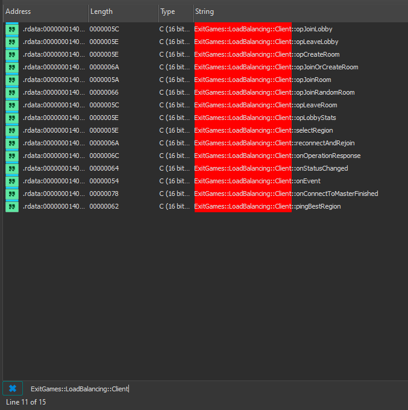
> From here we simply xref the string and make sure it only comes from one function 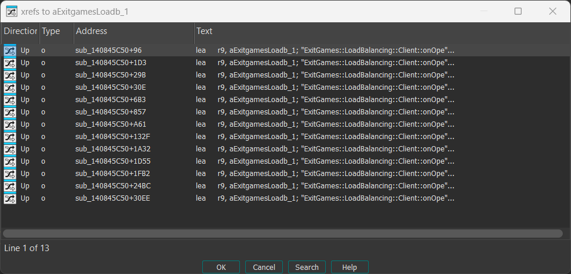.
> And we can now rename `sub_140845C50` to `ExitGames::LoadBalancing::Client::onOperationResponse`.
> Rinse and repeat.

Much better: 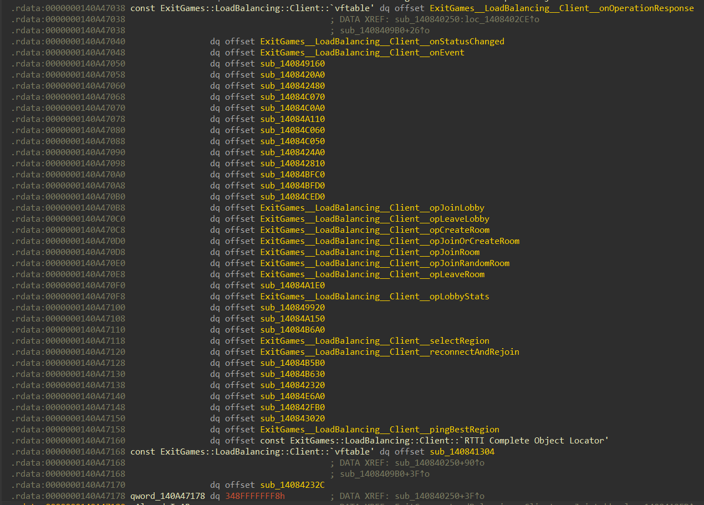

Just for the love of the game, I'll follow some string I saw along the way 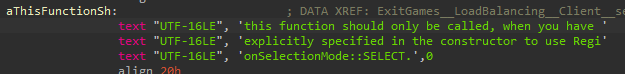
From here we can tell that 0x2B8 is the offset to a member in `ExitGames::LoadBalancing::Client` which has the type `RegionSelectionMode`.
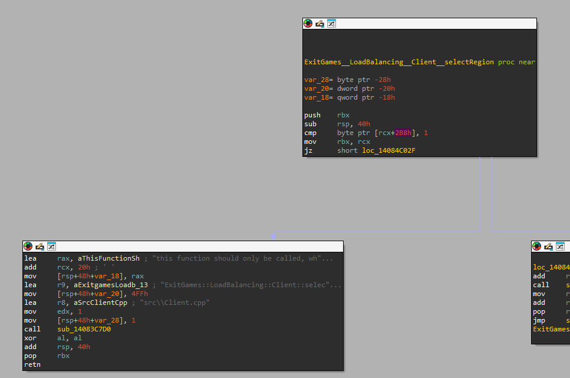
Let's create a type for this class and start giving members names.
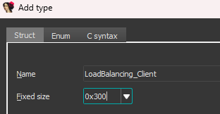
Ahh, retyping functions with `__thiscall`. Much much better. 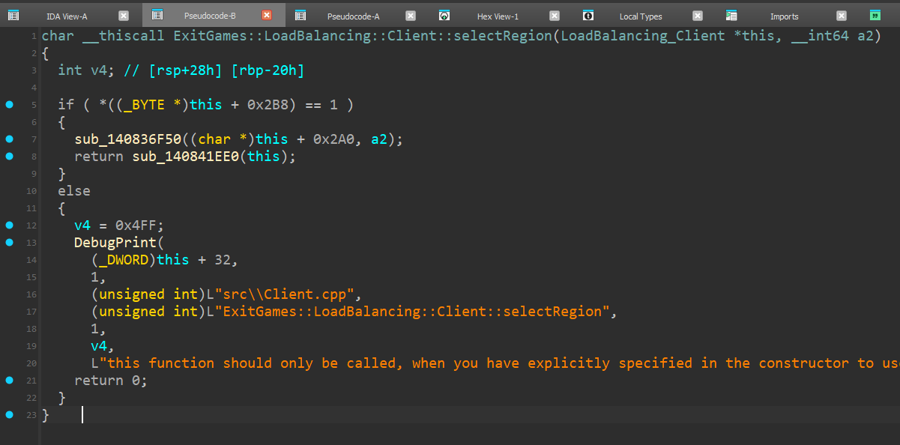

Just a few more types and the function already looks much more handsome: 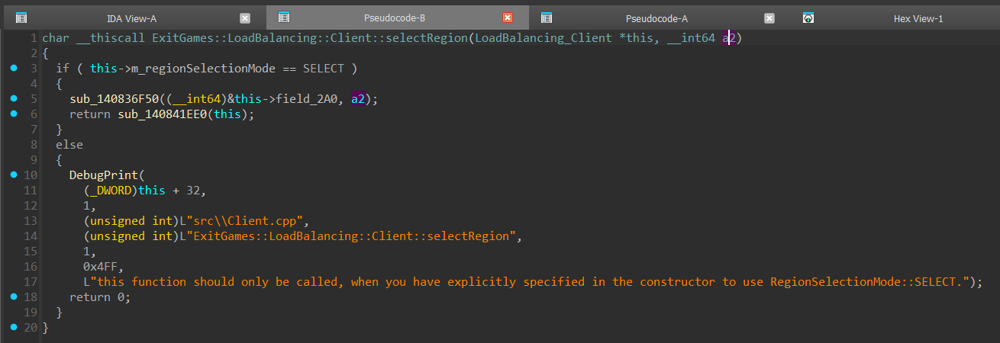

I jumped back into `onEvent` and am trying to name some of the local variables to make more sense of the function.

Some more dynamic debugging in `onOperationResponse` (found by xrefing the "server secret" string) I got to this state:
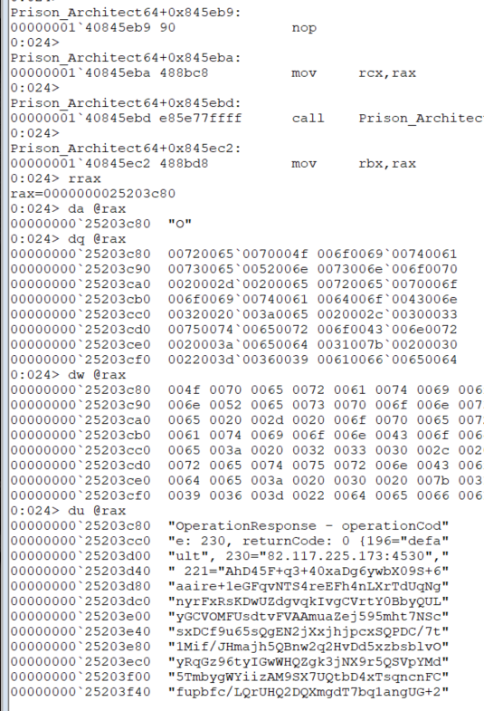

I want to peel off the encryption in my proxy server, so let's walk back and see which packets are passed before the encryption.

#### Learning to Read
Surprisingly, I did a lot of things rather than the simple act of openning my fucking eyes.
> [!IMPORTANT] Reading Documentation
> It is quite clear from the binary that an external library was used for much of the network communication - this library is "Photon".
> A quick Google search reveals that "Photon Engine" is a multiplayer game engine.
> A second search finds the [documentation](https://doc-api.photonengine.com/en/cpp/current/a12680.html) for the very functions I have been painstainkingly reversing.
> **Read the fucking docs**.

I downloaded the Windows C++ Realtime SDK. Let's see what we can do with it.

#### Forgetting How to Read
After downloading the SDK it does seem that the protocol is largely proprietary and I still do not have the source code.
After unsuccessfully trying to load the symbols from the SDK into IDA, I tried my luck at finding an on-premise Photon server.
This does exist, in C#, but is commercial and I am broke.
So back to the Python script it is! Only that now we are practically white-box reversing since we can write whatever client we want, and reverse the compiled libraries with symbols. Much more fun.

#### Working Dumber Not Harder
Instead of actually reversing this protocol, let's try our luck with vibe coding a decryption.
I convinced Gemini 3.1 Pro to help, so now I have my thirsty little retarded coworker. 

After findling with the demo projects from Photon's website, I got a vibe coded server to print the following:
```
Proxy listening on 127.0.0.1:4533
Client connected: ('127.0.0.1', 62341)
Connecting to ('<REDACTED>', 4533)

[C->S] Length: 48, Command: 0x0
 -> Init Request
[C->S] b'\xfb\x00\x00\x000\x00\x01\xf3\x00\x01\x06\x10P\x0e\x00\x006f869876bfbc491e8fff4210c966f145'

[S->C] Length: 10, Command: 0x1
 -> Init Response
[S->C] b'\xfb\x00\x00\x00\n\x00\x01\xf3\x01\x00'

[C->S] Length: 114, Command: 0x6
 -> Diffie-Hellman Request (Client Pub Key)
    Extracted Key (Hex): 8c216703611c5a913fa596bd95548fda920255c5f195d9b23b331e8c8b3143d40ed32e7ef984e5a0cbdf028f67a640c1c468b6eb2653db52b2c233854acc5135d3cd04d005d73dbf67d3747e83381e65c977e939859a1dffcc7bd6fcaa504933
[C->S] b'\xfb\x00\x00\x00r\x00\x01\xf3\x06\x00\x00\x01\x01x\x00\x00\x00`\x8c!g\x03a\x1cZ\x91?\xa5\x96\xbd\x95T\x8f\xda\x92\x02U\xc5\xf1\x95\xd9\xb2;3\x1e\x8c\x8b1C\xd4\x0e\xd3.~\xf9\x84\xe5\xa0\xcb\xdf\x02\x8fg\xa6@\xc1\xc4h\xb6\xeb&S\xdbR\xb2\xc23\x85J\xccQ5\xd3\xcd\x04\xd0\x05\xd7=\xbfg\xd3t~\x838\x1ee\xc9w\xe99\x85\x9a\x1d\xff\xcc{\xd6\xfc\xaaPI3'

[S->C] Length: 117, Command: 0x7
 -> Diffie-Hellman Response (Server Pub Key)
    Extracted Key (Hex): 6f3ce1a36336134509743589bbfc36ae98c6f1485edb1224484fd252ec1550b9233b4cc086c2c972fd8e07e2220619d6f1f3801211d34b9e2979dcb027fd6e3b61fb836f73be7aaa0e18f1c02a37c139f785c9db2f35b44e3e453f87d0b7f9f3
[S->C] b'\xfb\x00\x00\x00u\x00\x01\xf3\x07\x00\x00\x00*\x00\x01\x01x\x00\x00\x00`o<\xe1\xa3c6\x13E\tt5\x89\xbb\xfc6\xae\x98\xc6\xf1H^\xdb\x12$HO\xd2R\xec\x15P\xb9#;L\xc0\x86\xc2\xc9r\xfd\x8e\x07\xe2"\x06\x19\xd6\xf1\xf3\x80\x12\x11\xd3K\x9e)y\xdc\xb0\'\xfdn;a\xfb\x83os\xbez\xaa\x0e\x18\xf1\xc0*7\xc19\xf7\x85\xc9\xdb/5\xb4N>E?\x87\xd0\xb7\xf9\xf3'

[C->S] Length: 57, Command: 0x82
 -> [ENCRYPTED PAYLOAD] - Cannot deserialize without AES key.
[C->S] b'\xfb\x00\x00\x009\x00\x01\xf3\x82\x82L_^\xfa\x8e\x83\xfe\xde2\x8e\xf0\xae\x1d1\x92\x08MG\x8bG\x1a\x88\x17\xe4\xe0\xb5I\xf0?\xc9\xfe\xb5\xb4\xd6"^\xcf=\x91\xb4\x93\xe9?\x12\xfe\xd4"'

[S->C] Length: 153, Command: 0x83
 -> [ENCRYPTED PAYLOAD] - Cannot deserialize without AES key.
[S->C] b'\xfb\x00\x00\x00\x99\x00\x01\xf3\x83\x8f/=I\xefaV\xf5\xa4\xec\x06\xfcB+\x8c\x9d\xa2F\xcb\xc0\x14g\xff\xb5Ah\x94\xcc\xd6C\xe3\x06\xffC\x13\x8d\xc2\xfb\xb1(\x02^6\xd4\xaf\xd9!J\xd3\xf0\x96\xab\xc6z\xd2\x01\xd61\x87\xc2oW\xddA\x9a\xd9\xc8\xe59~yI\x05T\xaeZ\x05"\xf1q\xd3\xbe\xf4\x94a\xc8P\xec\x9f\xd5Lv\xb8D%\xe4\x82E\x90of\x12\xd7P\x08\xf5f: h7\x1d\xb5U\x7fo\x07\xd9\x0f}\x1f\xcc\xb4\xef&h\x9a\xb3\x17\x86~\xc7{z-\x84]\xcc{Q \xe38}'

[C->S] Length: 73, Command: 0x82
 -> [ENCRYPTED PAYLOAD] - Cannot deserialize without AES key.
[C->S] b'\xfb\x00\x00\x00I\x00\x01\xf3\x82\x83\xc3\x9e\xc6"\xdaA^\xc7w\xcdT\xac\xab\xa4\xa7\xe0\xad\r\x07I\xb2\xbbQ[\x8c\x8d\x17\x04\xd6\x00A\x03\xbb\xe7j\xb1\xcbW\r\xed\xc6%/;Z\xfb\xec\xde\x9e3F\x1e\xb1\xb3\x03\xd0b\x8bY\xef\xec\x19}'

[S->C] Length: 41, Command: 0x83
 -> [ENCRYPTED PAYLOAD] - Cannot deserialize without AES key.
[S->C] b'\xfb\x00\x00\x00)\x00\x01\xf3\x83la3\x14\x13l\xc8T\x0b0-\x0c\x16~\xd5\x9c$\xfbA\x98Gd\x08\xfc\xb0(\xeb\x1a\x0cGP\xd6'
```

This is a mssive win since we now hijack the DH key exchange, so we can potentially send our own keys (Gemini is currently "thinking" of how to find the derived IV, while I ponder if the client might have the same implementation as the server).
Once the packets are decrypted, hopefully our lives will be easier.

For now, some key insights regarding Prison Architect <-> Photon:

> [!IMPORTANT] Insights
> * Prison Architect uses Photon's TCP communication.
>   * The default port is used.
> * Prison Architect's app identifier for connecting to Photon's servers is `6f869876bfbc491e8fff4210c966f145`.
> * Prison Architect uses Photon's v6 serialization protocol (rather than v8).


> [!NOTE] Default Lobbies (Regions)
> Prison Architect's default lobbies are
> `["eu", "us", "usw", "asia", "au"] / ["<REDACTED>:4530", "<REDACTED>:4530", "<REDACTED>:4530", "<REDACTED>:4530", "<REDACTED>:4530"]`

To make sure I don't lose this later, the event codes of various commands are documented in [Photon's server documentation](https://doc-api.photonengine.com/en/server/current/namespace_photon_1_1_load_balancing_1_1_events.html#a899ae502016607daafc1f8f55c888923acdd92f595e5a61b64b668a399e88bf89)

#### Reversing Photon's SDK
After hitting a new roadblock with the encryption, I realised that I have Photon's full client SDK compiled as a Lib **with debug symbols**.
So let's try finding how the `Client::connect` is implemented and reverse the encryption from there.
After re-reading the logs produced by our mock client, I redirected my focues to `Client::onStatusChanged`
_Note that this is connecting to our **mock** server, which is currently **not** redirecting traffic, rather trying to handle it themselves._
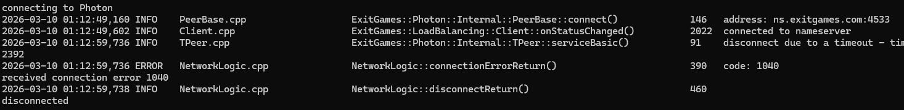

Looks like this is the code in the client SDK which is trriggering this print:
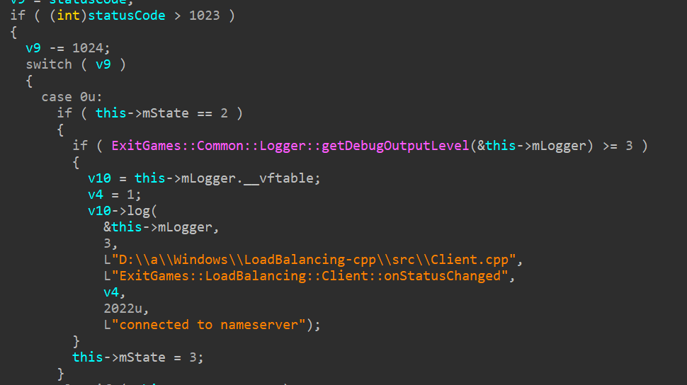

Let's debug this program and try figuring our what authentication voodoo is going on here.
I openned Windbg back up, this is the current state:
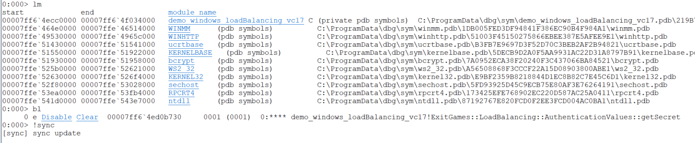

According to our breakpoint and the state we captured, it would seem that authentication happens after the init response is recieved (from our mock server) but without returning to our main client code!
Oh lord, here we goooo 
Going in deeper, looks like we found our encrypting culprit: 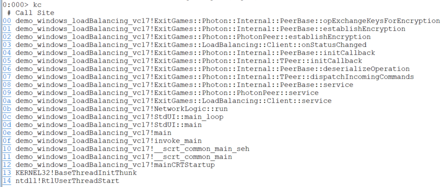
At least Gemini is proud of me  maybe we really did crack the key generation _this time_.
_We did not. Gemini is a fucking retard._
Anyway, here is a neat Windbg command to print the client's public key so that we can later make sure that we are actually deciphering it properly in the mock server. `db /c 60 poi(pPublicKey) L60`

Good news is that we are reading the client key properly: 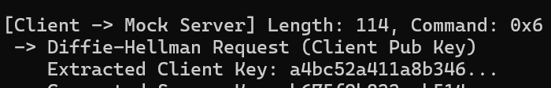 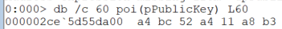

Full Windbg command for all the fun
```
.load C:\Users\mkupe\Code\ret-sync\ext_windbg\sync\x64\Release\sync.dll ;
.reload /f ;
bp ExitGames::Photon::Internal::PeerBase::opExchangeKeysForEncryption ;
bp ExitGames::Photon::Internal::PeerBase::opExchangeKeysForEncryption+0x12c "db /c 60 poi(pPublicKey) L60 ; gc ;"
bp ExitGames::LoadBalancing::Client::onStatusChanged ;
```

We managed to handle the key exchange properly for once, and now have a client building a `opGetRegions` request.
At this exact point, we have the request parameters unencrypted, and the encryption argument is set to `true`, so we are stepping into some final encryption function. 
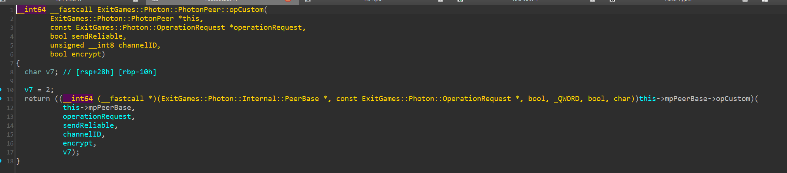

Fuck yeah!
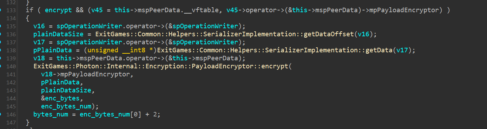


This is the decrypted data:
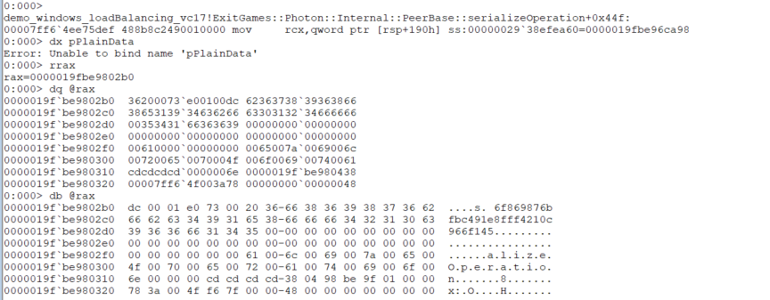
which we read right before the call to `ExitGames::Photon::Internal::Encryption::PayloadEncryptor::encrypt`

Let's add the following breakpoint in the future:
```
bp ExitGames::Photon::Internal::Encryption::PayloadEncryptor::encrypt+0x6a "db /c 20 @@(this->mhEncryptKey) L20"
```
This should show us the AES key the client uses for the encryption.
_This actually shows the **HANDLE** to the key, not the key_

**FUCK YES!**
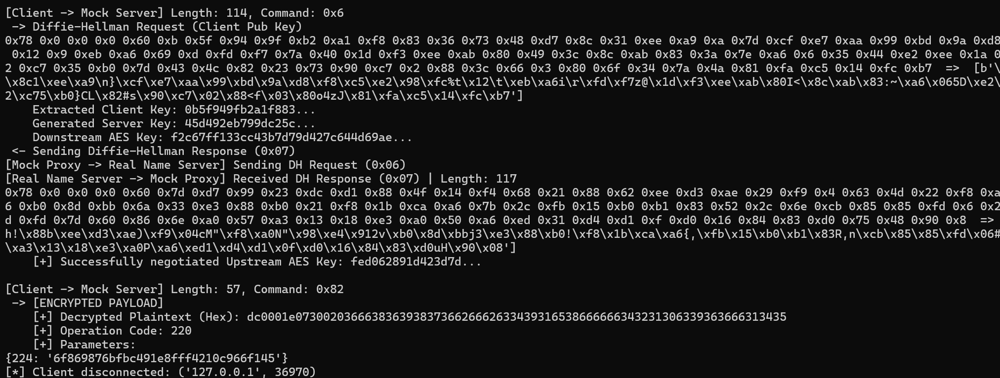

To actually see the aes key:
```
bp BCryptGenerateSymmetricKey ".printf \"AES Key: \\n\" ; dx (unsigned char[0x20])(*(unsigned char**)(@rsp+0x28)) ; gc ;"
```

#### Fixing My Proxy Server

Let's find out why the client crashes when deserializing my `GetRegions` response.

This will show us the raw operation response data the client will deserialize:
```
bp ExitGames::Photon::Internal::PeerBase::deserializeOperationResponse+0xc2 "db poi(decryptedResponseData)"
```

#### Proxy Server Final Touches
After fixing some flaws and rigorously guessing headers, this is the (tail of the) flow when proxying **the real game** through our server.
The client eventually disconnect in favor of connecting to the "MasterServer" rather than our "NameServer".
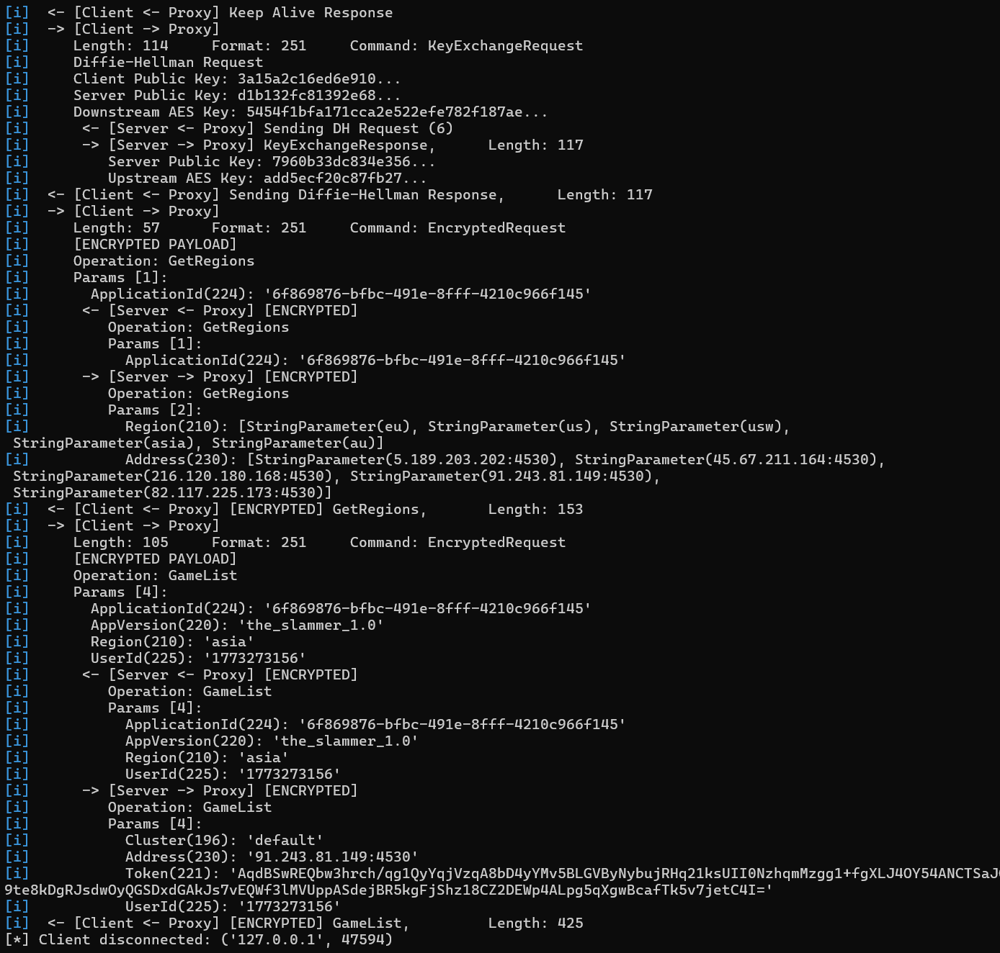 

#### Hijacking Packets
Implementing the entire name server is kind of a bummer, so for now we will simply be hijacking the specific fields we need in order to redirect the game to localhost as the "MasterServer".
After switching the IPs, we get a successful hit on the "MasterServer" (game server) port `4530`!
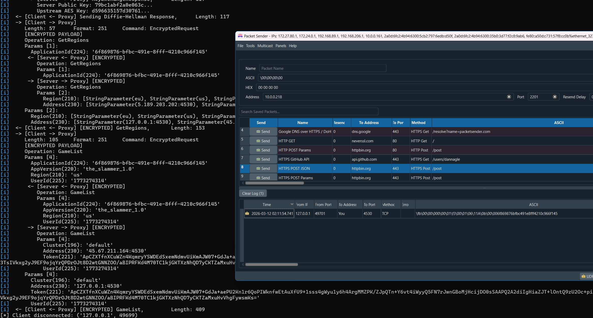

#### Hijacking Packet on the Master Server
After refactoring the code two more times and rewritting everything with asynchronous threads, we can now not only read any packet, but also inject/hijack/alter packets either to/from the name server or to/from the master server (regional server).
The dashboard looks like this:
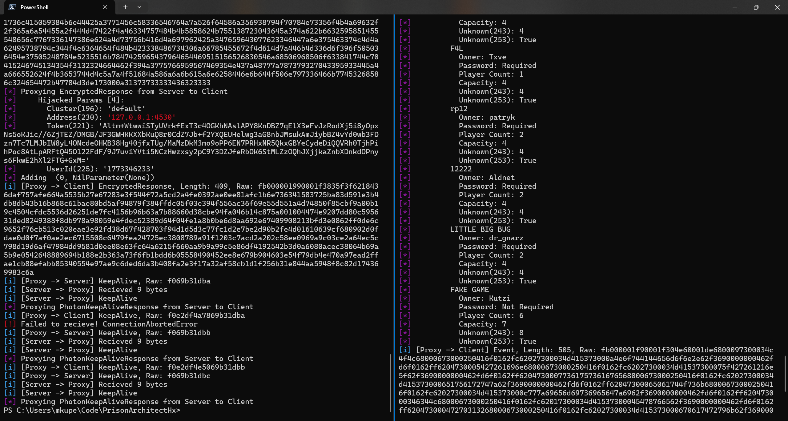
And this is our Fake Game - with an immpossible capacity of 7 players.
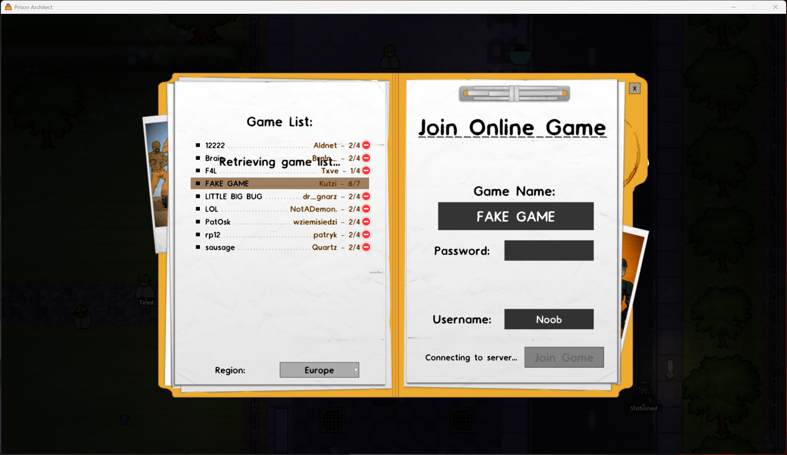

#### Fuck me there is a third server :(
I connected to a real game someone left open (without password requirement), and unforntunately it seems that we are redirected to some server at port 4531...
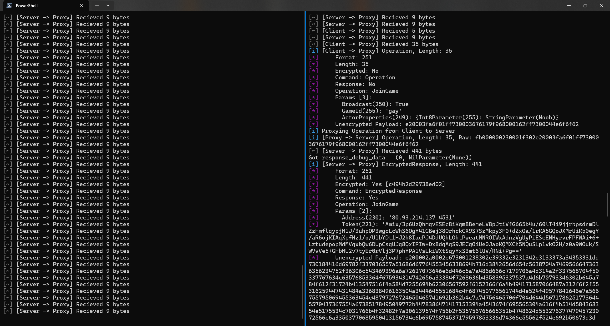

Apparently I could have known this if I actually read the documentation...
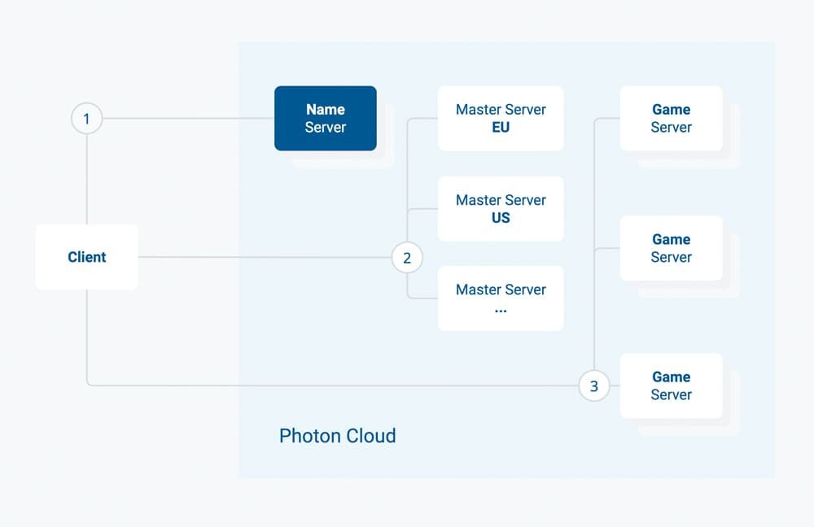

... So let's hijack this response too! (I literally hate everything right now)

#### Hijacking the Game Server
In retrospect, "Master Server" really does sound like a parent layer to the actual "Game Server".

To fiddle around with a game server more freely, I'm trying to create my own game.
This sort of seems to be working, but something is still broken.
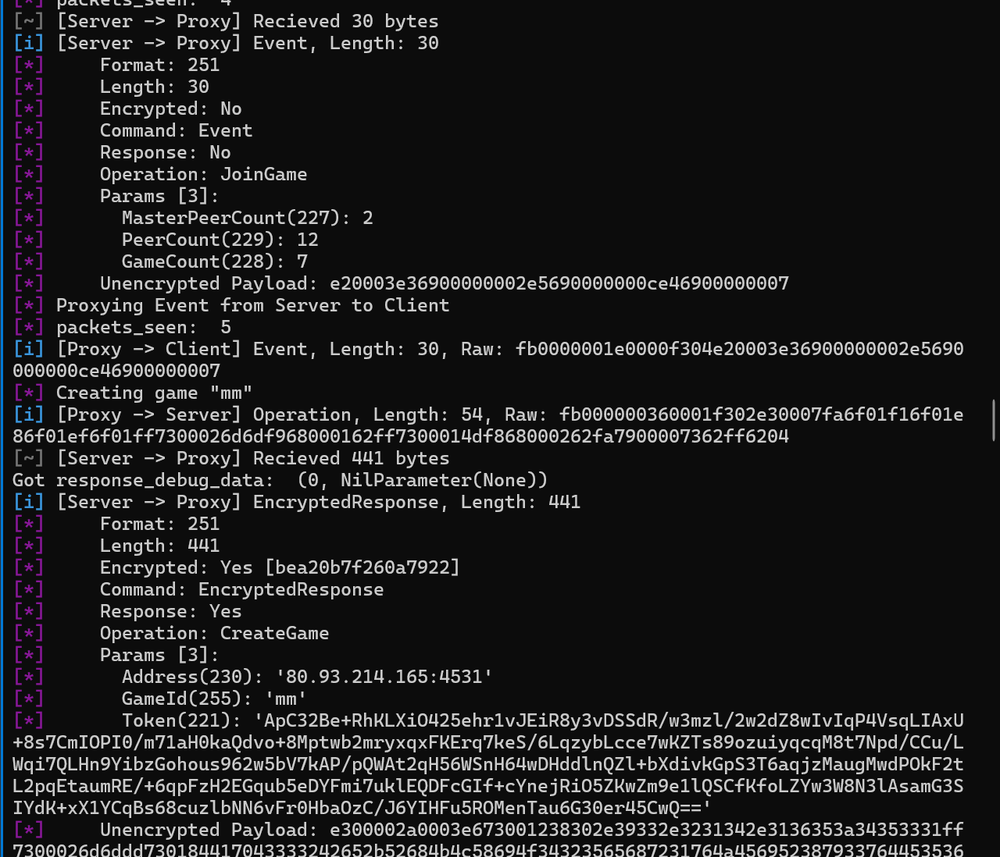

> [!IMPORTANT] Info Leak?
> An interesting find is that even if we enter the incorrect password, we get the names and player ids of the people joined to a game.
> 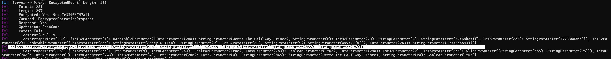

Although we seem to be recieving "world" and "intake" information, we eventually get kicked:
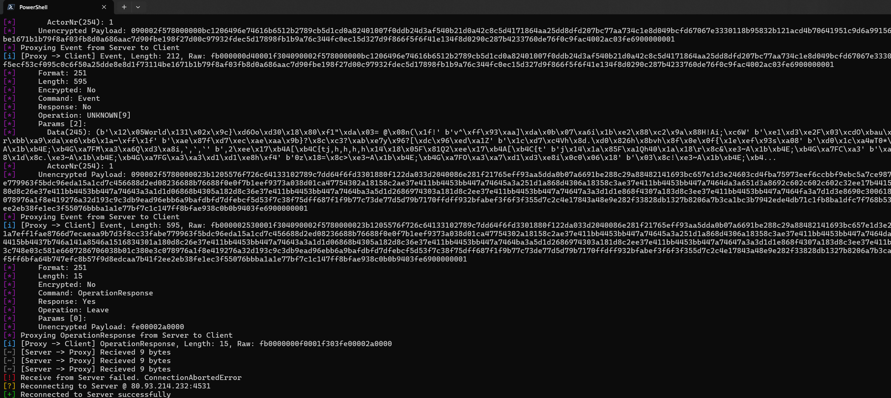

I gave up on trying to cheat my way into a game, so I openned Prison Architect on another user and went online from there.
I got stuck on the loading screen forever, with two silly packets cycling between them.
After debugging a little, I changed the packet downstream-upstream flow to flush the packets on each end all the time, instead of doing one here one there.
This brought the following abomination:
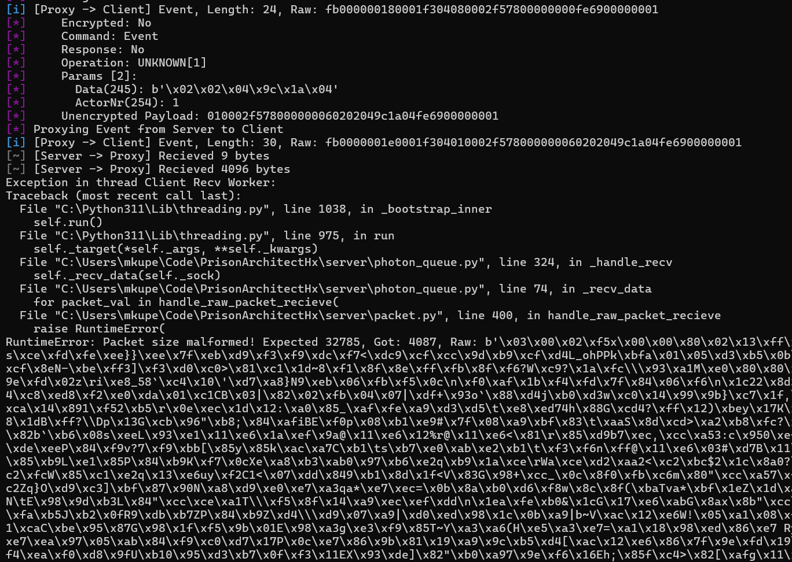

After fixing the TCP fragmentation issue, we successfully connected to our own game through the proxy!
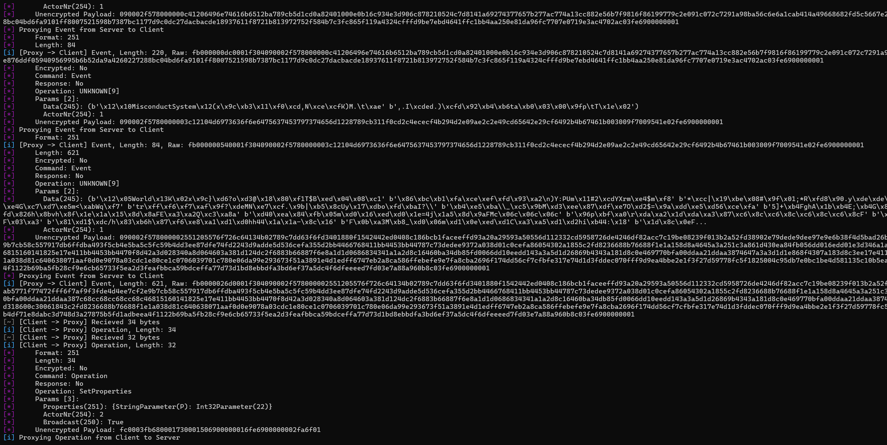

Now finally we can create our own game through the proxy and see what must be done.
Connecting is a bit of a pain, since each time we create a game, it gets assigned to a random (probably not random) game server.
Currently, I have the MasterServer wait for me to see which GameServer was selected, and then manually set that as the upstream of the GameServer proxy.
<details>
<summary>Nevertheless, here is the initial "CreateGame" connection logs:</summary>

```
[~] [Client -> Proxy] Recieved 404 bytes
[i] [Client -> Proxy] Operation, Length: 404
[*]     Format: 251
[*]     Length: 404
[*]     Encrypted: No
[*]     Command: Operation
[*]     Response: No
[*]     Operation: GameList
[*]     Params [1]:
[*]       Token(221): '<REDACTED_BASE64_TOKEN>'
[*]     Unencrypted Payload: e60001dd730184416a2b394d59664b4472724e36642f5852504967505736536735306e53797261724f6e62356e2b2f6130672f39465261663756497a4f35414270544b3368337a686d2b464377776d676c55474f45457942414e6c6754704852426a586e4253562b742b41414262494b7441635246383263356272703073544248794f676c506a4c634a613572794f324e3343576a4a35744e6874497a4b71376b48556a612f4b396c6f6e506850416c737936616d363674417152316a59647a6e514f63676d4e4e44784534557167555a466a585970716a5534584d6534486a6f5337735844302f6755636648455a49392b66547171664371556b3872694e65794d4e69596a717239455234354a742b6d4b5155454741317a32743153382b435759546e446b4c61504732586c63306c776f632f496e644972684d4e4a4e39304765655761694c4d5938784576717964507652774c4e564f4852522f37714a4a772f6d7046623975546a5337312f315343695034466b7a53524a566c464c6e364c3572493956764e413d3d
[i] Proxying Operation from Client to Server
[i] [Proxy -> Server] Operation, Length: 404, Raw: fb000001940001f302e60001dd730184416a2b394d59664b4472724e36642f5852504967505736536735306e53797261724f6e62356e2b2f6130672f39465261663756497a4f35414270544b3368337a686d2b464377776d676c55474f45457942414e6c6754704852426a586e4253562b742b41414262494b7441635246383263356272703073544248794f676c506a4c634a613572794f324e3343576a4a35744e6874497a4b71376b48556a612f4b396c6f6e506850416c737936616d363674417152316a59647a6e514f63676d4e4e44784534557167555a466a585970716a5534584d6534486a6f5337735844302f6755636648455a49392b66547171664371556b3872694e65794d4e69596a717239455234354a742b6d4b5155454741317a32743153382b435759546e446b4c61504732586c63306c776f632f496e644972684d4e4a4e39304765655761694c4d5938784576717964507652774c4e564f4852522f37714a4a772f6d7046623975546a5337312f315343695034466b7a53524a566c464c6e364c3572493956764e413d3d
[~] [Server -> Proxy] Recieved 15 bytes
[i] [Server -> Proxy] OperationResponse, Length: 15
[*]     Format: 251
[*]     Length: 15
[*]     Encrypted: No
[*]     Command: OperationResponse
[*]     Response: Yes
[*]     Operation: GameList
[*]     Params [0]:
[*]     Unencrypted Payload: e600002a0000
[*] Proxying OperationResponse from Server to Client
[*] server_type ServerType.GameServer
[i] [Proxy -> Client] OperationResponse, Length: 15, Raw: fb0000000f0001f303e600002a0000
[~] [Client -> Proxy] Recieved 115 bytes
[i] [Client -> Proxy] Operation, Length: 115
[~] [Server -> Proxy] Recieved 9 bytes
[*]     Format: 251
[*]     Length: 115
[*]     Encrypted: No
[*]     Command: Operation
[*]     Response: No
[*]     Operation: CreateGame
[*]     Params [7]:
[*]       ActorProperties(249): {Int8Parameter(255): StringParameter(Noob), StringParameter(P): Int32Parameter(3), StringParameter(C): StringParameter(0xbeb1c5ff)}
[*]       Broadcast(250): True
[*]       GameProperties(248): {Int8Parameter(255): Int8Parameter(4), Int8Parameter(250): SliceParameter([StringParameter(MAS), StringParameter(PA)]), StringParameter(MAS): StringParameter(Noob), StringParameter(PA): BooleanParameter(True)}
[*]       DeleteCacheOnLeave(241): True
[*]       UNKNOWN[232](232): True
[*]       GroupsForRemove(239): True
[*]       GameId(255): 'YAAAA'
[*]     Unencrypted Payload: e30007f96800037300015069000000037300014373000a3078626562316335666662ff7300044e6f6f62fa6f01f86800047300034d41537300044e6f6f6273000250416f0162ff620462fa7900027300034d415300025041f16f01e86f01ef6f01ff7300055941414141
[i] Proxying Operation from Client to Server
[i] [Proxy -> Server] Operation, Length: 115, Raw: fb000000730001f302e30007f96800037300015069000000037300014373000a3078626562316335666662ff7300044e6f6f62fa6f01f86800047300034d41537300044e6f6f6273000250416f0162ff620462fa7900027300034d415300025041f16f01e86f01ef6f01ff7300055941414141
[~] [Server -> Proxy] Recieved 121 bytes
[i] [Server -> Proxy] EncryptedOperationResponse, Length: 121
[~] [Server -> Proxy] Recieved 89 bytes
[i] [Server -> Proxy] EncryptedEvent, Length: 89
[*]     Format: 251
[*]     Length: 121
[*]     Encrypted: Yes [41bf7fe8f1661b06]
[*]     Command: EncryptedOperationResponse
[*]     Response: Yes
[*]     Operation: CreateGame
[*]     Params [4]:
[*]       ActorNr(254): 1
[*]       GameProperties(248): {Int8Parameter(253): BooleanParameter(True), Int8Parameter(254): BooleanParameter(True), Int8Parameter(255): Int8Parameter(4), Int8Parameter(245): Int32Parameter(0), Int8Parameter(246): Int32Parameter(0), Int8Parameter(243): Int32Parameter(4), Int8Parameter(250): SliceParameter([StringParameter(MAS), StringParameter(PA)]), Int8Parameter(248): Int32Parameter(1), StringParameter(PA): BooleanParameter(True), StringParameter(MAS): StringParameter(Noob)}
[*]       Actors(252): [Int32Parameter(1)]
[*]       AuthMode(191): 11
[*]     Unencrypted Payload: e300002a0004fe6900000001f868000a62fe6f0162fd6f0173000250416f017300034d41537300044e6f6f6262f8690000000162f6690000000062f5690000000062f3690000000462fa7900027300034d41530002504162ff6204fc7900016900000001bf690000000b
[*] Proxying EncryptedOperationResponse from Server to Client
[*] server_type ServerType.GameServer
[*]     Format: 251
[*]     Length: 89
``` 
</details>

<details>
<summary>Some more event data:</summary>

```
[i] [Proxy -> Client] OperationResponse, Length: 15
[i] [Client -> Proxy] Operation, Length: 108
[i] [Client -> Proxy] Operation, Length: 326
[i] [Client -> Proxy] Operation, Length: 1059
[i] [Client -> Proxy] Operation, Length: 182
[i] [Client -> Proxy] Operation, Length: 65
[i] [Client -> Proxy] Operation, Length: 126
[i] [Client -> Proxy] Operation, Length: 104
[i] [Client -> Proxy] Operation, Length: 135
[i] [Client -> Proxy] Operation, Length: 778
[i] [Client -> Proxy] Operation, Length: 962
[i] [Client -> Proxy] Operation, Length: 113
[i] [Client -> Proxy] Operation, Length: 246
[i] [Client -> Proxy] Operation, Length: 288
[i] [Client -> Proxy] Operation, Length: 83
[i] [Client -> Proxy] Operation, Length: 77
[i] [Client -> Proxy] Operation, Length: 62
[i] [Client -> Proxy] Operation, Length: 249
[i] [Server -> Proxy] OperationResponse, Length: 15
[i] [Client -> Proxy] Operation, Length: 19090
[i] [Client -> Proxy] Operation, Length: 151
[i] [Client -> Proxy] Operation, Length: 254
[i] [Client -> Proxy] Operation, Length: 69
[i] [Client -> Proxy] Operation, Length: 2282
[*]     Format: 251
[*]     Length: 108
[*]     Encrypted: No
[*]     Command: Operation
[*]     Response: No
[*]     Operation: RaiseEvent
[*]     Params [2]:
[*]       Data(245): (b'\x12\nPlayerData\x12Ix\x9c\xb3\xe1\n\xc8I\xacL-rI,Id`\xb4a4dc.\xd0\xab`b' b'\x00\x02 \xa3\x12\xcc`\xc9\x82\t\x81X0\xb1b\xb8X1T\x8c\xd1\x86\xd9+' b'?\x89\x91%\xa4\xb2 \x95\xf1?\x100\xd8\xd9\xd9\x01\...
[*]       Code(244): 9
[i] Proxying Operation from Client to Server
[*]     Format: 251
[i] [Proxy -> Server] Operation, Length: 108
[*]     Length: 326
[*]     Encrypted: No
[*]     Command: Operation
[*]     Response: No
[*]     Operation: RaiseEvent
[*]     Params [2]:
[*]       Data(245): (b'\x12\x08CellData\x13$\x01x\x9c\xb3\xe1pN\xcd\xc9qI,Id`\xb4\x81\xb3\x19Y' b'\x823\xabR\x19Y\x19\x18\x18XmX\xa33\x15\x0cb\x85\x19+\x18\xad\x81|\xc6JF\x16' b' \xc5\xec\x9bX\xc2\xc2\xe2\x92YT\xc2\x06d\...
[*]       Code(244): 9
[i] Proxying Operation from Client to Server
[*]     Format: 251
[i] [Proxy -> Server] Operation, Length: 326
[*]     Length: 1059
[*]     Encrypted: No
[*]     Command: Operation
[*]     Response: No
[*]     Operation: RaiseEvent
[*]     Params [2]:
[*]       Data(245): (b'\x12\nObjectData\x13\xff\x03x\x9c\xed\x98\xbbn\x1bG\x14@w\x96\\' b'\xc5\x8f\xc4\x96;\x17.\x82|\x00\xc1\x9d}\xd2\x96e\xf9!8\x14!(\xca\xe3' b'\x03\xd6\xcb\xb5\xb9\x02C\xc9\xdc%lw\x82\xab\x00i\x82\xa4...
[*]       Code(244): 9
[i] Proxying Operation from Client to Server
[*]     Format: 251
[*]     Length: 182
[*]     Encrypted: No
[i] [Proxy -> Server] Operation, Length: 1059
[*]     Command: Operation
[*]     Response: No
[*]     Operation: RaiseEvent
[*]     Params [2]:
[*]       Data(245): (b'\x12\x08RoomData\x12\x95x\x9c\xcd\x8eA\n\xc20\x10EgRj+"x\x12\xd1}\xc8' b'F\xb7"\x08\xaeuh\xc6\x12\xda\xa4!M{}\x1d\xbb\xf1\n\xfe\xc5\xf0\xde[' b'\x8d\xaeo\xc3\xe0\xcf\x94\tPW\xf7h)\xf3\x08J\xe3a\xa3...
[*]       Code(244): 9
[i] Proxying Operation from Client to Server
[*]     Format: 251
[i] [Proxy -> Server] Operation, Length: 182
[*]     Length: 65
[*]     Encrypted: No
[*]     Command: Operation
[*]     Response: No
[*]     Operation: RaiseEvent
[*]     Params [2]:
[*]       Data(245): (b'\x12\tBridgeMap\x12\x1fx\x9c\xb3\xe1t*\xcaLIO\xf5M,``\xb4a\x87p' b'\x8a\x19\x18\xec\xec\x00d\xd2\x071\x1a\x02')
[*]       Code(244): 9
[i] Proxying Operation from Client to Server
[*]     Format: 251
[*]     Length: 126
[i] [Proxy -> Server] Operation, Length: 65
[*]     Encrypted: No
[*]     Command: Operation
[*]     Response: No
[*]     Operation: RaiseEvent
[*]     Params [2]:
[*]       Data(245): (b'\x12\x12ConstructionSystem\x12Sx\x9c\xb3\x11r\xce\xcf+.)*M.\xc9' b'\xcc\xcf\x0b\xae,.I\xcde\xe4r,-\xc9\xf7\xc9L\xcf()fed\xb6a\xf1\xcaO*fd\t' b'\xce\xacJed\x00\x01;\x1b\xa6\x82,\x10\xc5\xe3\x94\x93\...
[*]       Code(244): 9
[i] Proxying Operation from Client to Server
[*]     Format: 251
[i] [Proxy -> Server] Operation, Length: 126
[*]     Length: 104
[*]     Encrypted: No
[*]     Command: Operation
[*]     Response: No
[*]     Operation: RaiseEvent
[*]     Params [2]:
[*]       Data(245): (b'\x12\nContraband\x12Ex\x9c-\xc81\n\x800\x14\x04\xd1\xf0K\x9b\\%jJI\xe3I"' b'[Gq\xbd?\n\xce4\x0ff\x9b\xf6s<w?\xfaP\x0e\x97H_q\xa1\xd03\x1f\x85^\xf8(\xf4' b'\xcaG\xa1+\x1f\xf5\x9b\xda\x0b\x96\x10\x0e...
[*]       Code(244): 9
[i] Proxying Operation from Client to Server
[*]     Format: 251
[i] [Proxy -> Server] Operation, Length: 104
[*]     Length: 135
[*]     Encrypted: No
[*]     Command: Operation
[*]     Response: No
[*]     Operation: RaiseEvent
[*]     Params [2]:
[*]       Data(245): (b'\x12\tExecution\x12ex\x9c-\xc7A\x0e@0\x10@\xd11\xc9H\x1c\xc05\xa4\xb4' b'\xe8B$\x16N\x82\xc5lh\xa2\x15\xb7\xc7\xc8\xfc\xd5\x7fC1\xdf\xdb\x92"\x1f' b'{\x99OK\xe4k#\xa0\xc0k\xc5\xd9\xf3\xf5o\xfa\x17\...
[*]       Code(244): 9
[i] Proxying Operation from Client to Server
[*]     Format: 251
[i] [Proxy -> Server] Operation, Length: 135
[*]     Length: 778
[*]     Encrypted: No
[*]     Command: Operation
[*]     Response: No
[*]     Operation: RaiseEvent
[*]     Params [2]:
[*]       Data(245): (b'\x12\x07Finance\x13\xe9\x02x\x9c]S\xdbR\xd4@\x10M\xd8U\xf0\x82\xa8\xa5' b'~\x06\x05\xe1j\x15%\x85\x0b\x0b\x14\xc2R\x0b\x05\xe5\x93\xd5Iz7SLf' b'\xe2d\xb2\xb0o>\xfa\t>\xfa\t~\x8a\x8f>\xfa\t|\x80eL&\...
[*]       Code(244): 9
[i] Proxying Operation from Client to Server
[*]     Format: 251
[i] [Proxy -> Server] Operation, Length: 778
[*]     Length: 962
[*]     Encrypted: No
[*]     Command: Operation
[*]     Response: No
[*]     Operation: RaiseEvent
[*]     Params [2]:
[*]       Data(245): (b'\x12\x06Grants\x13\xa2\x03x\x9c\xb5\xd8\xddN\xdb0\x14\x07\xf0&\xa5p\xb1M\x82' b'\xc1\x18\xfbx\x08\x9a\xa6\x03$\x844\x180$\xd8\xaa\xa6\x1a\x97\xc8MNZ\x8b' b'\xd4\xae\x8e\x9d\xb2>\xee\xde`o\xb09v\n\x...
[*]       Code(244): 9
[i] Proxying Operation from Client to Server
[*]     Format: 251
[i] [Proxy -> Server] Operation, Length: 962
[*]     Length: 113
[*]     Encrypted: No
[*]     Command: Operation
[*]     Response: No
[*]     Operation: RaiseEvent
[*]     Params [2]:
[*]       Data(245): (b'\x12\x12GuardInvestigation\x12Fx\x9c\xb3\x11r/M,J\xf1\xcc+K-.\xc9LO' b',\xc9\xcc\xcfccN\xcfLde`\xce+Igd\x00\x02\xa6\xbcd\x08]\\\xc2\x04\xa2Y\x1333' b'\xf52\x19\xff\x03\x01\x98Y\nf2\xd8\x01\x00:\xc2...
[*]       Code(244): 9
[i] Proxying Operation from Client to Server
[*]     Format: 251
[i] [Proxy -> Server] Operation, Length: 113
[*]     Length: 246
[*]     Encrypted: No
[*]     Command: Operation
[*]     Response: No
[*]     Operation: RaiseEvent
[*]     Params [2]:
[*]       Data(245): (b'\x12\x06Intake\x12\xd7x\x9c\xb5\xd2K\n\xc20\x10\x06\xe0\x99Xcq\xe5\x81J' b']X\x10A\x8b\xb6^`\xa8\xa3\x065\x914E\xbd\xa3\xde\xc1\x1bx\x05k\x0b>\x16n\x94' b'n2\x99\x84|\x7f\x16\x13\xc8\x91v\xb4\xe1\x...
[*]       Code(244): 9
[i] Proxying Operation from Client to Server
[*]     Format: 251
[i] [Proxy -> Server] Operation, Length: 246
[*]     Length: 288
[*]     Encrypted: No
[*]     Command: Operation
[*]     Response: No
[*]     Operation: RaiseEvent
[*]     Params [2]:
[*]       Data(245): (b'\x12\x10MisconductSystem\x12\xf7x\x9c\xb5\x94\xddj\xc3 \x18@M\x9a' b"\x94\xd0\x8b\xb0'\x191\xfd\xd9\x06\x92\x9b\xdc\xb6##\xf4\x01\xc4H#K\xb5\xe8" b'\x17Z\xdf\xba\x8f\xb0\xfct\x1b\xbd*-\xd5\xab\xc3\...
[*]       Code(244): 9
[i] Proxying Operation from Client to Server
[*]     Format: 251
[i] [Proxy -> Server] Operation, Length: 288
[*]     Length: 83
[*]     Encrypted: No
[*]     Command: Operation
[*]     Response: No
[*]     Operation: RaiseEvent
[*]     Params [2]:
[*]       Data(245): (b'\x12\x11NeedsDistribution\x12)x\x9c\xb3\x11\xf4KMM)v\xc9,.)\xcaL*-\xc9' b'\xcc\xcfc`\xb4a,\x00\x11\x06\x0c\x0cvvv\x00\xbb\x1e\t\x13"\x02')
[*]       Code(244): 9
[i] Proxying Operation from Client to Server
[*]     Format: 251
[i] [Proxy -> Server] Operation, Length: 83
[*]     Length: 77
[*]     Encrypted: No
[*]     Command: Operation
[*]     Response: No
[*]     Operation: RaiseEvent
[*]     Params [2]:
[*]       Data(245): (b'\x12\x0cPatrolSystem\x12(x\x9c\xb3\xe1\tH,)\xca\xcf\t\xae,.I\xcde`\xb4\xe1' b'\x08.I,\xc9\xcc\xcf+f`\xb0\xb3\x03\x00\x97\xdc\tV\x1e\x02')
[*]       Code(244): 9
[i] Proxying Operation from Client to Server
[*]     Format: 251
[i] [Proxy -> Server] Operation, Length: 77
[*]     Length: 62
[*]     Encrypted: No
[*]     Command: Operation
[*]     Response: No
[*]     Operation: RaiseEvent
[*]     Params [2]:
[*]       Data(245): (b'\x12\tRatSystem\x12\x1cx\x9c\xb3\xe1\x0cJ,\t\xae,.I\xcded,ad\x00\x01;\x00@' b')\x04\xa7\x15\x02')
[*]       Code(244): 9
[i] Proxying Operation from Client to Server
[*]     Format: 251
[i] [Proxy -> Server] Operation, Length: 62
[*]     Length: 249
[*]     Encrypted: No
[*]     Command: Operation
[*]     Response: No
[*]     Operation: RaiseEvent
[*]     Params [2]:
[*]       Data(245): (b'\x12\x08Research\x12\xd8x\x9c=\xceKjBQ\x10\x84\xe1\x83W!\x9b\tx\xaa\xfa\xbe' b'@t\x0f\x0e\x9c\x8b\x112\xd6\r\xb8\xf4hW\xba&\xdd\xd4?\xfa\x0e_\xe7\xfb' b'\xf3~}\xdc~/\xc3\xfe\xfbg\xd7\xde\xf7\xb1i\x...
[*]       Code(244): 9
[i] Proxying Operation from Client to Server
[*]     Format: 251
[i] [Proxy -> Server] Operation, Length: 249
[*]     Length: 19090
[*]     Encrypted: No
[*]     Command: Operation
[*]     Response: No
[*]     Operation: RaiseEvent
[*]     Params [2]:
[*]       Data(245): (b'\x12\x0cSectorSystem\x13lJx\x9c\x85\xd7O\xaev]~\xdf\xe5z_\xbb\x84' b'\x10a\x08\x08\xc4\x00\xa2Z\xbf\xbfkIV\x84\x92\x1e\x1d\x1a\xee\x81' b'\xd2\x08\x15\x03FN\x8c\\\x8e\x94\xd0b@\xcc\x8110"\xd8\x8f\x...
[*]       Code(244): 9
[i] Proxying Operation from Client to Server
[*]     Format: 251
[i] [Proxy -> Server] Operation, Length: 19090
[*]     Length: 151
[*]     Encrypted: No
[*]     Command: Operation
[*]     Response: No
[*]     Operation: RaiseEvent
[*]     Params [2]:
[*]       Data(245): (b'\x12\x0bThermometer\x12sx\x9c5\xccM\x0e@0\x10\x86\xe1*V\xce\xe0\x0e\xed' b'\xa8\xbfD$\x9c\xc1\r\xa4\x89M#)\xee\xe8X\xc4\xf7\x99\xcd33\x8bw(' b'\x96\xcd\xc7\xb0\x07\x7f\xfaX&\xa7V\xef\xa4q_\xbfE\xc7...
[*]       Code(244): 9
[i] Proxying Operation from Client to Server
[*]     Format: 251
[i] [Proxy -> Server] Operation, Length: 151
[*]     Length: 254
[*]     Encrypted: No
[*]     Command: Operation
[*]     Response: No
[*]     Operation: RaiseEvent
[*]     Params [2]:
[*]       Data(245): (b'\x12\rVictorySystem\x12\xd8x\x9c\x8d\x93K\x0e\x820\x10\x86\xe9\x00\x1b\x13/' b'\xe0!\x8cS\xdf\ta\xed\xca\r\x86=\x81bH\xe4\x11\xa8\x89\xdc\xd4cx\x03' b'\xe4!\xb2#\xffl\xfaw\xf2uf\xf1\xa5\xce\xd2OB\x...
[*]       Code(244): 9
[i] Proxying Operation from Client to Server
[*]     Format: 251
[i] [Proxy -> Server] Operation, Length: 254
[*]     Length: 69
[*]     Encrypted: No
[*]     Command: Operation
[*]     Response: No
[*]     Operation: RaiseEvent
[*]     Params [2]:
[*]       Data(245): (b'\x12\nVisitation\x12"x\x9c\xb3\xe1\n\xcb,\xce,I,\xc9\xcc\xcfcb,g' b'd\x00\x02\xc6D0\xc5`\x07\x00o\xd2\x05\x8d\x1d\x02')
[*]       Code(244): 9
[i] Proxying Operation from Client to Server
[*]     Format: 251
[i] [Proxy -> Server] Operation, Length: 69
[*]     Length: 2282
[*]     Encrypted: No
[*]     Command: Operation
[*]     Response: No
[*]     Operation: RaiseEvent
[*]     Params [2]:
[*]       Data(245): (b'\x12\x05World\x13\xcb\x08x\x9c\xcdXKo\xe3\xc8\x11&mi=\x96\x9f\xe3\xf1\xcc' b'd\x90\x99\x8dr\xcbi\xa1\x07EJ\x80\xe3YK\xb2=J\xfcZ\xcb\x1e\xef\x03' b'\x0b\xa3M\xb6\xe4\x8e\xc9n\xa6I\xdaV\x10\x04\xf3+\...
[*]       Code(244): 9
[i] Proxying Operation from Client to Server
[*]     Format: 251
[i] [Proxy -> Server] Operation, Length: 2282
[*]     Length: 15
[*]     Encrypted: No
[*]     Command: OperationResponse
[*]     Response: Yes
[*]     Operation: SetProperties
[*]     Params [0]:
[*] Proxying OperationResponse from Server to Client
[i] [Proxy -> Client] OperationResponse, Length: 15
[i] [Client -> Proxy] Operation, Length: 159
[i] [Client -> Proxy] Operation, Length: 341
[i] [Client -> Proxy] Operation, Length: 132
[i] [Client -> Proxy] Operation, Length: 126
[i] [Client -> Proxy] Operation, Length: 215
[i] [Client -> Proxy] Operation, Length: 634
[*]     Format: 251
[*]     Length: 159
[*]     Encrypted: No
[*]     Command: Operation
[*]     Response: No
[*]     Operation: RaiseEvent
[*]     Params [2]:
[*]       Data(245): (b'\x12\nPlayerData\x12|x\x9c\xb3\xe1\n\xc8I\xacL-rI,Id`\xb4a4dc.\xd0\xab`b' b"`\xf0p\x022*\x81\x0c\x05'\x96,\x98\x10\x88\x05\x13+\x06\x8b5\xd8\x83X" b'\x95`\x16\xa3\r\xb3W~\x12;KHeA*\xe3\x7f `\t\xc8/...
[*]       Code(244): 9
[i] Proxying Operation from Client to Server
[*]     Format: 251
[i] [Proxy -> Server] Operation, Length: 159
[*]     Length: 341
[*]     Encrypted: No
[*]     Command: Operation
[*]     Response: No
[*]     Operation: RaiseEvent
[*]     Params [2]:
[*]       Data(245): (b'\x12\x08CellData\x133\x01x\x9c\xe5\xd0MJ\xc40\x18\x06\xe0d\x9a\x96\x8e' b'n\x14A]\xc9\x9c@\xfc\xdd\x95\x82\xd3\x8a\x08\x8eS,\xb8\x11\x17\xe94\x81\x8c' b'\x9dD\xd2tP\xd7\xae\\y\x02\xaf \xe8\x15\xdcx...
[*]       Code(244): 9
[i] Proxying Operation from Client to Server
[*]     Format: 251
[*]     Length: 132
[*]     Encrypted: No
[i] [Proxy -> Server] Operation, Length: 341
[*]     Command: Operation
[*]     Response: No
[*]     Operation: RaiseEvent
[*]     Params [2]:
[*]       Data(245): (b'\x12\nObjectData\x12ax\x9c\xb3\xe1\xf2O\xcaJM.qI,Id\xe0\xb4a\xb4`d,' b'`\\\xe9\xbd \x94\xc1\xce\x86\xd1\x12\xc4a\xf6\x99\x0e\xe20\x19\x1a\x80x,>' b'+ <C\x10\xaf\xc1\x1b*g\x04\xe2\xd5xC\xe5\x8cA\xbc...
[*]       Code(244): 9
[i] Proxying Operation from Client to Server
[*]     Format: 251
[*]     Length: 126
[i] [Proxy -> Server] Operation, Length: 132
[*]     Encrypted: No
[*]     Command: Operation
[*]     Response: No
[*]     Operation: RaiseEvent
[*]     Params [2]:
[*]       Data(245): (b'\x12\x12ConstructionSystem\x12Sx\x9c\xb3\x11r\xce\xcf+.)*M.\xc9' b'\xcc\xcf\x0b\xae,.I\xcde\xe4r,-\xc9\xf7\xc9L\xcf()fed\xb6a\xf1\xcaO*fd\t' b'\xce\xacJed\x00\x01;\x1b\xa6\x82,\x10\xc5\xe3\x94\x93\...
[*]       Code(244): 9
[i] Proxying Operation from Client to Server
[*]     Format: 251
[i] [Proxy -> Server] Operation, Length: 126
[*]     Length: 215
[*]     Encrypted: No
[*]     Command: Operation
[*]     Response: No
[*]     Operation: RaiseEvent
[*]     Params [2]:
[*]       Data(245): (b'\x12\x06Intake\x12\xb8x\x9c\xb5\xd1\xc1\n\x82@\x10\x06\xe0\xb1l\x93' b'N=\x90\xd8\xa1 \x84\\L}\x81A\xa6Z\xd2\xdd\xd8]\xc9\xde\xb1\xde)K0;t1' b'\xbc\xfd3\x03\xdf\x0c\x8c\xcfBi\xf1L\xe0\xf8\xd3\x1c-\...
[*]       Code(244): 9
[i] Proxying Operation from Client to Server
[*]     Format: 251
[i] [Proxy -> Server] Operation, Length: 215
[*]     Length: 634
[*]     Encrypted: No
[*]     Command: Operation
[*]     Response: No
[*]     Operation: RaiseEvent
[*]     Params [2]:
[*]       Data(245): (b'\x12\x05World\x13[\x02x\x9c}\xd6Ok\xd4@\x18\x80\xf1m\xddE\xba\xa0\xa8\x88' b'\xdeJ\xee^2\x93\xf9\x17X\x8a\xd0\xbd\xf4`Y\xdb\x8aG\x89\xcd\x04\x03i"' b'\xd9\xdd\xba\xbd\x88\x9f\xc3/\xe2\xd7s\x12*4O\x...
[*]       Code(244): 9
[i] Proxying Operation from Client to Server
[i] [Proxy -> Server] Operation, Length: 634
[i] [Client -> Proxy] Operation, Length: 323
[i] [Client -> Proxy] Operation, Length: 132
[i] [Client -> Proxy] Operation, Length: 126
[i] [Client -> Proxy] Operation, Length: 215
[i] [Client -> Proxy] Operation, Length: 616
[*]     Format: 251
[*]     Length: 323
[*]     Encrypted: No
[*]     Command: Operation
[*]     Response: No
[*]     Operation: RaiseEvent
[*]     Params [2]:
[*]       Data(245): (b'\x12\x08CellData\x13!\x01x\x9c\xb3\xe1pN\xcd\xc9qI,Id`\xb4\x81\xb3\x19Y' b'\x823\xabR\x19Y\x19\x18\x18XmX\xa33\x15\x0cb\x85\x19+\x18y\x80|\xc6J\xb00' b'\xb3ob\t\x0b\x8bKfQ\t\x1b\x90\x15\\\x9a\xc4\x...
[*]       Code(244): 9
[i] Proxying Operation from Client to Server
[*]     Format: 251
[*]     Length: 132
[i] [Proxy -> Server] Operation, Length: 323
[*]     Encrypted: No
[*]     Command: Operation
[*]     Response: No
[*]     Operation: RaiseEvent
[*]     Params [2]:
[*]       Data(245): (b'\x12\nObjectData\x12ax\x9c\xb3\xe1\xf2O\xcaJM.qI,Id\xe0\xb4a\xb4`d,' b'`\x14\xf1Y\x10\xca`g\xc3h\t\xe28\xfbL\x07q\x98\x0c\r@<\x17\x9f\x15\x10\x9e!' b'\x88\xc7\x00\x933\x02\xf1\xfexC\xe5\x8cA\xbc\x1...
[*]       Code(244): 9
[i] Proxying Operation from Client to Server
[*]     Format: 251
[i] [Proxy -> Server] Operation, Length: 132
[*]     Length: 126
[*]     Encrypted: No
[*]     Command: Operation
[*]     Response: No
[*]     Operation: RaiseEvent
[*]     Params [2]:
[*]       Data(245): (b'\x12\x12ConstructionSystem\x12Sx\x9c\xb3\x11r\xce\xcf+.)*M.\xc9' b'\xcc\xcf\x0b\xae,.I\xcde\xe4r,-\xc9\xf7\xc9L\xcf()fed\xb6a\xf1\xcaO*fd\t' b'\xce\xacJed\x00\x01;\x1b\xa6\x82,\x10\xc5\xe3\x94\x93\...
[*]       Code(244): 9
[i] Proxying Operation from Client to Server
[*]     Format: 251
[i] [Proxy -> Server] Operation, Length: 126
[*]     Length: 215
[*]     Encrypted: No
[*]     Command: Operation
[*]     Response: No
[*]     Operation: RaiseEvent
[*]     Params [2]:
[*]       Data(245): (b'\x12\x06Intake\x12\xb8x\x9c\xb5\xd1\xc1\n\x82@\x10\x06\xe0\xb1l\x93' b'N=\x90\xd8\xa1 \x84\\L}\x81A\xa6Z\xd2\xdd\xd8]\xc9\xde\xb1\xde)K0;t1' b'\xbc\xfd3\x03\xdf\x0c\x8c\xcfBi\xf1L\xe0\xf8\xd3\x1c-\...
[*]       Code(244): 9
[i] Proxying Operation from Client to Server
[*]     Format: 251
[*]     Length: 616
[i] [Proxy -> Server] Operation, Length: 215
[*]     Encrypted: No
[*]     Command: Operation
[*]     Response: No
[*]     Operation: RaiseEvent
[*]     Params [2]:
[*]       Data(245): (b'\x12\x05World\x13I\x02x\x9c}\xd6Ok\x13A\x18\x80\xf1\x14\x13\xa4ADE\xf4' b'&\xfb\x11vf\xdf\xf9\x07\xa1\x08\xc9\xa5\x07Ki+=\xca\xda\xcc\xe2B\xba+' b'\x9b\xa4\xd6\x8b\x9fC\xfc\xb4\xee.\x15\xba\xcf\xa6...
[*]       Code(244): 9
[i] Proxying Operation from Client to Server
[i] [Proxy -> Server] Operation, Length: 616
[i] [Client -> Proxy] Operation, Length: 365
[i] [Client -> Proxy] Operation, Length: 130
[i] [Client -> Proxy] Operation, Length: 126
[i] [Client -> Proxy] Operation, Length: 215
[i] [Client -> Proxy] Operation, Length: 619
[*]     Format: 251
[*]     Length: 365
[*]     Encrypted: No
[*]     Command: Operation
[*]     Response: No
[*]     Operation: RaiseEvent
[*]     Params [2]:
[*]       Data(245): (b'\x12\x08CellData\x13K\x01x\x9c\xb3\xe1pN\xcd\xc9qI,Id`\xb4\x81\xb3\x19Y' b'\x823\xabR\x199\x18\x18\x188lX\xa33\x15\x0cb\x85\x19+\x18\xcd\x81|\xc6JFV' b' \xc5\xec\x9bX\xc2\xc2\xe2\x92YT\xc2\x06d\x05...
[*]       Code(244): 9
[i] Proxying Operation from Client to Server
[*]     Format: 251
[*]     Length: 130
[i] [Proxy -> Server] Operation, Length: 365
[*]     Encrypted: No
[*]     Command: Operation
[*]     Response: No
[*]     Operation: RaiseEvent
[*]     Params [2]:
[*]       Data(245): (b'\x12\nObjectData\x12_x\x9c\xb3\xe1\xf2O\xcaJM.qI,Id\xe0\xb4a\xb4`d,' b'`\x0c\xf1Y\x10\xca`g\xc3h\t\xe24\xfbL\x07q\x98\x0c\r@\xbc\x16\x9f' b'\x15\x10\x9e!\x88\xe7\x00\x933\x02\xf1\xec`r\xc6 \xde\x1f...
[*]       Code(244): 9
[i] Proxying Operation from Client to Server
[*]     Format: 251
[i] [Proxy -> Server] Operation, Length: 130
[*]     Length: 126
[*]     Encrypted: No
[*]     Command: Operation
[*]     Response: No
[*]     Operation: RaiseEvent
[*]     Params [2]:
[*]       Data(245): (b'\x12\x12ConstructionSystem\x12Sx\x9c\xb3\x11r\xce\xcf+.)*M.\xc9' b'\xcc\xcf\x0b\xae,.I\xcde\xe4r,-\xc9\xf7\xc9L\xcf()fed\xb6a\xf1\xcaO*fd\t' b'\xce\xacJed\x00\x01;\x1b\xa6\x82,\x10\xc5\xe3\x94\x93\...
[*]       Code(244): 9
[i] Proxying Operation from Client to Server
[*]     Format: 251
[i] [Proxy -> Server] Operation, Length: 126
[*]     Length: 215
[*]     Encrypted: No
[*]     Command: Operation
[*]     Response: No
[*]     Operation: RaiseEvent
[*]     Params [2]:
[*]       Data(245): (b'\x12\x06Intake\x12\xb8x\x9c\xb5\xd1\xc1\n\x82@\x10\x06\xe0\xb1l\x93' b'N=\x90\xd8\xa1 \x84\\L}\x81A\xa6Z\xd2\xdd\xd8]\xc9\xde\xb1\xde)K0;t1' b'\xbc\xfd3\x03\xdf\x0c\x8c\xcfBi\xf1L\xe0\xf8\xd3\x1c-\...
[*]       Code(244): 9
[i] Proxying Operation from Client to Server
[*]     Format: 251
[i] [Proxy -> Server] Operation, Length: 215
[*]     Length: 619
[*]     Encrypted: No
[*]     Command: Operation
[*]     Response: No
[*]     Operation: RaiseEvent
[*]     Params [2]:
[*]       Data(245): (b'\x12\x05World\x13L\x02x\x9c}\xd6Ok\x13A\x18\x80\xf1\x14\x13\xa49\x88\x8a\xe8' b'M\xf6#\xec\xcc\xbe\xf3\x0fB\x11\x92K\x0f\x96\xd2V\xbc\x08\xb2mfq!\xdd' b"\x95MR\xeb\xc5\x0f\xe2'\xf1\xe3\xb9\xbbT\xe8...
[*]       Code(244): 9
[i] Proxying Operation from Client to Server
[i] [Proxy -> Server] Operation, Length: 619
[i] [Client -> Proxy] Operation, Length: 301
[i] [Client -> Proxy] Operation, Length: 131
[i] [Client -> Proxy] Operation, Length: 126
[i] [Client -> Proxy] Operation, Length: 215
[i] [Client -> Proxy] Operation, Length: 635
[*]     Format: 251
[*]     Length: 301
[*]     Encrypted: No
[*]     Command: Operation
[*]     Response: No
[*]     Operation: RaiseEvent
[*]     Params [2]:
[*]       Data(245): (b'\x12\x08CellData\x13\x0b\x01x\x9c\xb3\xe1pN\xcd\xc9qI,Id`\xb4\x81\xb3\x19Y' b'\x823\xabR\x19\x99\x19\x18\x18\x98mX\xa33\x15\x0cb\x85\x19+\x18\xfd\x81|' b'\xc6JFV\x90\xb0ob\t\x0b\x8bKfQ\t\x1b\x90\x1...
[*]       Code(244): 9
[i] Proxying Operation from Client to Server
[*]     Format: 251
[i] [Proxy -> Server] Operation, Length: 301
[*]     Length: 131
[*]     Encrypted: No
[*]     Command: Operation
[*]     Response: No
[*]     Operation: RaiseEvent
[*]     Params [2]:
[*]       Data(245): (b'\x12\nObjectData\x12`x\x9c\xb3\xe1\xf2O\xcaJM.qI,Id\xe0\xb4a\xb4`d,' b'`\x9c\xe2\xb3 \x94\xc1\xce\x86\xd1\x12\xc49\xec3\x1d\xc4a24\x00\xf1\x8e\xf8' b'\xac\x80\xf0\x0cA\xbc\x06\x98\x9c\x11\x88W\x07\...
[*]       Code(244): 9
[i] Proxying Operation from Client to Server
[*]     Format: 251
[i] [Proxy -> Server] Operation, Length: 131
[*]     Length: 126
[*]     Encrypted: No
[*]     Command: Operation
[*]     Response: No
[*]     Operation: RaiseEvent
[*]     Params [2]:
[*]       Data(245): (b'\x12\x12ConstructionSystem\x12Sx\x9c\xb3\x11r\xce\xcf+.)*M.\xc9' b'\xcc\xcf\x0b\xae,.I\xcde\xe4r,-\xc9\xf7\xc9L\xcf()fed\xb6a\xf1\xcaO*fd\t' b'\xce\xacJed\x00\x01;\x1b\xa6\x82,\x10\xc5\xe3\x94\x93\...
[*]       Code(244): 9
[i] Proxying Operation from Client to Server
[*]     Format: 251
[*]     Length: 215
[i] [Proxy -> Server] Operation, Length: 126
[*]     Encrypted: No
[*]     Command: Operation
[*]     Response: No
[*]     Operation: RaiseEvent
[*]     Params [2]:
[*]       Data(245): (b'\x12\x06Intake\x12\xb8x\x9c\xb5\xd1\xc1\n\x82@\x10\x06\xe0\xb1l\x93' b'N=\x90\xd8\xa1 \x84\\L}\x81A\xa6Z\xd2\xdd\xd8]\xc9\xde\xb1\xde)K0;t1' b'\xbc\xfd3\x03\xdf\x0c\x8c\xcfBi\xf1L\xe0\xf8\xd3\x1c-\...
[*]       Code(244): 9
[i] Proxying Operation from Client to Server
[*]     Format: 251
[i] [Proxy -> Server] Operation, Length: 215
[*]     Length: 635
[*]     Encrypted: No
[*]     Command: Operation
[*]     Response: No
[*]     Operation: RaiseEvent
[*]     Params [2]:
[*]       Data(245): (b'\x12\x05World\x13\\\x02x\x9c}\xd6\xdfj\xd3P\x1c\xc0\xf1M[d\x05EE\x14' b'o4\x8f\x90sr\xfe\x05\xca\x18\xb47\xbbp\x94m\xe2\xa5\xc4\xe5\x04\x03Y"i\xbbu7' b'>\x88/\xe2\x13\xf8^\x9e\x84\t\xcb7\x9d\xed\xc...
[*]       Code(244): 9
[i] Proxying Operation from Client to Server
[i] [Proxy -> Server] Operation, Length: 635
[i] [Client -> Proxy] Operation, Length: 310
[i] [Client -> Proxy] Operation, Length: 130
[i] [Client -> Proxy] Operation, Length: 126
[i] [Client -> Proxy] Operation, Length: 215
[i] [Client -> Proxy] Operation, Length: 620
[*]     Format: 251
[*]     Length: 310
[*]     Encrypted: No
[*]     Command: Operation
[*]     Response: No
[*]     Operation: RaiseEvent
[*]     Params [2]:
[*]       Data(245): (b'\x12\x08CellData\x13\x14\x01x\x9c\xb3\xe1pN\xcd\xc9qI,Id`\xb4\x81\xb3\x19Y' b'\x823\xabR\x19Y\x18\x18\x18XlX\xa33\x15\x0cb\x85\x19+\x18\xb9\x81|\xc6JF6' b' \xc5\xec\x9bX\xc2\xc2\xe2\x92YT\xc2\x06d\...
[*]       Code(244): 9
[i] Proxying Operation from Client to Server
[*]     Format: 251
[i] [Proxy -> Server] Operation, Length: 310
[*]     Length: 130
[*]     Encrypted: No
[*]     Command: Operation
[*]     Response: No
[*]     Operation: RaiseEvent
[*]     Params [2]:
[*]       Data(245): (b'\x12\nObjectData\x12_x\x9c\xb3\xe1\xf2O\xcaJM.qI,Id\xe0\xb4a\xb4`d,' b'`\xbc\xee\xb3 \x94\xc1\xce\x86\xd1\x12\xc4a\xf3\x9d\x0e\xe20\x19\x1a' b'\x80x\xec\xbe+ <C\x10\xef\xb0\x0fT\xce\x08\xc4;\xe8\x0...
[*]       Code(244): 9
[i] Proxying Operation from Client to Server
[*]     Format: 251
[*]     Length: 126
[i] [Proxy -> Server] Operation, Length: 130
[*]     Encrypted: No
[*]     Command: Operation
[*]     Response: No
[*]     Operation: RaiseEvent
[*]     Params [2]:
[*]       Data(245): (b'\x12\x12ConstructionSystem\x12Sx\x9c\xb3\x11r\xce\xcf+.)*M.\xc9' b'\xcc\xcf\x0b\xae,.I\xcde\xe4r,-\xc9\xf7\xc9L\xcf()fed\xb6a\xf1\xcaO*fd\t' b'\xce\xacJed\x00\x01;\x1b\xa6\x82,\x10\xc5\xe3\x94\x93\...
[*]       Code(244): 9
[i] Proxying Operation from Client to Server
[*]     Format: 251
[*]     Length: 215
[i] [Proxy -> Server] Operation, Length: 126
[*]     Encrypted: No
[*]     Command: Operation
[*]     Response: No
[*]     Operation: RaiseEvent
[*]     Params [2]:
[*]       Data(245): (b'\x12\x06Intake\x12\xb8x\x9c\xb5\xd1\xc1\n\x82@\x10\x06\xe0\xb1l\x93' b'N=\x90\xd8\xa1 \x84\\L}\x81A\xa6Z\xd2\xdd\xd8]\xc9\xde\xb1\xde)K0;t1' b'\xbc\xfd3\x03\xdf\x0c\x8c\xcfBi\xf1L\xe0\xf8\xd3\x1c-\...
[*]       Code(244): 9
[i] Proxying Operation from Client to Server
[*]     Format: 251
[*]     Length: 620
[i] [Proxy -> Server] Operation, Length: 215
[*]     Encrypted: No
[*]     Command: Operation
[*]     Response: No
[*]     Operation: RaiseEvent
[*]     Params [2]:
[*]       Data(245): (b'\x12\x05World\x13M\x02x\x9c}\xd6\xcfj\x13A\x1c\xc0\xf1\x14\x13\xa4\x01EE\xf4' b'&\xfb\x08;\xb3\xf3\x17B\x11\x92K\x0f\x96\xdaV<\xca\xda\xcc\xea\xc2vW6' b'I\x8d\x17\x1f\xc0G\xf0i|4g\x97\n\xdd\xef\xa6...
[*]       Code(244): 9
[i] Proxying Operation from Client to Server
[i] [Proxy -> Server] Operation, Length: 620
[i] [Client -> Proxy] Operation, Length: 279
[i] [Client -> Proxy] Operation, Length: 130
[i] [Client -> Proxy] Operation, Length: 126
[i] [Client -> Proxy] Operation, Length: 215
[i] [Client -> Proxy] Operation, Length: 622
[*]     Format: 251
[*]     Length: 279
[*]     Encrypted: No
[*]     Command: Operation
[*]     Response: No
[*]     Operation: RaiseEvent
[*]     Params [2]:
[*]       Data(245): (b'\x12\x08CellData\x12\xf6x\x9c\xddP\xc1J\xc40\x14|i\xd3\xd2\xd5\x8b\xa0' b'\xa0\x17\xc1/\x10=[z\xd8VDpu\xb1\xe0E<d\xed\x0b>\xed&\x92\xa4\xa2~\x93' b'x\xf0\x07\xf5mVT<y6\x97\xcc\xbc\x19\x86a\xca\xa2\...
[*]       Code(244): 9
[i] Proxying Operation from Client to Server
[*]     Format: 251
[*]     Length: 130
[i] [Proxy -> Server] Operation, Length: 279
[*]     Encrypted: No
[*]     Command: Operation
[*]     Response: No
[*]     Operation: RaiseEvent
[*]     Params [2]:
[*]       Data(245): (b'\x12\nObjectData\x12_x\x9c\xb3\xe1\xf2O\xcaJM.qI,Id\xe0\xb4a\xb4`d,' b'`\x94\xf2]\x10\xca`g\xc3h\t\xe2x\xfaN\x07q\x98\x0c\r@</\xdf\x15\x10\x9e!' b'\x88\xc7\x06\x933\x02\xf1X`r\xc6 \xde\x11\x1f\xa8\...
[*]       Code(244): 9
[i] Proxying Operation from Client to Server
[*]     Format: 251
[i] [Proxy -> Server] Operation, Length: 130
[*]     Length: 126
[*]     Encrypted: No
[*]     Command: Operation
[*]     Response: No
[*]     Operation: RaiseEvent
[*]     Params [2]:
[*]       Data(245): (b'\x12\x12ConstructionSystem\x12Sx\x9c\xb3\x11r\xce\xcf+.)*M.\xc9' b'\xcc\xcf\x0b\xae,.I\xcde\xe4r,-\xc9\xf7\xc9L\xcf()fed\xb6a\xf1\xcaO*fd\t' b'\xce\xacJed\x00\x01;\x1b\xa6\x82,\x10\xc5\xe3\x94\x93\...
[*]       Code(244): 9
[i] Proxying Operation from Client to Server
[*]     Format: 251
[i] [Proxy -> Server] Operation, Length: 126
[*]     Length: 215
[*]     Encrypted: No
[*]     Command: Operation
[*]     Response: No
[*]     Operation: RaiseEvent
[*]     Params [2]:
[*]       Data(245): (b'\x12\x06Intake\x12\xb8x\x9c\xb5\xd1\xc1\n\x82@\x10\x06\xe0\xb1l\x93' b'N=\x90\xd8\xa1 \x84\\L}\x81A\xa6Z\xd2\xdd\xd8]\xc9\xde\xb1\xde)K0;t1' b'\xbc\xfd3\x03\xdf\x0c\x8c\xcfBi\xf1L\xe0\xf8\xd3\x1c-\...
[*]       Code(244): 9
[i] Proxying Operation from Client to Server
[*]     Format: 251
[i] [Proxy -> Server] Operation, Length: 215
[*]     Length: 622
[*]     Encrypted: No
[*]     Command: Operation
[*]     Response: No
[*]     Operation: RaiseEvent
[*]     Params [2]:
[*]       Data(245): (b'\x12\x05World\x13O\x02x\x9c}\xd6\xcfj\x13A\x1c\xc0\xf1\x14\x13\xa4' b'9\x88\x8a\xe8M\xf6\x11vf\xe7/\x84"$\x97\x1e,\xa5\xadx\x94\xb5\x99\xc5' b'\x85\xed\xael\x92\x1a/\xc5\x17\xf0\x05|\x02\x9f\xcd\xa...
[*]       Code(244): 9
[i] Proxying Operation from Client to Server
[i] [Proxy -> Server] Operation, Length: 622
[i] [Client -> Proxy] Operation, Length: 300
[i] [Client -> Proxy] Operation, Length: 130
[i] [Client -> Proxy] Operation, Length: 126
[i] [Client -> Proxy] Operation, Length: 215
[i] [Client -> Proxy] Operation, Length: 631
[*]     Format: 251
[*]     Length: 300
[*]     Encrypted: No
[*]     Command: Operation
[*]     Response: No
[*]     Operation: RaiseEvent
[*]     Params [2]:
[*]       Data(245): (b'\x12\x08CellData\x13\n\x01x\x9c\xb3\xe1pN\xcd\xc9qI,Id`\xb4\x81\xb3\x19Y' b'\x823\xabR\x19\x99\x19\x18\x18\x98mX\xa33\x15\x0cb\x85\x19+\x18\x93\x80|' b'\xc6JF6\x90\xb0ob\t\x0b\x8bKfQ\t\x1b\x90\x15\...
[*]       Code(244): 9
[i] Proxying Operation from Client to Server
[*]     Format: 251
[i] [Proxy -> Server] Operation, Length: 300
[*]     Length: 130
[*]     Encrypted: No
[*]     Command: Operation
[*]     Response: No
[*]     Operation: RaiseEvent
[*]     Params [2]:
[*]       Data(245): (b'\x12\nObjectData\x12_x\x9c\xb3\xe1\xf2O\xcaJM.qI,Id\xe0\xb4a\xb4`d,' b'`\x8c\xf2]\x10\xca`g\xc3h\t\xe2t\xfaN\x07q\x98\x0c\r@\xbc.\xdf\x15\x10\x9e!' b'\x88\xe7\x06\x933\x02\xf1\\`r\xc6 \x1e\x0bL\xce...
[*]       Code(244): 9
[i] Proxying Operation from Client to Server
[*]     Format: 251
[i] [Proxy -> Server] Operation, Length: 130
[*]     Length: 126
[*]     Encrypted: No
[*]     Command: Operation
[*]     Response: No
[*]     Operation: RaiseEvent
[*]     Params [2]:
[*]       Data(245): (b'\x12\x12ConstructionSystem\x12Sx\x9c\xb3\x11r\xce\xcf+.)*M.\xc9' b'\xcc\xcf\x0b\xae,.I\xcde\xe4r,-\xc9\xf7\xc9L\xcf()fed\xb6a\xf1\xcaO*fd\t' b'\xce\xacJed\x00\x01;\x1b\xa6\x82,\x10\xc5\xe3\x94\x93\...
[*]       Code(244): 9
[i] Proxying Operation from Client to Server
[*]     Format: 251
[i] [Proxy -> Server] Operation, Length: 126
[*]     Length: 215
[*]     Encrypted: No
[*]     Command: Operation
[*]     Response: No
[*]     Operation: RaiseEvent
[*]     Params [2]:
[*]       Data(245): (b'\x12\x06Intake\x12\xb8x\x9c\xb5\xd1\xc1\n\x82@\x10\x06\xe0\xb1l\x93' b'N=\x90\xd8\xa1 \x84\\L}\x81A\xa6Z\xd2\xdd\xd8]\xc9\xde\xb1\xde)K0;t1' b'\xbc\xfd3\x03\xdf\x0c\x8c\xcfBi\xf1L\xe0\xf8\xd3\x1c-\...
[*]       Code(244): 9
[i] Proxying Operation from Client to Server
[*]     Format: 251
[i] [Proxy -> Server] Operation, Length: 215
[*]     Length: 631
[*]     Encrypted: No
[*]     Command: Operation
[*]     Response: No
[*]     Operation: RaiseEvent
[*]     Params [2]:
[*]       Data(245): (b'\x12\x05World\x13X\x02x\x9c}\xd6\xcdn\xd3@\x14@\xe1\x14\x12\xa1F\x02\x01B' b'\xb0C~\x04\xcfx\xfe,E\x05)\xd9tA\x15\xb5E,\x91\xa9\xc7\xc2\xc8\xb5' b'\x91\x93\xb4\xe9\x86\x07\xe1=\xd93\xb6\x8aT\x1f\xa...
[*]       Code(244): 9
[i] Proxying Operation from Client to Server
[i] [Proxy -> Server] Operation, Length: 631
[i] [Client -> Proxy] Operation, Length: 312
[i] [Client -> Proxy] Operation, Length: 129
[i] [Client -> Proxy] Operation, Length: 126
[i] [Client -> Proxy] Operation, Length: 215
[i] [Client -> Proxy] Operation, Length: 620
[*]     Format: 251
[*]     Length: 312
[*]     Encrypted: No
[*]     Command: Operation
[*]     Response: No
[*]     Operation: RaiseEvent
[*]     Params [2]:
[*]       Data(245): (b'\x12\x08CellData\x13\x16\x01x\x9c\xb3\xe1pN\xcd\xc9qI,Id`\xb4\x81\xb3\x19Y' b'\x823\xabR\x19Y\x18\x18\x18XlX\xa33\x15\x0cb\x85\x19+\x18\xa5\x80|\xc6JFv' b' \xc5\xec\x9bX\xc2\xc2\xe2\x92YT\xc2\x06d\...
[*]       Code(244): 9
[i] Proxying Operation from Client to Server
[*]     Format: 251
[i] [Proxy -> Server] Operation, Length: 312
[*]     Length: 129
[*]     Encrypted: No
[*]     Command: Operation
[*]     Response: No
[*]     Operation: RaiseEvent
[*]     Params [2]:
[*]       Data(245): (b'\x12\nObjectData\x12^x\x9c\xb3\xe1\xf2O\xcaJM.qI,Id\xe0\xb4a\xb4`d,' b'`\x9c\xed\xbb \x94\xc1\xce\x86\xd1\x12\xc49\xe9;\x1d\xc4a24\x00\xf1N\xfb' b'\xae\x80\xf0\x0cA\xbc6\x98\x9c\x11\x88\xd7\x02\x93...
[*]       Code(244): 9
[i] Proxying Operation from Client to Server
[*]     Format: 251
[i] [Proxy -> Server] Operation, Length: 129
[*]     Length: 126
[*]     Encrypted: No
[*]     Command: Operation
[*]     Response: No
[*]     Operation: RaiseEvent
[*]     Params [2]:
[*]       Data(245): (b'\x12\x12ConstructionSystem\x12Sx\x9c\xb3\x11r\xce\xcf+.)*M.\xc9' b'\xcc\xcf\x0b\xae,.I\xcde\xe4r,-\xc9\xf7\xc9L\xcf()fed\xb6a\xf1\xcaO*fd\t' b'\xce\xacJed\x00\x01;\x1b\xa6\x82,\x10\xc5\xe3\x94\x93\...
[*]       Code(244): 9
[i] Proxying Operation from Client to Server
[*]     Format: 251
[i] [Proxy -> Server] Operation, Length: 126
[*]     Length: 215
[*]     Encrypted: No
[*]     Command: Operation
[*]     Response: No
[*]     Operation: RaiseEvent
[*]     Params [2]:
[*]       Data(245): (b'\x12\x06Intake\x12\xb8x\x9c\xb5\xd1\xc1\n\x82@\x10\x06\xe0\xb1l\x93' b'N=\x90\xd8\xa1 \x84\\L}\x81A\xa6Z\xd2\xdd\xd8]\xc9\xde\xb1\xde)K0;t1' b'\xbc\xfd3\x03\xdf\x0c\x8c\xcfBi\xf1L\xe0\xf8\xd3\x1c-\...
[*]       Code(244): 9
[i] Proxying Operation from Client to Server
[*]     Format: 251
[i] [Proxy -> Server] Operation, Length: 215
[*]     Length: 620
[*]     Encrypted: No
[*]     Command: Operation
[*]     Response: No
[*]     Operation: RaiseEvent
[*]     Params [2]:
[*]       Data(245): (b'\x12\x05World\x13M\x02x\x9c}\xd6\xcfj\x13A\x1c\xc0\xf1\x14\x13\xa49\x88\x8a(' b'^d\x1fagv\xfeB(Br\xe9\xc1R\xda\x8aGY\x9bY\\\xd8\xee\xca&i\xe3E|\t/>' b'\x86O\xe8\xecR\xa1\xfb\xdd\xd4\xf4\x92\xef\xaf...
[*]       Code(244): 9
[i] Proxying Operation from Client to Server
[i] [Proxy -> Server] Operation, Length: 620
[i] [Client -> Proxy] Operation, Length: 297
[i] [Client -> Proxy] Operation, Length: 130
[i] [Client -> Proxy] Operation, Length: 126
[i] [Client -> Proxy] Operation, Length: 215
[i] [Client -> Proxy] Operation, Length: 619
[*]     Format: 251
[*]     Length: 297
[*]     Encrypted: No
[*]     Command: Operation
[*]     Response: No
[*]     Operation: RaiseEvent
[*]     Params [2]:
[*]       Data(245): (b'\x12\x08CellData\x13\x07\x01x\x9c\xe5\x90\xbfN\xc30\x10\xc6\xed\xdaiSX' b'\x90\x18`\xe4\t\x1000E\x11$\xe9\x80\xc4\x9fB$\x16\xc4\xe0\x92\xb3t\x90' b'\xda\x95\xe3 \xe8\xab x\x00F^\x10\x9c+\x02\xc4\xd...
[*]       Code(244): 9
[i] Proxying Operation from Client to Server
[*]     Format: 251
[i] [Proxy -> Server] Operation, Length: 297
[*]     Length: 130
[*]     Encrypted: No
[*]     Command: Operation
[*]     Response: No
[*]     Operation: RaiseEvent
[*]     Params [2]:
[*]       Data(245): (b'\x12\nObjectData\x12_x\x9c\xb3\xe1\xf2O\xcaJM.qI,Id\xe0\xb4a\xb4`d,' b'`\xbc\xe7\xbb \x94\xc1\xce\x86\xd1\x12\xc4\xe1\xf5\x9b\x0e\xe20\x19\x1a' b'\x80x|~+ <C\x10\xef\xa4/T\xce\x08\xc4;\xee\x0b\x953...
[*]       Code(244): 9
[i] Proxying Operation from Client to Server
[*]     Format: 251
[i] [Proxy -> Server] Operation, Length: 130
[*]     Length: 126
[*]     Encrypted: No
[*]     Command: Operation
[*]     Response: No
[*]     Operation: RaiseEvent
[*]     Params [2]:
[*]       Data(245): (b'\x12\x12ConstructionSystem\x12Sx\x9c\xb3\x11r\xce\xcf+.)*M.\xc9' b'\xcc\xcf\x0b\xae,.I\xcde\xe4r,-\xc9\xf7\xc9L\xcf()fed\xb6a\xf1\xcaO*fd\t' b'\xce\xacJed\x00\x01;\x1b\xa6\x82,\x10\xc5\xe3\x94\x93\...
[*]       Code(244): 9
[i] Proxying Operation from Client to Server
[*]     Format: 251
[i] [Proxy -> Server] Operation, Length: 126
[*]     Length: 215
[*]     Encrypted: No
[*]     Command: Operation
[*]     Response: No
[*]     Operation: RaiseEvent
[*]     Params [2]:
[*]       Data(245): (b'\x12\x06Intake\x12\xb8x\x9c\xb5\xd1\xc1\n\x82@\x10\x06\xe0\xb1l\x93' b'N=\x90\xd8\xa1 \x84\\L}\x81A\xa6Z\xd2\xdd\xd8]\xc9\xde\xb1\xde)K0;t1' b'\xbc\xfd3\x03\xdf\x0c\x8c\xcfBi\xf1L\xe0\xf8\xd3\x1c-\...
[*]       Code(244): 9
[i] Proxying Operation from Client to Server
[*]     Format: 251
[*]     Length: 619
[i] [Proxy -> Server] Operation, Length: 215
[*]     Encrypted: No
[*]     Command: Operation
[*]     Response: No
[*]     Operation: RaiseEvent
[*]     Params [2]:
[*]       Data(245): (b'\x12\x05World\x13L\x02x\x9c}\xd6\xcfj\x13A\x1c\xc0\xf1\x14\x13\xa4' b'9\x88\x8a\xd4\x9b\xec\x13\xc8\xce\xec\xfc\x85P\x84\xe4\xd2\x83\xa5\xb4\x15' b'\x8f\xb26\xb3\xb8\xb0\xdd\x95MR\xd3\x83>\x88\xcf\...
[*]       Code(244): 9
[i] Proxying Operation from Client to Server
[i] [Proxy -> Server] Operation, Length: 619
[i] [Client -> Proxy] Operation, Length: 296
[i] [Client -> Proxy] Operation, Length: 130
[i] [Client -> Proxy] Operation, Length: 126
[i] [Client -> Proxy] Operation, Length: 215
[i] [Client -> Proxy] Operation, Length: 633
[*]     Format: 251
[*]     Length: 296
[*]     Encrypted: No
[*]     Command: Operation
[*]     Response: No
[*]     Operation: RaiseEvent
[*]     Params [2]:
[*]       Data(245): (b"\x12\x08CellData\x13\x06\x01x\x9c\xe5\x90\xc1J\x031\x10\x86'M\xb6l\xed" b'E\xf0\xa0x\xea\x13\x88z^\x16\xec\xae\x82`\xb5tA\x10\xf1\x90\xba\x13\x88n' b'\x13I\xb2\xa2>\x82\xaf\xe9\xd1G\xf0\xa0\xd9\xa9...
[*]       Code(244): 9
[i] Proxying Operation from Client to Server
[*]     Format: 251
[*]     Length: 130
[i] [Proxy -> Server] Operation, Length: 296
[*]     Encrypted: No
[*]     Command: Operation
[*]     Response: No
[*]     Operation: RaiseEvent
[*]     Params [2]:
[*]       Data(245): (b'\x12\nObjectData\x12_x\x9c\xb3\xe1\xf2O\xcaJM.qI,Id\xe0\xb4a\xb4`d,' b'`\x94\xf3[\x10\xca`g\xc3h\t\xe2\xf8\xfaM\x07q\x98\x0c\r@<?\xbf\x15\x10\x9e!' b'\x88\xc7\t\x933\x02\xf1\xd8ar\xc6 \xdeq_\xa8\x9...
[*]       Code(244): 9
[i] Proxying Operation from Client to Server
[*]     Format: 251
[i] [Proxy -> Server] Operation, Length: 130
[*]     Length: 126
[*]     Encrypted: No
[*]     Command: Operation
[*]     Response: No
[*]     Operation: RaiseEvent
[*]     Params [2]:
[*]       Data(245): (b'\x12\x12ConstructionSystem\x12Sx\x9c\xb3\x11r\xce\xcf+.)*M.\xc9' b'\xcc\xcf\x0b\xae,.I\xcde\xe4r,-\xc9\xf7\xc9L\xcf()fed\xb6a\xf1\xcaO*fd\t' b'\xce\xacJed\x00\x01;\x1b\xa6\x82,\x10\xc5\xe3\x94\x93\...
[*]       Code(244): 9
[i] Proxying Operation from Client to Server
[*]     Format: 251
[i] [Proxy -> Server] Operation, Length: 126
[*]     Length: 215
[*]     Encrypted: No
[*]     Command: Operation
[*]     Response: No
[*]     Operation: RaiseEvent
[*]     Params [2]:
[*]       Data(245): (b'\x12\x06Intake\x12\xb8x\x9c\xb5\xd1\xc1\n\x82@\x10\x06\xe0\xb1l\x93' b'N=\x90\xd8\xa1 \x84\\L}\x81A\xa6Z\xd2\xdd\xd8]\xc9\xde\xb1\xde)K0;t1' b'\xbc\xfd3\x03\xdf\x0c\x8c\xcfBi\xf1L\xe0\xf8\xd3\x1c-\...
[*]       Code(244): 9
[i] Proxying Operation from Client to Server
[*]     Format: 251
[i] [Proxy -> Server] Operation, Length: 215
[*]     Length: 633
[*]     Encrypted: No
[*]     Command: Operation
[*]     Response: No
[*]     Operation: RaiseEvent
[*]     Params [2]:
[*]       Data(245): (b'\x12\x05World\x13Z\x02x\x9c}\xd6_k\xd3P\x18\x80\xf1N[d\x05EE\xf4N\xe27\xc8' b'99\xff\x02e\x08\xed\xcd.\x1ce\x9bx)q9\xc1@\x96H\xda\xce\xee\xc6\x0b\xf1S\xf8' b']\x05O\xc2\x84\xe5Ig{\xb3\xe7\xddyC~\xb...
[*]       Code(244): 9
[i] Proxying Operation from Client to Server
[i] [Proxy -> Server] Operation, Length: 633
[i] [Client -> Proxy] Operation, Length: 283
[i] [Client -> Proxy] Operation, Length: 130
[i] [Client -> Proxy] Operation, Length: 126
[i] [Client -> Proxy] Operation, Length: 215
[i] [Client -> Proxy] Operation, Length: 618
[*]     Format: 251
[*]     Length: 283
[*]     Encrypted: No
[*]     Command: Operation
[*]     Response: No
[*]     Operation: RaiseEvent
[*]     Params [2]:
[*]       Data(245): (b'\x12\x08CellData\x12\xfax\x9c\xb3\xe1pN\xcd\xc9qI,Id`\xb4\x81\xb3\x19Y\x82' b'3\xabR\x19\x99\x18\x18\x18\x98lX\xa33\x15\x0cb\x85\x19+\x18\xa5\x80|\xc6' b'JF\x0e \xc5\xec\x9bX\xc2\xc2\xe2\x92YT\xc2\...
[*]       Code(244): 9
[i] Proxying Operation from Client to Server
[*]     Format: 251
[i] [Proxy -> Server] Operation, Length: 283
[*]     Length: 130
[*]     Encrypted: No
[*]     Command: Operation
[*]     Response: No
[*]     Operation: RaiseEvent
[*]     Params [2]:
[*]       Data(245): (b'\x12\nObjectData\x12_x\x9c\xb3\xe1\xf2O\xcaJM.qI,Id\xe0\xb4a\xb4`d,`L\xf4[' b'\x10\xca`g\xc3h\t\xe2L\xf0\x9b\x0e\xe20\x19\x1a\x80x\x13\xfdV@x\x86 \x9e/L' b'\xce\x08\xc4\xf3\x82\xc9\x19\x83x\\09\x13...
[*]       Code(244): 9
[i] Proxying Operation from Client to Server
[*]     Format: 251
[i] [Proxy -> Server] Operation, Length: 130
[*]     Length: 126
[*]     Encrypted: No
[*]     Command: Operation
[*]     Response: No
[*]     Operation: RaiseEvent
[*]     Params [2]:
[*]       Data(245): (b'\x12\x12ConstructionSystem\x12Sx\x9c\xb3\x11r\xce\xcf+.)*M.\xc9' b'\xcc\xcf\x0b\xae,.I\xcde\xe4r,-\xc9\xf7\xc9L\xcf()fed\xb6a\xf1\xcaO*fd\t' b'\xce\xacJed\x00\x01;\x1b\xa6\x82,\x10\xc5\xe3\x94\x93\...
[*]       Code(244): 9
[i] Proxying Operation from Client to Server
[*]     Format: 251
[i] [Proxy -> Server] Operation, Length: 126
[*]     Length: 215
[*]     Encrypted: No
[*]     Command: Operation
[*]     Response: No
[*]     Operation: RaiseEvent
[*]     Params [2]:
[*]       Data(245): (b'\x12\x06Intake\x12\xb8x\x9c\xb5\xd1\xc1\n\x82@\x10\x06\xe0\xb1l\x93' b'N=\x90\xd8\xa1 \x84\\L}\x81A\xa6Z\xd2\xdd\xd8]\xc9\xde\xb1\xde)K0;t1' b'\xbc\xfd3\x03\xdf\x0c\x8c\xcfBi\xf1L\xe0\xf8\xd3\x1c-\...
[*]       Code(244): 9
[i] Proxying Operation from Client to Server
[*]     Format: 251
[i] [Proxy -> Server] Operation, Length: 215
[*]     Length: 618
[*]     Encrypted: No
[*]     Command: Operation
[*]     Response: No
[*]     Operation: RaiseEvent
[*]     Params [2]:
[*]       Data(245): (b'\x12\x05World\x13K\x02x\x9c}\xd6Ok\x13A\x18\x80\xf1\x14\x13\xa49\x88\x8a\xe8' b'\xad\xecG\xd8\x99\x9d\xbf\x10\x8a\x90\\*XJ[\xf1(k3\x8b\x0b\xdb]\xd9$5\xbdx' b'\xf6\x0bx\xf1\xd3\xba\xbbT\xe8<\x9b\x9a...
[*]       Code(244): 9
[i] Proxying Operation from Client to Server
[i] [Proxy -> Server] Operation, Length: 618
[i] [Client -> Proxy] Operation, Length: 34
[*]     Format: 251
[*]     Length: 34
[*]     Encrypted: No
[*]     Command: Operation
[*]     Response: No
[*]     Operation: SetProperties
[*]     Params [3]:
[*]       Properties(251): {StringParameter(P): Int32Parameter(2)}
[*]       ActorNr(254): 1
[*]       Broadcast(250): True
[i] Proxying Operation from Client to Server
[i] [Proxy -> Server] Operation, Length: 34
[i] [Server -> Proxy] OperationResponse, Length: 15
[*]     Format: 251
[*]     Length: 15
[*]     Encrypted: No
[*]     Command: OperationResponse
[*]     Response: Yes
[*]     Operation: SetProperties
[*]     Params [0]:
[*] Proxying OperationResponse from Server to Client
[i] [Proxy -> Client] OperationResponse, Length: 15
[i] [Client -> Proxy] Operation, Length: 337
[i] [Client -> Proxy] Operation, Length: 128
[i] [Client -> Proxy] Operation, Length: 126
[i] [Client -> Proxy] Operation, Length: 215
[i] [Client -> Proxy] Operation, Length: 622
[*]     Format: 251
[*]     Length: 337
[*]     Encrypted: No
[*]     Command: Operation
[*]     Response: No
[*]     Operation: RaiseEvent
[*]     Params [2]:
[*]       Data(245): (b'\x12\x08CellData\x13/\x01x\x9c\xb3\xe1pN\xcd\xc9qI,Id`\xb4\x81\xb3\x19Y' b'\x823\xabR\x19\xd9\x18\x18\x18\xd8lX\xa33\x15\x0cb\x85\x19+\x18\xcd\x80|' b'\xc6JF\x0e \xc5\xec\x9bX\xc2\xc2\xe2\x92YT\xc2...
[*]       Code(244): 9
[i] Proxying Operation from Client to Server
[*]     Format: 251
[i] [Proxy -> Server] Operation, Length: 337
[*]     Length: 128
[*]     Encrypted: No
[*]     Command: Operation
[*]     Response: No
[*]     Operation: RaiseEvent
[*]     Params [2]:
[*]       Data(245): (b'\x12\nObjectData\x12]x\x9c\xb3\xe1\xf2O\xcaJM.qI,Id\xe0\xb4a\xb4`d,' b'`\\\xe2\xb7 \x94\xc1\xce\x86\xd1\x12\xc4\xb9\xec7\x1d\xc4a24\x00\xf1\xae\xf8' b'\xad\x80\xf0\x0cA\xbc\t09#\x10\xaf\x0f&g\x0c\x...
[*]       Code(244): 9
[i] Proxying Operation from Client to Server
[*]     Format: 251
[i] [Proxy -> Server] Operation, Length: 128
[*]     Length: 126
[*]     Encrypted: No
[*]     Command: Operation
[*]     Response: No
[*]     Operation: RaiseEvent
[*]     Params [2]:
[*]       Data(245): (b'\x12\x12ConstructionSystem\x12Sx\x9c\xb3\x11r\xce\xcf+.)*M.\xc9' b'\xcc\xcf\x0b\xae,.I\xcde\xe4r,-\xc9\xf7\xc9L\xcf()fed\xb6a\xf1\xcaO*fd\t' b'\xce\xacJed\x00\x01;\x1b\xa6\x82,\x10\xc5\xe3\x94\x93\...
[*]       Code(244): 9
[i] Proxying Operation from Client to Server
[*]     Format: 251
[*]     Length: 215
[*]     Encrypted: No
[i] [Proxy -> Server] Operation, Length: 126
[*]     Command: Operation
[*]     Response: No
[*]     Operation: RaiseEvent
[*]     Params [2]:
[*]       Data(245): (b'\x12\x06Intake\x12\xb8x\x9c\xb5\xd1\xc1\n\x82@\x10\x06\xe0\xb1l\x93' b'N=\x90\xd8\xa1 \x84\\L}\x81A\xa6Z\xd2\xdd\xd8]\xc9\xde\xb1\xde)K0;t1' b'\xbc\xfd3\x03\xdf\x0c\x8c\xcfBi\xf1L\xe0\xf8\xd3\x1c-\...
[*]       Code(244): 9
[i] Proxying Operation from Client to Server
[*]     Format: 251
[i] [Proxy -> Server] Operation, Length: 215
[*]     Length: 622
[*]     Encrypted: No
[*]     Command: Operation
[*]     Response: No
[*]     Operation: RaiseEvent
[*]     Params [2]:
[*]       Data(245): (b'\x12\x05World\x13O\x02x\x9c}\xd6\xcfj\x13A\x1c\xc0\xf1\x14\x13\xa4' b'9\x88\x8a\xe8M\xf6\x11vf\xe7/\x84"$\x97\x1e,\xa5\xadz\x94\xb5\x99\xc5' b'\x85\xed\xael\x92\x1a/\xe2\x0b\xf8\x02\xbe\x88\x0f\xe7...
[*]       Code(244): 9
[i] Proxying Operation from Client to Server
[i] [Proxy -> Server] Operation, Length: 622
[i] [Client -> Proxy] Operation, Length: 279
[i] [Client -> Proxy] Operation, Length: 130
[i] [Client -> Proxy] Operation, Length: 126
[i] [Client -> Proxy] Operation, Length: 215
[i] [Client -> Proxy] Operation, Length: 636
[*]     Format: 251
[*]     Length: 279
[*]     Encrypted: No
[*]     Command: Operation
[*]     Response: No
[*]     Operation: RaiseEvent
[*]     Params [2]:
[*]       Data(245): (b"\x12\x08CellData\x12\xf6x\x9c\xddP\xbbN\xc40\x10\\'\xce)\x81\x02$\n(\xef\x0b" b'\x10H\x94!\xc5%\x14Hp\x9c\x88D\x83(|d--\xe4ld;\x88\xc7o\xf1\x11\xfc' b'\x15\xf8\xf6\x10\x87\xa8\xa8q\xe3\x99\x9d\xd9\...
[*]       Code(244): 9
[i] Proxying Operation from Client to Server
[*]     Format: 251
[i] [Proxy -> Server] Operation, Length: 279
[*]     Length: 130
[*]     Encrypted: No
[*]     Command: Operation
[*]     Response: No
[*]     Operation: RaiseEvent
[*]     Params [2]:
[*]       Data(245): (b'\x12\nObjectData\x12_x\x9c\xb3\xe1\xf2O\xcaJM.qI,Id\xe0\xb4a\xb4`d,' b'`|\xe2\xb7 \x94\xc1\xce\x86\xd1\x12\xc4\x11\xf6\x9f\x0e\xe20\x19\x1a' b'\x80x"\xfe+ <C\x10\xef\x82\x1fT\xce\x08\xc4;\xe7\x07\x...
[*]       Code(244): 9
[i] Proxying Operation from Client to Server
[*]     Format: 251
[i] [Proxy -> Server] Operation, Length: 130
[*]     Length: 126
[*]     Encrypted: No
[*]     Command: Operation
[*]     Response: No
[*]     Operation: RaiseEvent
[*]     Params [2]:
[*]       Data(245): (b'\x12\x12ConstructionSystem\x12Sx\x9c\xb3\x11r\xce\xcf+.)*M.\xc9' b'\xcc\xcf\x0b\xae,.I\xcde\xe4r,-\xc9\xf7\xc9L\xcf()fed\xb6a\xf1\xcaO*fd\t' b'\xce\xacJed\x00\x01;\x1b\xa6\x82,\x10\xc5\xe3\x94\x93\...
[*]       Code(244): 9
[i] Proxying Operation from Client to Server
[*]     Format: 251
[i] [Proxy -> Server] Operation, Length: 126
[*]     Length: 215
[*]     Encrypted: No
[*]     Command: Operation
[*]     Response: No
[*]     Operation: RaiseEvent
[*]     Params [2]:
[*]       Data(245): (b'\x12\x06Intake\x12\xb8x\x9c\xb5\xd1\xc1\n\x82@\x10\x06\xe0\xb1l\x93' b'N=\x90\xd8\xa1 \x84\\L}\x81A\xa6Z\xd2\xdd\xd8]\xc9\xde\xb1\xde)K0;t1' b'\xbc\xfd3\x03\xdf\x0c\x8c\xcfBi\xf1L\xe0\xf8\xd3\x1c-\...
[*]       Code(244): 9
[i] Proxying Operation from Client to Server
[*]     Format: 251
[i] [Proxy -> Server] Operation, Length: 215
[*]     Length: 636
[*]     Encrypted: No
[*]     Command: Operation
[*]     Response: No
[*]     Operation: RaiseEvent
[*]     Params [2]:
[*]       Data(245): (b'\x12\x05World\x13]\x02x\x9c}\xd6Ok\xd4@\x18\x80\xf1Vw\x91.TTDo\x12\xfc\x04' b'\x99\xc9\xfc\x0b,E\xd8\xbd\xf4`Y\xda\x8aG\x89\xcd\x04\x03i"\xd9\xdd\xba\xbd' b'\x88\x9f\xc0\x8b7\xbf\x82_\xd2I\xa8\xd0<...
[*]       Code(244): 9
[i] Proxying Operation from Client to Server
[i] [Proxy -> Server] Operation, Length: 636
[i] [Client -> Proxy] Operation, Length: 351
[i] [Client -> Proxy] Operation, Length: 130
[i] [Client -> Proxy] Operation, Length: 126
[i] [Client -> Proxy] Operation, Length: 215
[i] [Client -> Proxy] Operation, Length: 621
[*]     Format: 251
[*]     Length: 351
[*]     Encrypted: No
[*]     Command: Operation
[*]     Response: No
[*]     Operation: RaiseEvent
[*]     Params [2]:
[*]       Data(245): (b'\x12\x08CellData\x13=\x01x\x9c\xb3\xe1pN\xcd\xc9qI,Id`\xb4\x81\xb3\x19Y' b'\x823\xabR\x19\xd9\x19\x18\x18\xd8mX\xa33\x15\x0cb\x85\x19+\x18%\x81|\xc6JFN' b' \xc5\xec\x9bX\xc2\xc2\xe2\x92YT\xc2\x06d\...
[*]       Code(244): 9
[i] Proxying Operation from Client to Server
[*]     Format: 251
[i] [Proxy -> Server] Operation, Length: 351
[*]     Length: 130
[*]     Encrypted: No
[*]     Command: Operation
[*]     Response: No
[*]     Operation: RaiseEvent
[*]     Params [2]:
[*]       Data(245): (b'\x12\nObjectData\x12_x\x9c\xb3\xe1\xf2O\xcaJM.qI,Id\xe0\xb4a\xb4`d,`T\xf7_' b'\x10\xca`g\xc3h\t\xe2\x84\xf9O\x07q\x98\x0c\r@\xbcp\xff\x15\x10\x9e!' b"\x88'\x0c\x933\x02\xf1\x04ar\xc6 \xdeE?\xa8\x9c...
[*]       Code(244): 9
[i] Proxying Operation from Client to Server
[*]     Format: 251
[i] [Proxy -> Server] Operation, Length: 130
[*]     Length: 126
[*]     Encrypted: No
[*]     Command: Operation
[*]     Response: No
[*]     Operation: RaiseEvent
[*]     Params [2]:
[*]       Data(245): (b'\x12\x12ConstructionSystem\x12Sx\x9c\xb3\x11r\xce\xcf+.)*M.\xc9' b'\xcc\xcf\x0b\xae,.I\xcde\xe4r,-\xc9\xf7\xc9L\xcf()fed\xb6a\xf1\xcaO*fd\t' b'\xce\xacJed\x00\x01;\x1b\xa6\x82,\x10\xc5\xe3\x94\x93\...
[*]       Code(244): 9
[i] Proxying Operation from Client to Server
[*]     Format: 251
[*]     Length: 215
[i] [Proxy -> Server] Operation, Length: 126
[*]     Encrypted: No
[*]     Command: Operation
[*]     Response: No
[*]     Operation: RaiseEvent
[*]     Params [2]:
[*]       Data(245): (b'\x12\x06Intake\x12\xb8x\x9c\xb5\xd1\xc1\n\x82@\x10\x06\xe0\xb1l\x93' b'N=\x90\xd8\xa1 \x84\\L}\x81A\xa6Z\xd2\xdd\xd8]\xc9\xde\xb1\xde)K0;t1' b'\xbc\xfd3\x03\xdf\x0c\x8c\xcfBi\xf1L\xe0\xf8\xd3\x1c-\...
[*]       Code(244): 9
[i] Proxying Operation from Client to Server
```

</details>

#### Black Box... On my own code?
While refactoring my code for the fifth time, I realized that Photon's server's actually return very indicative error messages - if you parse them correctly.
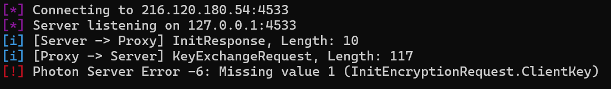


### Implementing the Servers
This time, without an "upstream".

#### Implementing the Name Server

The flow:
1) Client connects to port
2) Client sends init request
3) Server sends init response
4) Client sends KeyExchange request
5) Server sends KeyExchange response
6) Client sends EncryptedOperationRequest of GetRegions, Params: {224: StringParameter(6f869876-bfbc-491e-8fff-4210c966f145)}
7) Server sends EncryptedOperationResponse of GetRegions, return_code: 0, Debug data: None, Params: {Region: Slice(StringParameter(region_code),...), Address: Slice(StringParameter(region_ip),...)}
8) Client sends EncryptedOperationRequest of Authenticate, Params: {210: StringParameter(eu), 220: StringParameter(the_slammer_1.0), 224: StringParameter(6f869876-bfbc-491e-8fff-4210c966f145), 225: StringParameter(`<REDACTED_USER_ID>`)}
9) Server sends EncryptedOperationResponse of Authenticate, return_code: 0, Debug data: None, Params: {Cluster: StringParameter(default), Address: StringParameter(ip), UserId: StringParameter(`<REDACTED_USER_ID>`), Token: StringParameter('`<REDACTED_BASE64_TOKEN>`')}
10) Client keeps the socket alive, but does not inherently send any more data

I have no clue how to properly generate the token, and I have three possible ways to address this:
  * Guess and blackbox the token until we get a successful response.
  * Check if the client decodes the token, and if so reverse the decoding
  * Ignore the issue and hope for the best

Clearly I chose the later, thinking that if the client validates the token, then there must be some deciphering and validation code in the client which I can reverse, and if the client does not verify the token but rather simply forwards it like an entry pass, then it does not matter since we are going to fake the Master Server as well.
From an initial glance, it seems that the client really does not care what we return in the token. So let's just assume all tokens are okay.

#### Implementing the Master Server

We will use the "eu" (Europe) master server for testing.
IP: `<REDACTED>`
Port: TCP 4530

The flow:
_We will skip the init and key exchange this layer is handled by the PhotonQueue internally. I'm such a good fucking developer, look at that abstract SOLID design!_

1) Client sends Operation Authenticate request
2) Server sends OperationResponse with the error `Max CCU of 20 reached.`. Fuck.
   1) I think Prison Architect are on the free trial at Photon
   2) Server sends EncryptedOperationResponse for Authenticate with params: {token}
3) Server sends Event JoinGame, Params: {227: Int32Parameter(1), 228: Int32Parameter(10), 229: Int32Parameter(20)}
4) Client sends Operation JoinLobby, empty params
5) Server sends OperationResponse JoinLobby, no params, return code 0, no debug data
6) Server sends Event GameList with a Hashtable of the games (structure documented internally in our code)
7) Server sends Event JoinGame, Params: {227: Int32Parameter(1), 228: Int32Parameter(10), 229: Int32Parameter(20)}
8) Server sends Event JoinLobby, Params: {222: HashtableParameter({StringParameter("A Game"): HashtableParameter({Int8Parameter(251): BooleanParameter(True)})})} _"A Game" is the name of an active game_
9) Client sends Operation JoinGame, Params: {ActorProperties: HashtableParameter({Int8Parameter(255): StringParameter("Noob")}), Broadcast: BooleanParameter(True), GameId: StringParameter("Test Game 123")} _"Noob" is our username, "Test Game 123" is the name of the server we are trying to join - we did not supply a password although it was required_
10) Server sends EncryptedOperationResponse JoinGame, return code: 0. no debug data, params including a new token and the address of the Game Server

#### Implementing the Game Server
It seems for now that the game server simply forwards packets between the peers. Let's hope that is really the case.

<details>
<summary>
This is what Game creation looks like:
</summary>

```
[i] Proxying Operation from Client to Server
[i]     [Client -> Proxy]
[i]                       Command: Operation
[i]                       Operation: CreateGame
[i]                       Encrypted: No
[i]                       Params[7]:
[i]                         ActorProperties: HashtableParameter({StringParameter(P): Int32Parameter(6), Int8Parameter(255): StringParameter(Noob)})
[i]                         Broadcast: BooleanParameter(True)
[i]                         GameProperties: HashtableParameter({StringParameter(MAS): StringParameter(Noob), StringParameter(PA): BooleanParameter(True), Int8Parameter(255): Int8Parameter(4), Int8Parameter(250): SliceParameter([StringParameter(MAS), StringParameter(PA)])})
[i]                         DeleteCacheOnLeave: BooleanParameter(True)
[i]                         UNKNOWN[232]: BooleanParameter(True)
[i]                         GroupsForRemove: BooleanParameter(True)
[i]                         GameId: StringParameter(AAA)
[i] [Proxy -> Server] Operation, Length: 96
[~] [Server -> Proxy] Recieved 9 bytes
[~] [Server -> Proxy] Recieved 194 bytes
[i] [Server -> Proxy] EncryptedOperationResponse, Length: 121
[i] [Server -> Proxy] EncryptedEvent, Length: 73
[*] Proxying EncryptedOperationResponse from Server to Client
[i]     [Server -> Proxy]
[i]                       Command: EncryptedOperationResponse
[i]                       Operation: CreateGame
[i]                       Return Code: 0
[i]                       Debug Message: None
[i]                       Encrypted: Yes [a55708fabeaca5f9]
[i]                       Params[4]:
[i]                         ActorNr: Int32Parameter(1)
[i]                         GameProperties: HashtableParameter({Int8Parameter(254): BooleanParameter(True), Int8Parameter(253): BooleanParameter(True), StringParameter(PA): BooleanParameter(True), StringParameter(MAS): StringParameter(Noob), Int8Parameter(248): Int32Parameter(1), Int8Parameter(246): Int32Parameter(0), Int8Parameter(245): Int32Parameter(0), Int8Parameter(243): Int32Parameter(4), Int8Parameter(250): SliceParameter([StringParameter(MAS), StringParameter(PA)]), Int8Parameter(255): Int8Parameter(4)})
[i]                         Actors: SliceParameter([Int32Parameter(1)])
[i]                         AuthMode: Int32Parameter(11)
[*] Proxying EncryptedEvent from Server to Client
[i]     [Server -> Proxy]
[i] [Proxy -> Client] EncryptedOperationResponse, Length: 121
[i]                       Command: EncryptedEvent
[i]                       Operation: Join
[i]                       Encrypted: Yes [a55708fabeaca5f9]
[i]                       Params[3]:
[i]                         ActorProperties: HashtableParameter({Int8Parameter(255): StringParameter(Noob), StringParameter(P): Int32Parameter(6), Int8Parameter(253): StringParameter(<REDACTED_USER_ID>)})
[i]                         Actors: SliceParameter([Int32Parameter(1)])
[i]                         ActorNr: Int32Parameter(1)
```
</details>


<details>
<summary>
This is what Game joining looks like (with an incorrect password):
</summary>

```
[*] Connecting to <REDACTED_IP>:4531
[*] Server listening on 127.0.0.1:4531
[i] [Server -> Proxy] InitResponse, Length: 10
[i] [Proxy -> Server] KeyExchangeRequest, Length: 114
[i] [Server -> Proxy] KeyExchangeResponse, Length: 117
[i]         Server Public Key: e849b7345715e29fbede264fecb45500...
[i]         Upstream AES Key: c34f31017f9205e5793cc3472a5fa58e...
[*] New client connected: ('127.0.0.1', 63994)
[i] [Client -> Proxy] Init, Length: 48
[i] [Client -> Proxy] KeyExchangeRequest, Length: 114
[i]     Diffie-Hellman Request
[i]     Client Public Key: 59512c1fab6016a50915951fd4747bdf...
[i]     Server Public Key: 43f1cde8d71c416233fe51da23799830...
[i]     Downstream AES Key: 11176289304e8ac5fd4bbdb0d4a80f7e...
[i] [Proxy -> Client] KeyExchangeResponse, Length: 117
[i] [Client -> Proxy] Operation, Length: 404
[i] Proxying Operation from Client to Server
[i]     [Client -> Proxy]
[i]                       Command: Operation
[i]                       Operation: GameList/Authenticate
[i]                       Encrypted: No
[i]                       Params[1]:
[i]                         Token: StringParameter('<REDACTED_BASE64_TOKEN>')
[i] [Proxy -> Server] Operation, Length: 404
[i] [Server -> Proxy] OperationResponse, Length: 15
[*] Proxying OperationResponse from Server to Client
[i]     [Server -> Proxy]
[i]                       Command: OperationResponse
[i]                       Operation: GameList/Authenticate
[i]                       Return Code: 0
[i]                       Debug Message: None
[i]                       Encrypted: No
[i]                       Params[0]:
[i] [Proxy -> Client] OperationResponse, Length: 15
[i] [Client -> Proxy] Operation, Length: 61
[i] Proxying Operation from Client to Server
[i]     [Client -> Proxy]
[i]                       Command: Operation
[i]                       Operation: JoinGame
[i]                       Encrypted: No
[i]                       Params[3]:
[i]                         ActorProperties: HashtableParameter({StringParameter('P'): Int32Parameter(0), StringParameter('C'): StringParameter('0xcaa1f2ff'), Int8Parameter(255): StringParameter('Noob')})
[i]                         Broadcast: BooleanParameter(True)
[i]                         GameId: StringParameter('123')
[i] [Proxy -> Server] Operation, Length: 61
[i] [Server -> Proxy] EncryptedOperationResponse, Length: 265
[i] [Server -> Proxy] EncryptedEvent, Length: 105
[*] Proxying EncryptedOperationResponse from Server to Client
[i]     [Server -> Proxy]
[i]                       Command: EncryptedOperationResponse
[i]                       Operation: JoinGame
[i]                       Return Code: 0
[i]                       Debug Message: None
[i]                       Encrypted: Yes [c34f31017f9205e5]
[i]                       Params[5]:
[i]                         ActorNr: Int32Parameter(21)
[i]                         ActorProperties: HashtableParameter({Int32Parameter(5): HashtableParameter({Int8Parameter(255): StringParameter('<REDACTED_USER_NAME_2>'), StringParameter('P'): Int32Parameter(69), StringParameter('C'): StringParameter('0x7ce7d2ff'), Int8Parameter(253): StringParameter('<REDACTED_USER_ID_2>')}), Int32Parameter(1): HashtableParameter({Int8Parameter(255): StringParameter('<REDACTED_USER_NAME_1>'), StringParameter('P'): Int32Parameter(71), StringParameter('C'): StringParameter('0xbcc1caff'), Int8Parameter(253): StringParameter('<REDACTED_USER_ID_1>')})})
[i]                         GameProperties: HashtableParameter({Int8Parameter(254): BooleanParameter(True), Int8Parameter(253): BooleanParameter(True), StringParameter('PA'): BooleanParameter(True), StringParameter('MAS'): StringParameter('<REDACTED_USER_NAME_1>'), Int8Parameter(248): Int32Parameter(1), Int8Parameter(246): Int32Parameter(0), Int8Parameter(245): Int32Parameter(0), Int8Parameter(243): Int32Parameter(4), Int8Parameter(250): SliceParameter([StringParameter('MAS'), StringParameter('PA')]), Int8Parameter(255): Int8Parameter(4)})
[i]                         Actors: SliceParameter([Int32Parameter(1), Int32Parameter(5), Int32Parameter(21)])
[i]                         AuthMode: Int32Parameter(11)
[*] Proxying EncryptedEvent from Server to Client
[i] [Proxy -> Client] EncryptedOperationResponse, Length: 265
[i]     [Server -> Proxy]
[i]                       Command: EncryptedEvent
[i]                       Operation: Join/Event
[i]                       Encrypted: Yes [c34f31017f9205e5]
[i]                       Params[3]:
[i]                         ActorProperties: HashtableParameter({Int8Parameter(255): StringParameter('Noob'), StringParameter('P'): Int32Parameter(0), StringParameter('C'): StringParameter('0xcaa1f2ff'), Int8Parameter(253): StringParameter('<REDACTED_USER_ID>')})
[i]                         Actors: SliceParameter([Int32Parameter(1), Int32Parameter(5), Int32Parameter(21)])
[i]                         ActorNr: Int32Parameter(21)
[i] [Proxy -> Client] EncryptedEvent, Length: 105
[i] [Client -> Proxy] Operation, Length: 42
[i] [Client -> Proxy] Operation, Length: 33
[i] [Server -> Proxy] Event, Length: 222
[i] [Server -> Proxy] Event, Length: 2938
[i] [Server -> Proxy] Event, Length: 129
[i] [Server -> Proxy] Event, Length: 79
[i] [Server -> Proxy] Event, Length: 802
[i] [Server -> Proxy] Event, Length: 66
[i] [Server -> Proxy] Event, Length: 223
[i] [Server -> Proxy] Event, Length: 227
[i] [Server -> Proxy] Event, Length: 235
[i] [Server -> Proxy] Event, Length: 104
[i] [Server -> Proxy] Event, Length: 357
[i] [Server -> Proxy] Event, Length: 122
[i] [Server -> Proxy] Event, Length: 159
[i] [Server -> Proxy] Event, Length: 647
[i] Proxying Operation from Client to Server
[i]     [Client -> Proxy]
[i]                       Command: Operation
[i]                       Operation: SetProperties
[i]                       Encrypted: No
[i]                       Params[3]:
[i]                         Properties: HashtableParameter({StringParameter('C'): StringParameter('0x90c3e4ff')})
[i]                         ActorNr: Int32Parameter(21)
[i]                         Broadcast: BooleanParameter(True)
[i] Proxying Operation from Client to Server
[i] [Proxy -> Server] Operation, Length: 42
[i]     [Client -> Proxy]
[i]                       Command: Operation
[i]                       Operation: RaiseEvent
[i]                       Encrypted: No
[i]                       Params[3]:
[i]                         Data: Int8SliceParameter(b'\x12\x01a')
[i]                         Code: Int8Parameter(5)
[i]                         Actors: SliceParameter([Int32Parameter(1)])
[*] Proxying Event from Server to Client
[i] [Proxy -> Server] Operation, Length: 33
[i]     [Server -> Proxy]
[i]                       Command: Event
[i]                       Operation: UNKNOWN[9]
[i]                       Encrypted: No
[i]                       Params[2]:
[i]                         Data: Int8SliceParameter(b'\x12\x08CellData\x12\xbax\x9c\xb3\xe1pN\xcd\xc9qI,Id`\xb4\x81\xb3\x19Y\x823\xabR\x19y\x18\x18\x18xlX\xa33\x15\x0cb\x99\x19+\x18\xfd\x81|\xc6JF\x17 \xc5\xec\x9c\x9f\xc7\xe4:\xed\xb8\x13\x83\x1dX\x81!X\x81\x1fD\x813L\x01\x03\xc3\t\x98\x02#d\x05.X\x14\x18#+p\xc5\xa2\xc0\x04\xd9\rp+"&\xae\x80)0EV\x80\xcd\x043\xb0\x82\x00\xdc\x8e4GV\x00w\xe4\x8c\xe5poZ +\x80[a\x90\xb9\x04\xa6\xc0\x12\xac`\x07DA-L\x81\xba\x97\xb4#P\x01\x1b(\xa0 A\xb9\x0bM\xc5]\x8e4\'\x98\nHX\nAT\xd4\xc1Txl\x9e\x084\xc3\xce\x0e\x00\x98CR\xdf\x01\xb2\x03')
[i]                         ActorNr: Int32Parameter(1)
[*] Proxying Event from Server to Client
[i] [Proxy -> Client] Event, Length: 222
[i]     [Server -> Proxy]
[i]                       Command: Event
[i]                       Operation: UNKNOWN[9]
[i]                       Encrypted: No
[i]                       Params[2]:
[i]                         Data: Int8SliceParameter(b'<REDACTED_BINARY_DATA>')
[i]                         ActorNr: Int32Parameter(1)
[*] Proxying Event from Server to Client
[i] [Proxy -> Client] Event, Length: 2938
[i]     [Server -> Proxy]
[i]                       Command: Event
[i]                       Operation: UNKNOWN[9]
[i]                       Encrypted: No
[i]                       Params[2]:
[i]                         Data: Int8SliceParameter(b'\x12\x12ConstructionSystem\x12Sx\x9c\xb3\x11r\xce\xcf+.)*M.\xc9\xcc\xcf\x0b\xae,.I\xcde\xe4r,-\xc9\xf7\xc9L\xcf()fe`\xb6a\xf1\xcaO*fd\t\xce\xacJed\x00\x01;\x1b\xa6\x82,\x10\xc5\xe3\x94\x93\x9f\x9c\x9d\x9a\xe2X\x94\x9aX\x0c\x14\xb0\x03\x00\xcfB\x16]O\x02')
[i]                         ActorNr: Int32Parameter(1)
[*] Proxying Event from Server to Client
[i] [Proxy -> Client] Event, Length: 129
[i]     [Server -> Proxy]
[i]                       Command: Event
[i]                       Operation: UNKNOWN[9]
[i]                       Encrypted: No
[i]                       Params[2]:
[i]                         Data: Int8SliceParameter(b'\x12\nContraband\x12)x\x9c\xb3\xe1r\xce\xcf+)JLJ\xccKabJ1`\xda\x1f\xe1h\xcfT`\xc8d!\x1bb\xcb`\x07\x00\x92W\x08=\x1f\x02')
[i]                         ActorNr: Int32Parameter(1)
[*] Proxying Event from Server to Client
[i] [Proxy -> Client] Event, Length: 79
[i]     [Server -> Proxy]
[i]                       Command: Event
[i]                       Operation: UNKNOWN[9]
[i]                       Encrypted: No
[i]                       Params[2]:
[i]                         Data: Int8SliceParameter(b'\x12\x08EventLog\x13\xfd\x02x\x9c\xc5\xd8_HSq\x14\x07\xf0{\xf3\xce\xadea`IP0\x8b0\xc9VM\x1f\x84\xc62Qbd\x0f\x11R\x84\x0f\x81[7\xa54u\x13{\x88\x822\xa8\x87\xde\x8a\xc2,\xb7\xf5g9\xe9\x0f\x94\xe4L\xd2\xc0\t\x91u!\xe7\xc29#\xfaK\x0f\x92\xeb\x8fP\xf4g\xce\xab\xe7\x86\xe2\xf6\xfd%\xcb\x17\x0f\x03\xf9p~\xe7w\xce\xef8\xa3\xa6\xa8\xceZi+\xae\x129\xde\x98\x12\xf9%Z-\xd1Oj\xb9\x1c#_\xae\xe5m\x82p\xa8F\x7fP\xb0\x99-\xf5\xea\xe6\xbe\xaf\x01\xa9\xbb??I4\x17\xf2\xf38\x8e\x13"\x81!\x1a\xa9\x0eT\x95\xe9\xeb\xc7\xa3\x89\xf0\xf0Dh\xad\xdc\xa8/\xe7\xb3\x049\xb4\xf3b\xb6}<4D>\xfd\x1d\xf9\x89\x86\xf6h\xc8\x99b\x80\xaaD\x80;|\x8e\xc7>\x19\x9c?\x05\xf2\xb1\xc0{IS\xe0\x8d>\x1b\x02f\xe6\x86%\x06p1e\x98\xb6\x16\xcaP\xb8\xbb\xb4A\x92A!\xfe#\xcd!\xf0\xc2:\x08\xfc4\xf6\xba\x9b\x01\xbcCGz\x12;R%\x98\x9ch\x10\xb8\xa5\xec`kfF\xd6\x10\xde\x87&\xaa\xa1\xa4\x87j\xb8\xcb\xd5\xfe\xea\'^\xc3n\xcaP%A\x19.s\xba\xb9_8\xb8\x99\xc0\xde\xd3\xcc PCvpa\xd1`\x98\xf3\xc3\x8d\x9fM5<\x8f\x8d\xb6\xf0\x87\xd4}\xc92\xa8\x8d\x1fd\xcf\xf0\xbf\x82\xc0\x91\xb2\x83\'|\x1d\xa9j\x1c\xbcO\xe0\x96\xa7\x10X|k\xf7&\x8d\x1fn\x8b\xe5tiJ\xb0\xd7B\t\x02\xb3tn@\xa0\x0f\xd9\xc1\x8beKz\xb5x\r\x1fQ\r\xd3\xb1\xd1\xb6\xc2\xf7F<\xeb\x87\x87w.e\xe8\xc1\x1e`%\x08\x1c)\x06\xaa"`\x85(\x8b\xdb\x8eU\xe77N\xbb5\xd1?\x9dM|Nb\xd3\xcb:fQ\x1d\xbf\xd8Ob\xeb?\x88@\x8e~\x12\xdbc\x8b\xe3e\xb4\xc8\xa0\xb3`\xf0Z\xb3\x0cr3\x81\xf6\xfd\xa1\x02\x19\xfcX\xb3\xba`\xd6\x07C\xde\x1f\r\xf2\xfe8\xe3\xbd\xd1\xdaS\x7f8\xf0a\xd3A\x9dQ\x8dM7%\x08\x0c\x1bv\xd0w9\x14p\xe2\x19\xb2/\xdfJ\x10\xc8pn@M"\xc0\x17\xd2\xf5\xcf\x0cG\xaa\'\xd0\x8d\xad5J\x108Rv0\xb8}x\xab\x0b\xcfp=\x81^v\x10\xc8\x90\x1d\x0c\xf5,\xda\xe3\xc2\x1f\x8c\r\x04>\xc1\xc0##\xc3\xef]\xf8\xa6\x88\xcf\xd2I\xd0\x1f\x18V_\xc13\\I\xe0q\xac-.\x05\x1f4L\x82\x0b\xe2\xcfPG\xa0\x15\x03\x0b\x8f\xf2\xdf\xaf&\x12\x1ckiZ\xd5\x82\xd7\xd0M\xc3\xdb\x8c\xfd\x13\xec(\x19M\xf7\xe0\x8b[\x06eX\x8be\xd8%\x9d\x1a\xf5L[\xdcb\x82y\x04\x0ea\x8b\xdb\xbb37\xbfx\xf0#e\x1fm5k\xf2Jo\xe3\xa3\xcdK5\xdc\x8b=\xc0J\x10\x18m\x18\xf8\xd7\xda\xd6\x18\x0e\x9e\xeb\x9c\xd6\xf91\xd7\xb6\x87$\xbe}\x86\xa4\xa8\xeb\xf4\xf6\xec\x1c\xc2\xaf)\xf3\xa8\xd1u}k\xabH\x19\x80g\x1bs\xe7\xebL#b[\xda\x00\x9ca\x9c_\xd2\x9aL\x7f\x00+\xe8_\xcb\x16\xa5\x03')
[i]                         ActorNr: Int32Parameter(1)
[*] Proxying Event from Server to Client
[i] [Proxy -> Client] Event, Length: 802
[i]     [Server -> Proxy]
[i]                       Command: Event
[i]                       Operation: UNKNOWN[9]
[i]                       Encrypted: No
[i]                       Params[2]:
[i]                         Data: Int8SliceParameter(b'\x12\x05Gangs\x12!x\x9c\xb3auO\xccK/f`\xb6a4e`\xb0\xb3a4\x03\x93\xe6@\xd2\x0e\x00K\xd1\x04\x86\x1c\x02')
[i]                         ActorNr: Int32Parameter(1)
[*] Proxying Event from Server to Client
[i] [Proxy -> Client] Event, Length: 66
[i]     [Server -> Proxy]
[i]                       Command: Event
[i]                       Operation: UNKNOWN[9]
[i]                       Encrypted: No
[i]                       Params[2]:
[i]                         Data: Int8SliceParameter(b"\x12\x06Intake\x12\xbdx\x9c\xad\xd0\xcf\n\x82@\x10\x06\xf0\xd9\xfc\x93\x08A/\xd2\x1b\x88\x97\x82\xf0\xa0\x98\xfa\x02CM\xb5\xa4\xbb\xb1\xbb\x92\xdd{\xe1\xde kA\xbct)o\xdf\xcc\xe17\x1f\x13\xf9\x890x!`\x91\xb3G\x03\xf3\x88q\x7f\x99+\xae\xa5 \xb5FC'\xa9\xee\xae\x9frQ\xd2\xde\xcd\xa5\xac\xd9\n\x00\xbc\x02\r\x97\xb3>A\x98Qg\xac\xc2\xde\xb3\xb7k\xa9\xb51\xc8\xda&K\xaa\xad\xfeL\x10\x7f\xc13\xa9\x1a\xac-~\x98\x1aO\xb1\x1b\x9a\x8f\xf0\xc5\xe3\x19\x8f\xf1\xf0\x17<(\xdb+\xa9\xfe\x82\xe5\x9d\x89\xbb\x07\x1bBs.\xe4\xcd\xf20\xf5k\x12\xa1Q\x90\xc5\xd9\xc4\xf8\xb0\xa9\x14\n}$\xf5\xef\x998~\x01a0\xaa\xb5\x02\xac\x03")
[i]                         ActorNr: Int32Parameter(1)
[*] Proxying Event from Server to Client
[i] [Proxy -> Client] Event, Length: 223
[i]     [Server -> Proxy]
[i]                       Command: Event
[i]                       Operation: UNKNOWN[9]
[i]                       Encrypted: No
[i]                       Params[2]:
[i]                         Data: Int8SliceParameter(b"\x12\x10MisconductSystem\x12\xb7x\x9c\xb3\x11\xf0\xcd,N\xce\xcfK)M.\t\xae,.I\xcded.)\xcfd2\x9c\xbc\xd5\x95\xd1\x86=(\xb5 \xbf\xa8\xa4\x98\x81\xcb\x86\xd9\xd2\xc4\x94Q8\xa04/\xb38#75\xaf$>8?'\xb3$\xb1\xa8\x92i\x91\x07\xa7\x0b\x83\x1dH\x81\x19v\x05=\xeaq\x10\x05\xa6&\xd8\x15\xac\xf76\x85*\xc0a\xc5\x8d\x9eH\xa8\x02s\x14\x05>\xf9\xc9\xd9)\xf9\xe5yL\xdf\xb6mq\x02*`1405\xc2n\xc4b\x19K\x17\xa8\n\x0b\xec*\xae\x7f\xbc\xe4\x0cQaf\x8a\xdd\x16\xab\xafS\xa0*\xcc\r\xb1\x9b\xb1\xf3\x93.\xd4\x16s\x1c\x811\xa9Y\x06\xa8\xc2\xce\x0e\x00s\xa9{\x97\x01y\x03")
[i]                         ActorNr: Int32Parameter(1)
[*] Proxying Event from Server to Client
[i] [Proxy -> Client] Event, Length: 227
[i]     [Server -> Proxy]
[i]                       Command: Event
[i]                       Operation: UNKNOWN[9]
[i]                       Encrypted: No
[i]                       Params[2]:
[i]                         Data: Int8SliceParameter(b"\x12\x12NetworkSoundSystem\x12\xbdx\x9c\xb3\x11\xf2K-)\xcf/\xca\x0e\xce/\xcdK\t\xae,.I\xcde`\xb4a\x0ev-f`\xb7a4edLacc```ddy\xf8\x8d\x85\xc1\xce\x86\xd1\x18$$\n\x14b`\xcebdy\xc5T,\xc4\xe5\x94\x9a\x9e\x99\xe7\x9c\x93_\x9c\xca\x00W!\x04V\xb1\x96\x89\xe5\xbeW\x89\x10\xbbk^\x8a\x7fAj\x1e\xba\xf4Q&\x16#w4i#\x90\xb4\x11HZ\x887\xde713\xaf\x04\x88S\xf3\x92S\x85\xb8\x83\x12\xb3S\xfdKKR\xf2\xf3\x8b\xa4\xac~\\q\x92z\xbdi\xab\xa3\x14\x03\xc4y\xdf\x90\x9c'\x02\x12c\xfa\xcc\xf2\xf1'\x0e\xd7A\x14(\xb3\\kCW`g\x07\x00%HAQ\x01\x13\x03")
[i]                         ActorNr: Int32Parameter(1)
[*] Proxying Event from Server to Client
[i] [Proxy -> Client] Event, Length: 235
[i]     [Server -> Proxy]
[i]                       Command: Event
[i]                       Operation: UNKNOWN[9]
[i]                       Encrypted: No
[i]                       Params[2]:
[i]                         Data: Int8SliceParameter(b'\x12\x0eReformPrograms\x12>x\x9c\xb3\xe1\x0bJM\xcb/\xca\r(\xcaO/J\xcc-f`\xb4a,``\xb2a24fdJ.`\xea\xf2mqb\xb0\xb3a26\x05s\xd5\x04\xaf:3\xd8\xd9\xd9\x01\x00\x9d\xa4\r\x8d7\x02')
[i]                         ActorNr: Int32Parameter(1)
[*] Proxying Event from Server to Client
[i] [Proxy -> Client] Event, Length: 104
[i]     [Server -> Proxy]
[i]                       Command: Event
[i]                       Operation: UNKNOWN[9]
[i]                       Encrypted: No
[i]                       Params[2]:
[i]                         Data: Int8SliceParameter(b'\x12\x0cSectorSystem\x13<\x01x\x9c\xb3\xe1\tNM.\xc9/\n\xae,.I\xcde`\xb4a\x87\xf0\x8b\x81LfC\x03\x0b\x1en\xe7\xd2\xe2\x92\xfc\xdc\xa8\xfc\xbcT\x03V\x06$\x9e!\n\xcf\x08\x85g\x8c\xc23A\xe1\x99\xa2\xf0\xccPx\xe6(<\x0b\x14\x9e%+\x03\x0f\x92\xed\x06\xa8\\\xa0kxl\x18\x8b\x19Y\x823\xabR\x19\x19\x19\x18\x80\xeeg\x8d\xceT0\x88e\xe6p\xcd+\xc9,\xa9\xd4\xcbd\x94`f`\x80\xf1J\x19w\x94\x970\xf0\xf8$\x16\x97\xf8\'\'\x97\x16d\xa6\xa60\xd9\xd8ltc\xb0\xb3\xb3aJ\x81\x19\xc4\x00\x02@\x81Dt\x81|t\x81d4\x01\x96\x94|t!\xa6,t\x81tt\x8144\x01\xc6,(\x9f\r\xc8e\xc3\xf4\xd1A\x14\x1f\xb1^\xc0\xee#\xb0>Cd}\xebQ\xf4e\x9f\xc5\xa3\xcf\x08Y\xdf\x7f @\xe8\x03\xf1P\xf5q\x9al\x80\xe93F\xd6\'\xc8\x82l\x9f\x88v)n\xfbLH\xb1/\xec3\xdc>Sd}\x17P\xec\xeb\xb9_\x86+\xa6\x93\x8b\x98\x10I\x06\x12\xbc\x8c\xa2\xd0\xb0\xcfa\x83H\xb1"\xa4L\xa0L\xc3XF6F\x08\xd3(\x96\x91\x19\xca4\x8ee\x14\x822Mb\x19\x17\x81\x8d\x01\x02\x00\rV\xeb6\x03d\x03')
[i]                         ActorNr: Int32Parameter(1)
[*] Proxying Event from Server to Client
[i] [Proxy -> Client] Event, Length: 357
[i]     [Server -> Proxy]
[i]                       Command: Event
[i]                       Operation: UNKNOWN[9]
[i]                       Encrypted: No
[i]                       Params[2]:
[i]                         Data: Int8SliceParameter(b'\x12\x0bThermometer\x12Sx\x9c\xb3\xe1\x0e\xc9H-\xca\xcd\xcfM-I-bg,a\x9a\xff\x94\xcb\x91\xb9(?\x99\xa9\x95\xd7z/Sq.S\xca\xaaCN,\xc5 \x91\xec\t\xab\xf60\x19Z0\x05\x04\xd6\xda1\x19\x1905=\x9d\xed\xc0dd\xc8te\x8d\xb1\x03\x83\x1d\x00\x9a\xb3\x18\x11J\x02')
[i]                         ActorNr: Int32Parameter(1)
[*] Proxying Event from Server to Client
[i] [Proxy -> Client] Event, Length: 122
[i]     [Server -> Proxy]
[i]                       Command: Event
[i]                       Operation: UNKNOWN[9]
[i]                       Encrypted: No
[i]                       Params[2]:
[i]                         Data: Int8SliceParameter(b"\x12\tWorkQueue\x12zx\x9c\xb3\xe1\x0c\xcf/\xca\x0e,M-Me`\xb4a\xccd`\xb5a51370ed\xf3\xcc\x0b(\xcaOged\xb0\x03\tY\x98\x183r\x80\xd4\xba\xe4\xe7\xa52\x19\x9cep\x82\x88[\x1a\x1a \x89\x97\xdd\xabu\x84\x8a\x1b[ \x89\xf7\xb5\xad\xb2\x83\x8a\x9b\x980\xf1\xfa'e9\x16\x17g\xa6\xe7\xa5\xa6\xe8e2\x9efa`@\x11*e\x9c\x7f\xa1\x8c\x81\xc1\xce\xce\x0e\x00\x83\xf0*\xa0\x9f\x02")
[i]                         ActorNr: Int32Parameter(1)
[*] Proxying Event from Server to Client
[i] [Proxy -> Client] Event, Length: 159
[i]     [Server -> Proxy]
[i]                       Command: Event
[i]                       Operation: UNKNOWN[9]
[i]                       Encrypted: No
[i]                       Params[2]:
[i]                         Data: Int8SliceParameter(b'\x12\x05World\x13e\x02x\x9c}\xd6\xcfj\x13A\x1c\xc0\xf1T\x13$\x05AE\xecM\xf6"\xdedgv\xfeB(Br\xc9\xc1Z\xda\x8aG\xd96\xb3\xb8\xb2\xdd\x95M\xd2\xc6\xab\x17\xdf\xc1\x07\xf3\xee\x0b\xf8\x0cNB\x85\xeew\x83\xe9%\xdf_g\x86\xf9\xe44\x93\xd1\xc7\xa6\xad\x16\x83\xd1d\xbc\xfb2\xcbW\xf9\x83\xf1Ey\x1d\xe6\xf5"l\x1e%\xbf\xff|\xff\xf1\xfa\xd7\xdb\xc7\xef/\xbf\x84\xab\xd5|\xf1\xa6\x0e\x9b\xd5A\xf1\xeav08\x9e<9k\xf2\xc5,T\xe5Mh\xbfm\xb7\xee\x86\xd3\xb6\\\x96\xcb\xf3\xb8\xbciw\xc3\x9f\x93\x87i\x92\x1e\x8cn\xf2j\x1dF\xdb5\xb1\x05Z\xa23\xb4Bk\xb4A[\xb4C\xfb\xfb=\x8c\xf7I9\x10\x1cH\x0e\xbaw\x140\n\x18\x05\x8c"\xe1~\x85\xd6h\x83\xb6h\x87\xee\x1a\x05\x8d\x82FA\xa3\xa0Q\xc2(a\x940\xca\x84\xfb\x15Z\xa3\r\xda\xa2\x1d\xbak\x944J\x1a%\x8d\x92\xc6\x0c\xc6\x0c\xc6\x0c\xc6,\xe1~\x85\xd6h\x83\xb6h\x87\xee\x1a3\x1a3\x1a3\x1a3\x1a\x15\x8c\nF\x05\xa3J\xb8_\xa15\xda\xa0-\xda\xa1\xbbFE\xa3\xa2Q\xd1\xa8h\xd40j\x185\x8c:\xe1~\x85\xd6h\x83\xb6h\x87\xee\x1a5\x8d\x9aFM\xa3\xa6\xd1\xc0h`40\x9a\x84\xfb\x15Z\xa3\r\xda\xa2\x1d\xbak44\x1a\x1a\r\x8d\x86F\x0b\xa3\x85\xd1\xc2h\x13\xeeWh\x8d6h\x8bv\xe8\xae\xd1\xd2hi\xb44Z\x1a\x1d\x8c\x0eF\x07\xa3K\xb8_\xa15\xda\xa0-\xda\xa1\xbbFG\xa3\xa3\xd1\xd1\xe8h\xf40z\x18=\x8c>\xe1~\x85\xd6h\x83\xb6h\x87\xee\x1a=\x8d\x9eFO\xa3\x87q(\xf0\xd0\xd9\x0e\x04\x07\x92\x83\xde\x19\x8a\x03\xcd\x81\xe1\xc0r\xe08\xe8hG\x82O\x9e\xddD\xf4&\xb27\xb9\x7f\xdb\xe3\xc9\xe1\xb4*C\xbd\xfa\xf7\xfa{\xfa\xa1.\x8b\xa6\xbd\x9e6U\xb3\xde=\xff\xc6\xcfN\x9a:|\xba\xda\r\xee\xfe;<L7\xc5\xdd\xe7\xf9\xbb\xb2\x8e\x8f\xc5\xfe\x82\xd4\xe7E\x9a\xc5\x05\'q\x90W{N\xb0^\x89\xc5\xf6\x84|\xb3\xf7\x84\xc2\xaa\xcb\xed\x82\xa3\xd3\xb6Y\xc5\xf7hX\xec\xbfF\x9a\x16\xc5\x8b\xf3\xf5\xd7\xd0\xc6\x93\xfaKr\x9bj-\xe3\x92Y\xc8W\x9f\xcf\x9a\xdb\xfe\x12\x99n\xff\xe2U\xe6\xf52\xff\x9f\xf6\xe5i|\x1d\xc7\xdf\xa3\xbdh\xf3zY\x84\xb6\xbf\xd4\x17^\xe5\xb6(\xe2\xaf\xfb\x17\xa9k\x90\xd7\x0b\x9f\x03')
[i]                         ActorNr: Int32Parameter(1)
[i] [Proxy -> Client] Event, Length: 647
[i] [Server -> Proxy] OperationResponse, Length: 15
[*] Proxying OperationResponse from Server to Client
[i]     [Server -> Proxy]
[i]                       Command: OperationResponse
[i]                       Operation: SetProperties
[i]                       Return Code: 0
[i]                       Debug Message: None
[i]                       Encrypted: No
[i]                       Params[0]:
[i] [Proxy -> Client] OperationResponse, Length: 15
[i] [Server -> Proxy] Event, Length: 86
[i] [Server -> Proxy] Event, Length: 24
[*] Proxying Event from Server to Client
[i]     [Server -> Proxy]
[i]                       Command: Event
[i]                       Operation: UNKNOWN[9]
[i]                       Encrypted: No
[i]                       Params[2]:
[i]                         Data: Int8SliceParameter(b"\x12\nPlayerData\x120x\x9c\xb3\xe1\n\xc8I\xacL-rI,Id`\xb4a4eb.\xd0\xab`\xb2J\xfd\xec\x04dT2\xf5\xeb\x9791\xd8\xd9\x01\x00\xd7\xc6\n\xa0'\x02")
[i]                         ActorNr: Int32Parameter(5)
[*] Proxying Event from Server to Client
[i] [Proxy -> Client] Event, Length: 86
[i]     [Server -> Proxy]
[i]                       Command: Event
[i]                       Operation: UNKNOWN[7]
[i]                       Encrypted: No
[i]                       Params[2]:
[i]                         Data: Int8SliceParameter(b'')
[i]                         ActorNr: Int32Parameter(1)
[i] [Proxy -> Client] Event, Length: 24
[i] [Client -> Proxy] Operation, Length: 12
[i] Proxying Operation from Client to Server
[i]     [Client -> Proxy]
[i]                       Command: Operation
[i]                       Operation: Leave
[i]                       Encrypted: No
[i]                       Params[0]:
[i] [Proxy -> Server] Operation, Length: 12
[i] [Server -> Proxy] Event, Length: 176
[i] [Server -> Proxy] Event, Length: 3001
[i] [Server -> Proxy] Event, Length: 129
[i] [Server -> Proxy] Event, Length: 79
[i] [Server -> Proxy] Event, Length: 802
[i] [Server -> Proxy] Event, Length: 66
[i] [Server -> Proxy] Event, Length: 223
[i] [Server -> Proxy] Event, Length: 226
[i] [Server -> Proxy] Event, Length: 161
[i] [Server -> Proxy] Event, Length: 104
[i] [Server -> Proxy] Event, Length: 357
[i] [Server -> Proxy] Event, Length: 130
[i] [Server -> Proxy] Event, Length: 127
[i] [Server -> Proxy] Event, Length: 645
[i] [Server -> Proxy] OperationResponse, Length: 15
[*] Proxying Event from Server to Client
[i]     [Server -> Proxy]
[i]                       Command: Event
[i]                       Operation: UNKNOWN[9]
[i]                       Encrypted: No
[i]                       Params[2]:
[i]                         Data: Int8SliceParameter(b'\x12\x08CellData\x12\x8cx\x9c\xb3\xe1pN\xcd\xc9qI,Id`\xb4\x81\xb3\x19Y\x823\xabR\x199\x19\x18\x188mX\xa33\x15\x0cb\x99\x18+\x18\xb3\x80|\xc6JF1 \xc5`\x07\x167\x8ce\x06\x8agB\xc4E\x81\x14\xb3s~\x1e\x93Tb\xb7\x13T\x81\x11\xb2\x021\x98\x02\x06\x86\x130\x05\xc6\xc8\n\xc4\xb1(0\x01+\xc8B\xb3\xe2\xde\xcf\xfd0\x05\xa6\xc8n\x13G\xb8\xcd\x0c\xac1\x1bM#\x92\xc9\xe6`\x8d\xd9\x18\x9e\xb2@\x16\x87\x18hg\x07\x00-;4l\x01)\x03')
[i]                         ActorNr: Int32Parameter(1)
[*] Proxying Event from Server to Client
[i] [Proxy -> Client] Event, Length: 176
[i]     [Server -> Proxy]
[i]                       Command: Event
[i]                       Operation: UNKNOWN[9]
[i]                       Encrypted: No
[i]                       Params[2]:
[i]                         Data: Int8SliceParameter(b'\x12\nObjectData\x13\x92\x0bx\x9c}Xy|\x14U\x12\xee\xee\xc9\x84Y@Q\x04\xf6\x87!\xcb\xe9\x85\x80=\xd3\xd33\xd3\x90d\x0e\x10\x03h\x8e\xe9\xce\x90\x00"C2\x86\xa0$1\x84@"\xca\x00\x11\x85\xac\xc8ePn\xd8\x88\x82\x10Yn\x161\xe1\x08\xfcVP\x84]AY\x8fH"\xb0\x1e\xcb\xa1\xcb\x8a\xfeH\xb6\xab\xde\xeb\x17{\\6\x7f\xa5\xfb}U\xf5\xd5W\xf5\xea\xbd\x9e\xa4\xf6\xe9\x13\'GrK\x87\x85K\xc3\xdc\xe2$A\x92y\xa1\xa8X\x10\x9aO\xa7p)I\x16\xbb\xe8\xe1\xe3\n#y\xa5\x027 \xdb\x87o\x1cN\x0b_\xcc\x0f\xd2>\xcf\xe6\x8bl\xf9\x95B\xe4ia\xf5\x99\xd1\x01\\sJq\xfa\xdaO\xea\xf9l\xbe\x8c\xe7\xb8TN\x87\x14\xfa\x00\xf2\xc8\xb3\xef\x11\x88\xdb\r\x90\x140/\xe3\xb7\xb6\xb4\xb6\xea\x90\x9c\x99\x00\x19\xbe\xa5\x8e@<N\x80L\x0c>\r\x90>\xad\x08\xb9Z\r\x90\xefO>L!\n\x90xK\xed\x10\xd2\xd7Z\xeb`\xadK\xe8\x00\xae9D;\x98\xcfRkst\xf3\x87\xb8!@"\xaf\x1f@.t\x0c\x11\x88S\xc2,9.\xea\xc5gBj\xbfv5\x07y\x97\x80\xc9\r/M\xdcr\x9f\x9f\x80<\xf1:\xa8R\x1bI@\x1c\x80\xde\xeai\xc9\x1b4C\x80\'\xfd\x9fr\xfc\x87\x98\xf9\xb6w\xa7fHu\xa8\xa6\xe6\xe8\xf8vQ\xb2\x1a\xbd\xdc\x97\xaczD\xab\xbezIm\x86\\\xfbs\xaf\x80S\xbb\x13\xc8f_;\x16\xa0\x0cn\xba(\x183\xdb\xa8\xdd\x0e\xae\xb8z@y\xd75PTt\xe75\x1fA9h\xc9|a\x0f\xb5\xc3\xb2$h\xfd\x80y\r\x11t\xd1S\xd4\xacy,\x05\xc9\x00\x9a\x1e\x9c\x0bu\xed\x18\x05\xe7\xe7\xfa\xd4\x1b\xce\xcb\xd3(\xca\x05|\xf7g5\x18"\xdc*\xff\xfaC\x99\xd4\xc2\r\x16j\xba^\xaa2\xbe=\'@\xf0\r\x07\xc1}\xe4\xc1:#\xc3;9\nf\xed6f\x1a}\xa3\x18o\x16,%\xf9)"\xd4\xe1\x86\xda\xf4\xab:\x1c\xaa\xb8\x15\x8fu\xb6-\xc4\x91\x82\xe2\x9d\xd3\x9a\xc1l9\x97\x08f\x9f\xb7\xa3\xe9\xe5\x97#H\x12]\xd8\x18c\x1aN`\xfbKv\x85\xbf-wR\xb8$?\x92\x11)\xc9\x8d\x14\x96\n\xf1\xb9\x0f&\xe3\x92lo\xa7\xfb\xb3em\x02\x7fwq\x97 \xaf\xec\x7f@^\xa9q\xae\x00\xa1\x13\x95\x86R:\xeb\x8dL\x93\x1f\xf0\x11s\x07\xc8\xb2U\x9d8Z7\xef\xc4\xd5\xb6\xe8\xe6\xe7Q\x96\xf7\xc7;(\xb8>\xab\x0b\xa1\xe5r\xd0~\xd5\xff\xf0Y1?\xbb\x9d\xf8\\Ue\xf3\x92g\x97\x10W\x06\x0c\xe6vy\xcc\x0b\xff\x95\x0b\x1f*\xdd\xebp\xcd#\tz\xe0\x95\xc1\xa9Pg\xb13y\x87;n\x82\xb6\x1cr\x11\xb9\xf7!\x97w>\x072\x8b\xbe\xbd\x8a|\x9d\xa2\x0b \x1b\x82\x8b\xa1Q\xd7\x08\xff\x01\xc8\xd3\xad\x00\xb9r$\x17w\x95SR\x00R\xadV\x80\x97k\xbc\x05\x14N\xe7\x00\xb2u\xf61\x02QD\x13q\xd9\xe1\xa0D\xbf\x9b\xe5\xa2D?\x9b\'y\xc9\x9a\x04\x1b\x87\xcf\x98\x91\x05\xdd\x8e~\xae\xd4:\xd0\x8fKD\xc2e\xc1\'!\x94\xc2I\x10\xea\x9dD\x80Tm\x0e\xa0fn;\xce\xa9\xd4\xcc\xa3\xd9lD\xe4\xa7\x91!\xe4\xb6\xe3~?\x931\t\x92\xf9\x8al\x88sK\x01\xb2-k\x075\xf7@}\xe23\xc7\x02\xa4\x03\xf7%\x96\xf7\x03\x80L\xef\xdd\xc3O\x8b9\xfc0\x01K\x12\xaf\x83\xab\xd4m!|t\x1aY\x9dJThV\xc7\xff&bVnY\x01\xe8g\x19Wr\xf0\xd1\xe3\x11\xc0g\xcb\x17V\xa3Av\xed@\xc1\xdd\x8a\x1d\xf8oS\xbf\xce\x02\xc0\xa5\x85<\xed)\x8eLI\xb7\xe2\x80\x1cn\xd3\x92\xa1\x81.\x90\x1c8\x15\xb0\xc2\xbfR(\x04s\xf8(\xb3<K\x87\x1c&\x90\x929\x00y\xe3\xa3\x15F\xbc\xed94\x1eV\xaf~\xd4\xb9\x10n\xab\xe1 i*\xce\xeeW\xcb_C\x7f\x1e\t\xb7PW\xad\x05 6\xae\'@f\xcbV}\x83\x0c\xb2\xf3\xaan\xc4\'Y\x02\x05E\x82\xc5\x9f\x1f\x11\xea\x1b\xef\x0c\xc4\xab\x91\x92\xb2H\x9e0t\x0e\xaf\x0b\x05.\\"d\xb5$\xd8\x19\xaar\xba\t\xdcW\xae\x18@\xdc\xbb$\xa0\xfb\x8d6\x16\x8a\xda\x99\xe3\xc1\xfdt\x94G\xebt4 L\xcbc}\xe3\xf1\xa0\xe0\xd73\xbe\xcd!\x8f\xb2\x80\x9b)<Z79~\x07\xbeS\x1c\x10i\xddco\x86\x84\xc9\x05\xbc\x9e<6k\xd3\xc5C\x18Lq\xd8yx\x9e\x10\xeaB\x9e%\x94\xb3"]\x86\xdc\xce\x12\xad\x0e\xe5\x03\xe4\xe7\x8c$\n\xc1\x8e\xba;\xb8\x1f\xa2\xb4\xcc\xa2yo\x8e3\xe7\xbd\xc7fey\xf7\xad\x98B\xf2V$\xdc>\xad\xea\xf3\xe0\xfe\xcf\xc4\xbd\xfc"u1\xcd\x1a\xeb\xa2+s\xb1\xf3H\x07\xea\x82\x1c\xae\x16\xedI(x"\x91g\x89 \x84\xa7\x08\x85=V\xfa\x7fm\xbfZ]\xe37\xec\xc5\x9b\x97\xbd\xd4^\x17\xa9\xc8\xe6<J\xeb\xdekA\xb29\xa6\xccbV\x9d\xb5\xf8\xa8\x8d\x8b\xd7m\x16?bF\xda\x19r\xb5\xfa\xa1\xc1N\x81\xe2\xd9\xb4\nHp\x04Ip\xcd\\\x9a\xe02\xbdl\xf8\xaf\xc2\xcf\x14\xcc\xb9\xfeo\xae2\xb6I\xad\x9a\x06\xb9\n\xdc\x11\xc8\xb5\xc2\xfbk\xbb\x84v\xf70\x16\x1b\xb4\x1f)_\x19\xab\xd8A\x8b@\xc77\x13\x16\x9f,\xa7\xd3\xb4~\xb0I\xa5\x0f2v\xb3\xc8\x87\xd6\xac2<8A\xa5e\x9fR\x95\xae=\xe13\xdb\xd42\x1bk\xe18\xc3\x06\x95mYL\x0f\x93\xbf\xc4\xc69\xc3l:\xef}\xd9\xb0qqf\xd0\xf562\xe3\xce\x18 7\xf4\xf5\xea\x8c\x11p\xcd\xe9\xbd\xcd\x9c\xff\xe3,\xff9\x89\xeb\r\x03\xbclp\xdaA0\x98\x98G\xe5\xdf\x12\xb35o>\xd6\xa6y\xcf\r\x86\xe6.\xdc\xddV-\x13\xda{\xfd0j{\xaf\xde\xde\xd0c\xa7\xac\xef\x9a\x94\x18\x15\xd7\xb6\xbd\x7f^\x18G\xe3\xbbP\x7f9s\x10\xf8\xe0|\xb4\xe6\xb5\x02\xbb\x15\x9c\x9fi\xd2\xa6\xda\xda\x96\xc57o\xd6\x18^\xb0\xd3\x15m\x14T\xd1\xca\xa9P\xfd\xa1\xc9\x94\xd0\xca\x98\xcdRm\x1d\xc8\\\x9c\xaf\xecM\xdb\xd1\xe5\x14(>\x897\x82GK\x16\xf8\x04\x93\x0c-L\x86\xcd\xcf\\\x871h\x1bQ85\\XPZ.t*\x8cD\xf2\xa6\xd2S?\xac\xa3\xa7w\x0bz;\x15\xc0r$\x10\x99\x14.+(\x9aV\xc2\x93\x81\x84\x01e\xeeV\x89\x9d\x1f\xdc\x9d\xb2"\xf7\xcc\x9aQ\x85\xa3q\xc6n\xe1Q%\xbc\xbd\x8e\xf4\x93!\xe3\xc6}t\x7f\xfa`r\xbb\t@\xee5^\x1c]>\xe3\x12\x11}\x90\xdc\xad\x14\x8f\x1d\xfac\xb7\xf6O<#.\xbe\xd0@|\xe8G<9\x7f\xbaO\xedH\xcf\x1f\xcd\x16\x82\xf3\'\xce.\xda\xc9\xe0[\xb1\r\x8fd\xfd\x85\x03\x9b\xacV\xad\x0c\xc1\xfb\x92\x86\xf6\xf4\xbd$\xc2\x05\xe7\xab\xb4/\xb2\xdb\xeeY\xd6\x03\x80\xd9\xd7\xf9p\xe0V\xf7\xad\xe8\x0b\xb3}\xd4\xde\x03\xbd\xf8AF!\x8c\xfa\xa67\xc0\xf0\xa5~\xf5\xd4\xb9\x13\x9b-?\xbd\x16\x94h!\x1b5T\x07\x8d6\xfb\xae|S\x8b\xf4\xee\xd7\x83)\xb9\xa0\xe6Yl\x11p\x80#\x7fY\xf0\xab\x10\xadsQ\xcc\x1c^\xb5\xaa\x86U\xb7\xf1\xb9\xfe\xccN\x81\xdb\xe3\xbf\xd3\x7f\x809u\x93\x04\x9e\xb2\x11\xc8\xdd8\xb5\xd6\xc8\xea\xaf\x01\xe3\x12?\xc3O\xf8\xca"\xf0}Q\xbb\x0c-\xc9s\x17\xc1\xec\xc8A\x1a\xba8f\xa6\x05z\xf5b\x94\xd3\xf7\xe4yih\xd9aBm\xd8\x7f\x82\x11l\x19r\xdd (\xe3\xd5&S\xfb\td\x97\xb9\x81 \xfb\x9a\x1e@\xb0~\x93Q2\xd9e\x11\xf2\xc2\xc2\xfc\xb4\xba\x14K\xa4\xa0T\xb0\x89\x8d\x01\xcae\xa9\xc5\xcc%\xf9r\x07\xc6\xa5f^\xa5\xdf\x88\x82\x9d\xe8\xd4\x8a@\x06\x1f\x17\x86(\xbf\xdcG}<\x15\xb3\xc5>~\xe3]\xc6T:\xb9\x8b1\xf5@\xff^\xf6\x99\xab5\x93\x85KH]\xcc\xa0x\xb9\xd8\xabZ \xdc%\xa2\xfa\xdb\xefBRR\xf5V\x9a\x94K\xe2i\xfc\x1fc\xe6Ue\x9f.\xcc\xe9\xa9\xbd\xcb\x8c\x1cb\xb6\xdc\xf0\xab\xf7\xb5]8F\xbfn\x84v\xe1\xc9\xfb\x07u>\x84\x9eGB\x7f<\x93F\xba\x10S\xb9\x857\x1eb>\x12=\xc7Y$7\xfd\x08\x89>\xcc\xf9\xc9\x08\xe1\r\xd8\xc1c\r\xfe\xff?9\xb6\xde\xde\xf7\xd6\x93\x03\xbc{\x04\xfcB\xfa\x1d\x0c\xed~\xbfP5P\xb1\xb5pM/\xe3;\x12\xda\xe3\x9f\x03\xc5V\xbe4\x9e*\xe6\x16\r\xc5\xb2X\x1e\x8c\xd7\xf4%\xf3\r\t\xdcvS\x92\xa7\xf6\x1ea\xe5\xdc\'\x9ea(\x07\xec\x8ch\xc6n\x10\xea\x10\x89x"J\x03|*\xb0\x13\xfc^\x9dx<\xbeu\xf3u1\xfa\xed\x9d\xb5\x8c\xb9\xce}\xfb\x1e\xa3\xf3\xf5\xef\x13\xba\xa1\xf8\x87L\x9b\xfbB/\x91\xe9\xfd\xc4\x1fW1*2Py1x\'\xf9f\xcc\x81\xeeL\x1eB\xa9L\xb12*\x87\xd9\xc1\xd2\x98\xba\xd6\xe4\xb8uW3#b\xf1\xf67\n\xa9\x7f\x18\xe9\xae\x164\xd2\xd3\xfd\xa5o\xbc1\xaa\xbd\x9c(1\xd28\xbf\x9eI;\x05\xdf\x1f\xc99\xd4\xe4\x84\xc5gN\xe0~\x96@S\x870\x8b\xa3@I\xe7\xab7\xc1\xb6\x97\xc9\xc2_\xda\xa6~\xed\x17\x7f7R\xf6\x88`\xd1\x94f\x81&hw\xc0\x9c\xcbNf\x91\xaa\xde0\xf8y\xec\xf1\xd8!w\x83H?\x92z\xf9\x1e\xb5\x16\x14\xe6\x0e\xb2[\x8d\xc6\x18\x10g\x12\xcb\xec\xb6m@\x86K\x1een\xb1\r\x1c\xda\x15\r~\xa0!n\xcfVRwnv\x98r\xd6j\x1f\x8c\xeb\xe7\xbbZc\x84\xff\x8ey=} \xc4\xd2\xc3q=\x1e~\xd3)\xb2}\xdb\x8d\xf4/\xfc\x98\x00\xd34\x1e\xea\xebv\xd1\xe1{<@\x8f\x94W\x8c\x99\xf6\xfb\x98y4\xb2g[\xd7\xfci\xf20\x16\x03g\xda\xab\x19;@\x90m\x84\xf9&\xe3\x9a\xbe\xc6\xfa\x9b\x1d2\xef\xcbJf\x8a\xf5\xea\xa1Y\xa1^ko\'\xf4\x14\xbc\x86\xccJ\x1f\x07[\xf0S\xe2oN\x05l\xc1\xed\x93\x12\xe8\x16Td\xf8\x10\xb9\xa89\xc7\xd0g\xe3\xcb{T\\F\x1d9z\xaf\xbb\xba\xd2\xa3WQ\xe8\xe2\xeb\t\x93\xe9\xe2\xe1\xfe\'Sp\xd1.\xe2\x957\xa4]\x06\x85\xd6w\x830s\xe5\xfe~\xba(\xe3\xa1}rZ\r\x89\xab\xff\x01\xb7N\x99w@\xbb\x08\xf8S\xd0\xaaK?\xd3\xef\xd2\xfa\x06/\xb5\xb3c\n\xc72\x13\x01\xb6\xf8\x01\x80m\xb8\xab\x8fq\x8d\xe8\xbd\xc8\x80\xe1\x99sM{\x1c.\x1d\xc5$\xd3\xe9\xf3\x00}bB\x9a\x11\xd1\x05\xfc\x8a\xb5a\xc0o\x7f3,.k\x1ce,\xa2\xf4bz\x0eH\xd5\x97\xeb\x89\x17\x9b!\xf8A}}0\xc580\xc1\xb8\xac\x85\xf0\xeb\xd5\x14\xbc\xf5\x84\xc6\xd4\x19\x8bX\x00\x87j\xc3\x9b\x8c\xf6\xd3z\xcaL\xc2\xaf\xe0\x0f\x8360\xeav\x8c\x12\x1fQ\xe3\xa3\xcbD\x97\x8d]\x1e\xa0~\x9c\xc82!kF6\xd3\xa5z`\xd0X\xc4\x9f\xa2^S\xcf\x87\xda.\x1d\xeb\xf1\x97\x81w\xfc\xbb\xa9(\x13\xaa7\xd1\xd0\xb2\x07r\xcaI\xab\x01\xf4\xf7\x04-\xd21\xd0\xab\xb4\xde@\xe1\x8d{l\xdavP8g\n8\x8b\xee\t\xd3\x80.\xfc\x06\x9d\x1f\xbc\x04l~H\x82\xc5\xafK\x1b\x8cE\xfc!\xc6\xad.\x07K\x9e\xa3/\x9d\xf02M]\x87\x97\xb1O\xea\xaa(\xd8-\x83\xa4\x8dy\xf4\t\x83\xde\r\xedZ\xc6\x9f\xe6V\x00\xb5\x15\xdf\x935v\xf9+\x1dVF/\x7f\xcf}\\\xf5\x1e.:D\x94\xf9\x19\xf2#\xdf\xc8\x1e\xe4\xa5\x84,\xab\xd4\x8d@$\x0ew\xf5\x92&\xf3w\xcf\x80\xb9w\xb0\x1d\xd7\xdd\xd7\x9bn\x1b\x87\x84\xbf\x19\xdeP\x8bA\xa2}D\xa2%\xc5\xc6\xe1po\xccUd\xf3\xdc\xb7\xd8hx\xfd\x97a\xcc\t\x96\xac\xaf6\x03\x9c\x8c#N\x1c\x0b\xcc\xd1\xdb\xf6\xfb\xd9\xf8\xd5\xcc\xd0\xcd\x99Q\x1d\x19\xea\xed\x84\x890\xcfR\xfe\x0b\xc30\x01~\x16\xdf\x03')
[i]                         ActorNr: Int32Parameter(1)
[*] Proxying Event from Server to Client
[i] [Proxy -> Client] Event, Length: 3001
[i]     [Server -> Proxy]
[i]                       Command: Event
[i]                       Operation: UNKNOWN[9]
[i]                       Encrypted: No
[i]                       Params[2]:
[i]                         Data: Int8SliceParameter(b'\x12\x12ConstructionSystem\x12Sx\x9c\xb3\x11r\xce\xcf+.)*M.\xc9\xcc\xcf\x0b\xae,.I\xcde\xe4r,-\xc9\xf7\xc9L\xcf()fe`\xb6a\xf1\xcaO*fd\t\xce\xacJed\x00\x01;\x1b\xa6\x82,\x10\xc5\xe3\x94\x93\x9f\x9c\x9d\x9a\xe2X\x94\x9aX\x0c\x14\xb0\x03\x00\xcfB\x16]O\x02')
[i]                         ActorNr: Int32Parameter(1)
[*] Proxying Event from Server to Client
[i] [Proxy -> Client] Event, Length: 129
[i]     [Server -> Proxy]
[i]                       Command: Event
[i]                       Operation: UNKNOWN[9]
[i]                       Encrypted: No
[i]                       Params[2]:
[i]                         Data: Int8SliceParameter(b'\x12\nContraband\x12)x\x9c\xb3\xe1r\xce\xcf+)JLJ\xccKab*0`:\xda\xb4\xd7\x96)\xc5\x80\xe9\x81\xb7\xa3=\x83\x1d\x00\x9fo\t\xab\x1f\x02')
[i]                         ActorNr: Int32Parameter(1)
[*] Proxying Event from Server to Client
[i] [Proxy -> Client] Event, Length: 79
[i]     [Server -> Proxy]
[i]                       Command: Event
[i]                       Operation: UNKNOWN[9]
[i]                       Encrypted: No
[i]                       Params[2]:
[i]                         Data: Int8SliceParameter(b'\x12\x08EventLog\x13\xfd\x02x\x9c\xc5\xd8_HSq\x14\x07\xf0{\xf3\xce\xadea`IP0\x8b0\xc9VM\x1f\x84\xc62Qbd\x0f\x11R\x84\x0f\x81[7\xa54u\x13{\x88\x822\xa8\x87\xde\x8a\xc2,\xb7\xf5g9\xe9\x0f\x94\xe4L\xd2\xc0\t\x91u!\xe7\xc29#\xfaK\x0f\x92\xeb\x8fP\xf4g\xce\xab\xe7\x86\xe2\xf6\xfd%\xcb\x17\x0f\x03\xf9p~\xe7w\xce\xef8\xa3\xa6\xa8\xceZi+\xae\x129\xde\x98\x12\xf9%Z-\xd1Oj\xb9\x1c#_\xae\xe5m\x82p\xa8F\x7fP\xb0\x99-\xf5\xea\xe6\xbe\xaf\x01\xa9\xbb??I4\x17\xf2\xf38\x8e\x13"\x81!\x1a\xa9\x0eT\x95\xe9\xeb\xc7\xa3\x89\xf0\xf0Dh\xad\xdc\xa8/\xe7\xb3\x049\xb4\xf3b\xb6}<4D>\xfd\x1d\xf9\x89\x86\xf6h\xc8\x99b\x80\xaaD\x80;|\x8e\xc7>\x19\x9c?\x05\xf2\xb1\xc0{IS\xe0\x8d>\x1b\x02f\xe6\x86%\x06p1e\x98\xb6\x16\xcaP\xb8\xbb\xb4A\x92A!\xfe#\xcd!\xf0\xc2:\x08\xfc4\xf6\xba\x9b\x01\xbcCGz\x12;R%\x98\x9ch\x10\xb8\xa5\xec`kfF\xd6\x10\xde\x87&\xaa\xa1\xa4\x87j\xb8\xcb\xd5\xfe\xea\'^\xc3n\xcaP%A\x19.s\xba\xb9_8\xb8\x99\xc0\xde\xd3\xcc PCvpa\xd1`\x98\xf3\xc3\x8d\x9fM5<\x8f\x8d\xb6\xf0\x87\xd4}\xc92\xa8\x8d\x1fd\xcf\xf0\xbf\x82\xc0\x91\xb2\x83\'|\x1d\xa9j\x1c\xbcO\xe0\x96\xa7\x10X|k\xf7&\x8d\x1fn\x8b\xe5tiJ\xb0\xd7B\t\x02\xb3tn@\xa0\x0f\xd9\xc1\x8beKz\xb5x\r\x1fQ\r\xd3\xb1\xd1\xb6\xc2\xf7F<\xeb\x87\x87w.e\xe8\xc1\x1e`%\x08\x1c)\x06\xaa"`\x85(\x8b\xdb\x8eU\xe77N\xbb5\xd1?\x9dM|Nb\xd3\xcb:fQ\x1d\xbf\xd8Ob\xeb?\x88@\x8e~\x12\xdbc\x8b\xe3e\xb4\xc8\xa0\xb3`\xf0Z\xb3\x0cr3\x81\xf6\xfd\xa1\x02\x19\xfcX\xb3\xba`\xd6\x07C\xde\x1f\r\xf2\xfe8\xe3\xbd\xd1\xdaS\x7f8\xf0a\xd3A\x9dQ\x8dM7%\x08\x0c\x1bv\xd0w9\x14p\xe2\x19\xb2/\xdfJ\x10\xc8pn@M"\xc0\x17\xd2\xf5\xcf\x0cG\xaa\'\xd0\x8d\xad5J\x108Rv0\xb8}x\xab\x0b\xcfp=\x81^v\x10\xc8\x90\x1d\x0c\xf5,\xda\xe3\xc2\x1f\x8c\r\x04>\xc1\xc0##\xc3\xef]\xf8\xa6\x88\xcf\xd2I\xd0\x1f\x18V_\xc13\\I\xe0q\xac-.\x05\x1f4L\x82\x0b\xe2\xcfPG\xa0\x15\x03\x0b\x8f\xf2\xdf\xaf&\x12\x1ckiZ\xd5\x82\xd7\xd0M\xc3\xdb\x8c\xfd\x13\xec(\x19M\xf7\xe0\x8b[\x06eX\x8be\xd8%\x9d\x1a\xf5L[\xdcb\x82y\x04\x0ea\x8b\xdb\xbb37\xbfx\xf0#e\x1fm5k\xf2Jo\xe3\xa3\xcdK5\xdc\x8b=\xc0J\x10\x18m\x18\xf8\xd7\xda\xd6\x18\x0e\x9e\xeb\x9c\xd6\xf91\xd7\xb6\x87$\xbe}\x86\xa4\xa8\xeb\xf4\xf6\xec\x1c\xc2\xaf)\xf3\xa8\xd1u}k\xabH\x19\x80g\x1bs\xe7\xebL#b[\xda\x00\x9ca\x9c_\xd2\x9aL\x7f\x00+\xe8_\xcb\x16\xa5\x03')
[i]                         ActorNr: Int32Parameter(1)
[*] Proxying Event from Server to Client
[i] [Proxy -> Client] Event, Length: 802
[i]     [Server -> Proxy]
[i]                       Command: Event
[i]                       Operation: UNKNOWN[9]
[i]                       Encrypted: No
[i]                       Params[2]:
[i]                         Data: Int8SliceParameter(b'\x12\x05Gangs\x12!x\x9c\xb3auO\xccK/f`\xb6a4e`\xb0\xb3a4\x03\x93\xe6@\xd2\x0e\x00K\xd1\x04\x86\x1c\x02')
[i]                         ActorNr: Int32Parameter(1)
[*] Proxying Event from Server to Client
[i] [Proxy -> Client] Event, Length: 66
[i]     [Server -> Proxy]
[i]                       Command: Event
[i]                       Operation: UNKNOWN[9]
[i]                       Encrypted: No
[i]                       Params[2]:
[i]                         Data: Int8SliceParameter(b"\x12\x06Intake\x12\xbdx\x9c\xad\xd0\xcf\n\x82@\x10\x06\xf0\xd9\xfc\x93\x08A/\xd2\x1b\x88\x97\x82\xf0\xa0\x98\xfa\x02CM\xb5\xa4\xbb\xb1\xbb\x92\xdd{\xe1\xde kA\xbct)o\xdf\xcc\xe17\x1f\x13\xf9\x890x!`\x91\xb3G\x03\xf3\x88q\x7f\x99+\xae\xa5 \xb5FC'\xa9\xee\xae\x9frQ\xd2\xde\xcd\xa5\xac\xd9\n\x00\xbc\x02\r\x97\xb3>A\x98Qg\xac\xc2\xde\xb3\xb7k\xa9\xb51\xc8\xda&K\xaa\xad\xfeL\x10\x7f\xc13\xa9\x1a\xac-~\x98\x1aO\xb1\x1b\x9a\x8f\xf0\xc5\xe3\x19\x8f\xf1\xf0\x17<(\xdb+\xa9\xfe\x82\xe5\x9d\x89\xbb\x07\x1bBs.\xe4\xcd\xf20\xf5k\x12\xa1Q\x90\xc5\xd9\xc4\xf8\xb0\xa9\x14\n}$\xf5\xef\x998~\x01a0\xaa\xb5\x02\xac\x03")
[i]                         ActorNr: Int32Parameter(1)
[*] Proxying Event from Server to Client
[i] [Proxy -> Client] Event, Length: 223
[i]     [Server -> Proxy]
[i]                       Command: Event
[i]                       Operation: UNKNOWN[9]
[i]                       Encrypted: No
[i]                       Params[2]:
[i]                         Data: Int8SliceParameter(b'\x12\x10MisconductSystem\x12\xb6x\x9c\xb3\x11\xf0\xcd,N\xce\xcfK)M.\t\xae,.I\xcded.)\xcfd\xfa;u\xab+\xa3\r{PjA~QI1\x03\x97\r\xb3\xa5\x89)\xa3p@i^fqFnj^I|p~NfIbQ%\x93\x9e\x11\xa7\x0b\x83\x1dH\x81\x19v\x05\x12\x82q\x10\x05\xa6&\xd8\x15X\x9b\x9aB\x15\xe0\xb0"\xa5,\x12\xaa\xc0\x1cE\x81O~rvJ~y\x1eS \xf3\x16\'\xa0\x02\x16C\x03S#\xecF\xe8\xb3Y\xba@UX`W\xf1\xf6\xc8%g\x88\n3S\xec\xb6\x04\x9c\x98\x02Uan\x88\xdd\x0c\xd7;\xbaP[\xccq\x04\x86\\\xae\x0cP\x85\x9d\x1d\x00\xf7\x01w\x19\x01y\x03')
[i]                         ActorNr: Int32Parameter(1)
[*] Proxying Event from Server to Client
[i] [Proxy -> Client] Event, Length: 226
[i]     [Server -> Proxy]
[i]                       Command: Event
[i]                       Operation: UNKNOWN[9]
[i]                       Encrypted: No
[i]                       Params[2]:
[i]                         Data: Int8SliceParameter(b'\x12\x12NetworkSoundSystem\x12sx\x9c\xb3\x11\xf2K-)\xcf/\xca\x0e\xce/\xcdK\t\xae,.I\xcde`\xb4a\x0ev-f`\xb1a4fdLa\x13f\x00\x02\xa6\xcf,\x1f\x7f\x16\x0bq:\xa5\xa6g\xe6\xf9\x17\xa4\xe610\xd8!\xcb3g1\xb2\xbcb*\x16\xe2p\xcdKq\xce\xc9/NE\xc8\x0b"\xe9g\x07J\xc3u\x9b\x82d\xd9\x80\x92\x8c\x8c,\xdf\xbe\xb10\xd8\xd9\xd9\x01\x00[N"\'\x90\x02')
[i]                         ActorNr: Int32Parameter(1)
[*] Proxying Event from Server to Client
[i] [Proxy -> Client] Event, Length: 161
[i]     [Server -> Proxy]
[i]                       Command: Event
[i]                       Operation: UNKNOWN[9]
[i]                       Encrypted: No
[i]                       Params[2]:
[i]                         Data: Int8SliceParameter(b'\x12\x0eReformPrograms\x12>x\x9c\xb3\xe1\x0bJM\xcb/\xca\r(\xcaO/J\xcc-f`\xb4a,``\xb2a24fdJ.`\xd2glub\xb0\xb3a26\x05s\x05\xec\xae:3\xd8\xd9\xd9\x01\x00\x8f\x8f\x0c\xfe7\x02')
[i]                         ActorNr: Int32Parameter(1)
[*] Proxying Event from Server to Client
[i] [Proxy -> Client] Event, Length: 104
[i]     [Server -> Proxy]
[i]                       Command: Event
[i]                       Operation: UNKNOWN[9]
[i]                       Encrypted: No
[i]                       Params[2]:
[i]                         Data: Int8SliceParameter(b"\x12\x0cSectorSystem\x13<\x01x\x9c\xb3\xe1\tNM.\xc9/\n\xae,.I\xcde`\xb4a\x87\xf0\x8b\x81LfC\x03\x0b\x1en\xe7\xd2\xe2\x92\xfc\xdc\xa8\xfc\xbcT\x03V\x06$\x9e!\n\xcf\x08\x85g\x8c\xc23A\xe1\x99\xa2\xf0\xccPx\xe6(<\x0b\x14\x9e%+\x03\x0f\x92\xed\x06\xa8\\\xa0kxl\x18\x8b\x19Y\x823\xabR\x19\x19\x19\x18\x80\xeeg\x8d\xceT0\x88e\xe6p\xcd+\xc9,\xa9\xd4\xcbd\x94`f`\x80\xf1J\x19w\x94\x970\xf0\xf8$\x16\x97\xf8''\x97\x16d\xa6\xa60}\xb0\xd9\xe8\xc6`gg\xc3\x94\x023\x88\x01\x04\x80\x02\x89\xe8\x02\xf9\xe8\x02\xc9h\x02,)\xf9\xe8BLY\xe8\x02\xe9\xe8\x02ih\x02\x8cYP>\x1b\x90\xcb\x86\xe9\xa3\x83(>b\xbd\x80\xddG`}\x86\xc8\xfa\xd6\xa3\xe8\xcb>\x8bG\x9f\x11\xb2\xbe\xff@\x80\xd0\x07\xe2\xa1\xea\xe34\xd9\x00\xd3g\x8c\xacO\x90\x05\xd9>\x11\xedR\xdc\xf6\x99\x90b_\xd8g\xb8}\xa6\xc8\xfa.\xa0\xd8\xd7s\xbf\x0cWL'\x171!\x92\x0c$x\x19E\xa1a\x9f\xc3\x06\x91bEH\x99@\x99\x86\xb1\x8cl\x8c\x10\xa6Q,#3\x94i\x1c\xcb(\x04e\x9a\xc42.\x02\x1b\x03\x04\x00\x96n\xee\xba\x03d\x03")
[i]                         ActorNr: Int32Parameter(1)
[*] Proxying Event from Server to Client
[i] [Proxy -> Client] Event, Length: 357
[i]     [Server -> Proxy]
[i]                       Command: Event
[i]                       Operation: UNKNOWN[9]
[i]                       Encrypted: No
[i]                       Params[2]:
[i]                         Data: Int8SliceParameter(b'\x12\x0bThermometer\x12[x\x9c\xb3\xe1\x0e\xc9H-\xca\xcd\xcfM-I-\xe2`,abK\xe1rd.\xcaOf\x8a\x99l\xb6\x97\xa98\x97\xe9\xf0\xe2CN,\xc5 \x11~\xd5\x89{\x98\x0c\x8d\x98\x18\x18\x14\x1c\x99\x0c-\x98\x94\x84j\xed\x98\x8c\x0c\x98\x16\xee\x9b\xed\xc0dd\xc8\xc4\xd2`\xec\xc0`\x07\x00\xe7\x11\x16\x1fR\x02')
[i]                         ActorNr: Int32Parameter(1)
[*] Proxying Event from Server to Client
[i] [Proxy -> Client] Event, Length: 130
[i]     [Server -> Proxy]
[i]                       Command: Event
[i]                       Operation: UNKNOWN[9]
[i]                       Encrypted: No
[i]                       Params[2]:
[i]                         Data: Int8SliceParameter(b'\x12\tWorkQueue\x12Zx\x9c\xb3\xe1\x0c\xcf/\xca\x0e,M-Me`\xb2a\xcc\x04\x12\xac&f\x16&\xc6\x8c\x1c \t\x97\xfc\xbcT\xa6\xc3\xb3\x99\x9d\x18\xec@\xe2\x96\x86\x06H\xe2i=-\x8e\x0cvv6LE\x99L,\xc1\x99U\xa9\x8c\x8c\x0c\x0c\x0c\xac\xd1\x99\n\x06\xb1\x8cQ\xdb\x81l;;\x00\xa29\x17c`\x02')
[i]                         ActorNr: Int32Parameter(1)
[*] Proxying Event from Server to Client
[i] [Proxy -> Client] Event, Length: 127
[i]     [Server -> Proxy]
[i]                       Command: Event
[i]                       Operation: UNKNOWN[9]
[i]                       Encrypted: No
[i]                       Params[2]:
[i]                         Data: Int8SliceParameter(b'\x12\x05World\x13c\x02x\x9c}\xd6Ok\x13A\x18\x80\xf1T\x13$\x05AE\xecM\xf7"\xdedgv\xfeB(Br\xc9\xc1Z\xda\x8aG\xd96\xb3\xb8\x92\xee\xcaf\xd3\xc6\xaf\xe1Q\xf0k\xf9U\xbc:\t\x15\xba\xcf\x06\xd3K\x9e\xb73\xc3\xfcr\x9a\xc9\xe8S\xdd,\x17\x83\xd1d\xbc\xfb2\xcb\xdb\xfc\xc1\xf8\xa2\xbc\x0e\xf3j\x116\x8f\x92W?\xfe\xfcz\xf3\xfb\xdd\xe3\x0f\x97_\xc3U;_\xbc\xad\xc2\xa6=\xa8^\xdf\x0e\x06\xc7\x93\'gu\xbe\x98\x85ey\x13\x9a\xef\xdb\xad\xbb\xe1\xb4)W\xe5\xea<.\xaf\x9b\xdd\xf0\xe7\xe4a\x9a\xa4\x07\xa3\x9b|\xb9\x0e\xa3\xed\x9a\xd8\x02-\xd1\x19Z\xa15\xda\xa0-\xda\xa1\xfd\xfd\x1e\xc6\xfb\xa4\x1c\x08\x0e$\x07\xdd;\n\x18\x05\x8c\x02F\x91p\xbfBk\xb4A[\xb4Cw\x8d\x82FA\xa3\xa0Q\xd0(a\x940J\x18e\xc2\xfd\n\xad\xd1\x06m\xd1\x0e\xdd5J\x1a%\x8d\x92FIc\x06c\x06c\x06c\x96p\xbfBk\xb4A[\xb4Cw\x8d\x19\x8d\x19\x8d\x19\x8d\x19\x8d\nF\x05\xa3\x82Q%\xdc\xaf\xd0\x1am\xd0\x16\xed\xd0]\xa3\xa2Q\xd1\xa8hT4j\x185\x8c\x1aF\x9dp\xbfBk\xb4A[\xb4Cw\x8d\x9aFM\xa3\xa6Q\xd3h`40\x1a\x18M\xc2\xfd\n\xad\xd1\x06m\xd1\x0e\xdd5\x1a\x1a\r\x8d\x86FC\xa3\x85\xd1\xc2ha\xb4\t\xf7+\xb4F\x1b\xb4E;t\xd7hi\xb44Z\x1a-\x8d\x0eF\x07\xa3\x83\xd1%\xdc\xaf\xd0\x1am\xd0\x16\xed\xd0]\xa3\xa3\xd1\xd1\xe8ht4z\x18=\x8c\x1eF\x9fp\xbfBk\xb4A[\xb4Cw\x8d\x9eFO\xa3\xa7\xd1\xc38\x14x\xe8l\x07\x82\x03\xc9A\xef\x0c\xc5\x81\xe6\xc0p`9p\x1ct\xb4#\xc1\'\xcfn"z\x13\xd9\x9b\xdc\xbf\xed\xf1\xe4p\xba,C\xd5\xfe{\xfd=\xfdX\x95E\xdd\\O\xebe\xbd\xde=\xff\xc6\xcfN\xea*|\xbe\xda\r\xee\xfe;<L7\xc5\xdd\xe7\xf9\xfb\xb2\x8a\x8f\xc5\xfe\x82\xd4\xe7E\x9a\xc5\x05\'q\x90/\xf7\x9c`\xbd\x12\x8b\xed\t\xf9f\xef\t\x85U\x97\xdb\x05G\xa7M\xdd\xc6\xf7hX\xec\xbfF\x9a\x16\xc5\x8b\xf3\xf5\xb7\xd0\xc4\x93\xfaKr\x9bj-\xe3\x92Y\xc8\xdb/g\xf5m\x7f\x89L\xb7\x7f\xf1*\xf3j\x95\xffO\xfb\xf24\xbe\x8e\xe3\xef\xd1\\4y\xb5*B\xd3_\xea\x0b\xafr[\x14\xf1\xd7\xfd\x0bj\'\x90L\x0b\x9f\x03')
[i]                         ActorNr: Int32Parameter(1)
[*] Proxying OperationResponse from Server to Client
[i] [Proxy -> Client] Event, Length: 645
[i]     [Server -> Proxy]
[i]                       Command: OperationResponse
[i]                       Operation: Leave
[i]                       Return Code: 0
[i]                       Debug Message: None
[i]                       Encrypted: No
[i]                       Params[0]:
[i] [Proxy -> Client] OperationResponse, Length: 15
```

</details>

Interesting to note that the password is sent as plain text (the password was "a"):
```
[i] [Proxy -> Server] Operation, Length: 42
[i]     [Client -> Proxy]
[i]                       Command: Operation
[i]                       Operation: RaiseEvent
[i]                       Encrypted: No
[i]                       Params[3]:
[i]                         Data: Int8SliceParameter(b'\x12\x01a')
[i]                         Code: Int8Parameter(5)
[i]                         Actors: SliceParameter([Int32Parameter(1)])
```

#### Debugging
I refactored the entire codebase a few more times, added generic type hints, made everything much more abstract, used factory methods...
Anyway, everything works locally, one terminal, three listening sockets, around 10 threads (a few more for each new client connected), and we can create a game and join it.
Technically, multiple games at once should work as well...
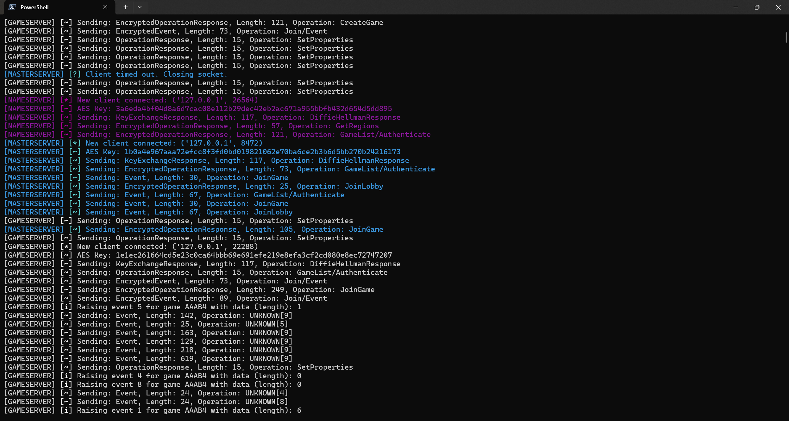

On another note, I broke all the old proxy code. I'll probably fix it tommorrow and package it as a "Photon Packet Sniffer" or something.

Technically, there are still some features we do not support, like kicking or banning players.
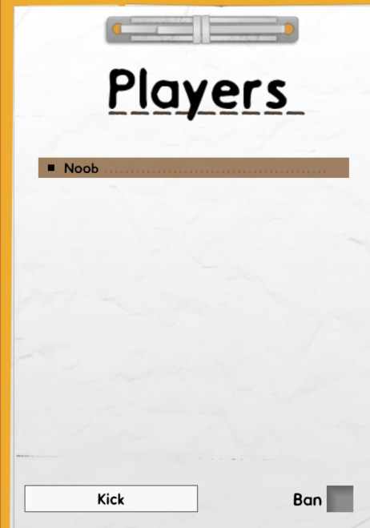
I stand corrected! Kicking a player simply sends a "RaiseEvent" packet to the server, who sends the kicked player an Event packet with code 6.
It seems as though "kicking" a player is more like asking them nicely to leave.

We do need to handle players leaving though, they currently remain in the games player list:


Well fuck me, "banning" a player literally does the same as kicking.
Doesn't seem like there is even an extra parameter in the RaiseEvent request.
Seems interesting, I might dig into this.

Regarding the player list, it looks to be that the server _does_ maintain the player list correctly, but _does not_ send a player list update event to the connected players.
Anyway, it's 4:43 AM, I'm going to sleep. It's been a productive day! 

#### It works!
After a lot more debugging, and fixing some Event vs. Operation mix ups, the local servers work excellent, allowing game creation and then joing into the created games!
There is still some work to be done, such as indefinite game hosting, and proper parsing of Prison Architect specific event types, but other than that, our work here is quite done.
The next step is to fix the proxy servers and ship them as a seperate "Photon Traffic Proxy" solution.

#### Rewriting for IRL Use
While adding proper error handling, I came accross this funny thing:
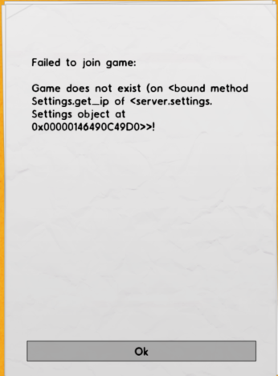
